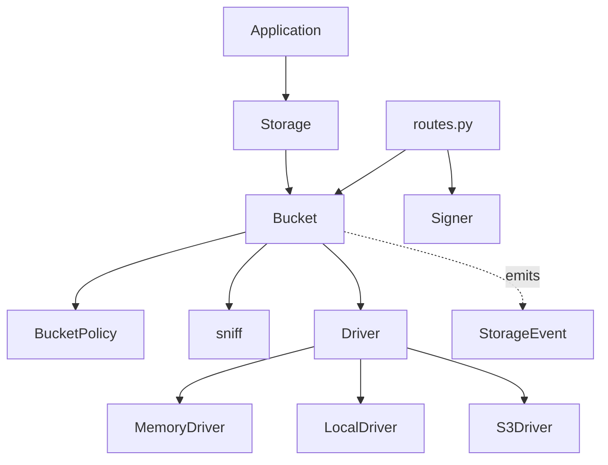

> Internal engineering reference for Sillo's storage subsystem.
>
> Source: `core/sillo/storage/` (15 files, ~2,400 lines)

---

## 1. Overview

One contract over local disk and S3-compatible object storage, with the four
things a driver deliberately does not know about wrapped around it: the policy,
the sniffer, the size limit, and the event.

Keeping those out of the drivers is what makes the contract testable. A driver's
job is to move bytes; if it also decided what a file was and who could have it,
every backend would get its own chance to decide differently, and the one suite
that holds them together would have nothing to hold.

### Module layout

```
sillo/storage/
├── base.py          Driver ABC, FileInfo, Page, Stored, StorageEvent, Action
├── bucket.py        Bucket — policy, sniffing, limits and events around a driver
├── storage.py       Storage, setup_storage
├── config.py        StorageConfig, BucketConfig
├── policies.py      Private, Public, ReadOnly, Signed, Owned
├── signing.py       Signer, SignedGrant
├── sniff.py         Magic-number content-type detection
├── paths.py         Key normalisation and containment
├── routes.py        The serving route
├── errors.py        Five exceptions
├── context.py       current_storage() — reaches the registered Storage
└── drivers/
    ├── memory.py    Dictionary. The contract's definition, and the test double.
    └── local.py     Files, written atomically, contained by resolution.
```

### Layering



Nothing below `Bucket` knows about users, policies or content types.

### Reaching it from anywhere

`sillo.storage.bucket(name)` works in a route handler, a queue job, or a
script — nothing to fetch first, no request required. `current_storage()` is
the `Storage` itself, for the handful of things `bucket()` doesn't cover
(`.listen()`, building a bucket at runtime); most code never needs it.

Both are registered by `setup_storage`, alongside the existing
`app.state["storage"]`, with `sillo._internals.registry` — a plain slot filled
once at startup, not scoped to a request, because storage is written to from
queue jobs and scripts at least as often as from a handler. See
[Instance Registry](/v1.0/advanced/context-binding/) for the mechanism and the
trade it makes — one registered `Storage` at a time.

---

## 2. The contract

Six abstract methods. Every signature decision below closes a specific failure.

```python
class Driver(abc.ABC):
    async def write(self, key, stream, *, content_type="", declared_type="") -> Stored
    def read(self, key) -> AsyncIterator[bytes]
    async def stat(self, key) -> FileInfo
    async def delete(self, key) -> bool
    async def page(self, prefix="", *, cursor="", limit=100) -> Page
    async def close(self) -> None
```

`exists`, `copy`, `move`, `signed_url`, `capabilities` and the listener methods
are provided.

### `write` takes an async iterator

There is no `put_bytes`. The moment a convenience exists that takes a whole
buffer, every caller reaches for it and "streamed uploads that never buffer a
whole file" degrades from a property into a comment.

Callers who genuinely want to buffer use `chunks()` on the way in or `collect()`
on the way out, both of which are explicit and — in `collect`'s case — require
you to state a ceiling.

**This is measured, not asserted.** A test uploads 64 MB under `tracemalloc` and
fails if peak memory passes 8 MB. Without it, everything passes whether or not
the file was assembled whole.

### `read` is not a coroutine

It returns the iterator directly, so `async for chunk in driver.read(key)` works
without an intermediate `await`. Making it a coroutine that returns an iterator
reads worse at every call site.

### `page` is the only way to list

S3 pages at a thousand keys; a filesystem does not. A contract returning a plain
list is a contract where every project works in development and falls over the
first time a bucket grows — in production, on the largest tenant. Putting the
cursor in the signature makes the constraint impossible to forget.

`MemoryDriver` pages as well, though a dictionary need not. A test double more
permissive than production hides the exact bug it exists to catch.

### `signed_url` is on the base, not optional

Local disk cannot sign anything by itself. The honest alternatives were:

1. Let the method raise "unsupported", which makes "one contract" a lie and puts
   a branch in every project that might one day switch backend.
2. Make local signing real.

It is real: an HMAC the framework mounts a route to verify. A third-party driver
that genuinely cannot sign raises `NotImplementedError` and says so in
`capabilities()`.

### `stat` returns the sniffed type

`FileInfo.content_type` is what the file is *served* as. `FileInfo.declared_type`
is what the uploader claimed, kept only so the two can be compared —
`FileInfo.mistyped` is the comparison.

---

## 3. Signing

What is signed is the whole permission, not just the key:

```
key · method · expiry · content type · maximum size
```

Each one omitted is a permission accidentally granted. A signature over the key
alone is a URL that reads *and* overwrites.

### Key derivation

```python
key = HMAC(app_secret, f"sillo-storage/v1/{bucket}")
```

Derived rather than used directly, so the application secret is not the key for
anything else that also uses HMAC-SHA256. The bucket name is mixed in, so a
token minted for `avatars` cannot be presented to `exports` under the same
secret.

### Verification order

1. Split on `.` — malformed is refused before anything is decoded.
2. **Compare the MAC first**, in constant time. A forged payload is never
   parsed, let alone acted on.
3. Decode the claims. A claim set of the wrong shape is refused rather than
   crashing the verifier.
4. Check the version, so a token minted under one interpretation of the claims
   cannot be replayed against a newer one.
5. Check expiry.
6. **Bind to the request** — the grant's key and method must match the ones
   actually being used. This is what stops a read token being replayed as a
   write.

Every failure raises `SignatureInvalid` with the same message. Telling an
unauthenticated caller which check failed tells them how the signing works, and
there is a test asserting all three of expiry, wrong-object and malformed
produce one identical string.

### Secret length

A `Signer` built with a secret under sixteen bytes raises at construction. A
signer built with `""` would mint forgeable tokens, silently, forever.

---

## 4. Sniffing

`mimetypes` reads the file extension, which is the same string the uploader
chose. This reads magic numbers.

### The chain

1. **Signatures** — about two dozen, offset and prefix, longest-first within a
   family. RIFF and ISO-BMFF carry their real type a few bytes in, so the table
   holds offsets rather than assuming zero.
2. **Binary check** — a control character is conclusive; beyond that the content
   has to *decode* as UTF-8. A byte-set check alone called `\xde\xad\xbe\xef`
   text and served it as `text/plain`.
3. **Markup** — anything starting `<!doctype html`, `<script`, `<svg`, `<?xml`.
   This is the family that turns a permissive content type into an incident.
4. **Textual tie-break** — the only place the declared type is consulted, and it
   can only ever choose between types that are all textual and none of which a
   browser executes. The worst outcome is a `.csv` served as `text/plain`.

Anything unrecognised is `application/octet-stream`, which downloads.

### Truncation

The probe cuts at a fixed offset, which can land mid-character. A UTF-8 decode
failure within the last four bytes is treated as truncation rather than as
binary content.

### The probe is capped by the bucket's limit

A bucket limited to a kilobyte reads about a kilobyte, not the full four. The
limit is what the caller asked to be enforced.

### Sniffing is half a defence

The other half is `routes.py`: `X-Content-Type-Options: nosniff`, a
`Content-Disposition`, and a sandbox CSP. Without `nosniff` the browser reaches
its own conclusion and the whole chain was pointless.

---

## 5. Paths

Object storage has keys; filesystems have paths. `a//b` and `a/b` are one file
on disk and two keys on S3. A driver that normalises differently from its
neighbour is a driver whose behaviour changes when a project switches backend —
so every key goes through `normalise()` before any driver sees it, and drivers
never re-interpret.

| Rule | Why |
|---|---|
| NFC normalisation | A macOS and a Linux upload of `café.pdf` must be one object, not two that look identical in every listing. |
| No leading `/` | A key is relative to its bucket. |
| No `..` after `normpath` | Climbing above the bucket. |
| No backslash | A separator on one platform, a literal on another. A key that means two things is not a key. |
| No control characters | Break HTTP headers and some filesystems. |
| ≤ 1024 bytes, segments ≤ 255 | S3's limit and a filesystem's, so both backends refuse the same keys. |

`posixpath`, not `pathlib`: a key is slash-separated whatever the host does, and
`pathlib` would reinterpret it.

### Containment

```python
def contain(root: Path, key: str) -> Path:
    base = root.resolve()
    target = (base / key).resolve()
    if target != base and base not in target.parents:
        raise UnsafeKey(...)
    return target
```

Resolve, then compare. Filtering for `..` in the input misses percent-encoding,
misses symlinks entirely, and misses whatever is invented next. Containment is
the property that actually has to hold, and `resolve()` is what establishes it —
including through a symlink pointing outside the root, which has a test.

---

## 6. The local driver

### Atomic writes

Content goes to `.{name}.{pid}.partial` beside the target and is renamed into
place. On a POSIX filesystem that rename is atomic, so a reader never sees a
half-written object and a crash mid-upload leaves the previous version intact
rather than a truncated one. Object storage gets this free; a filesystem must be
asked.

The staging file is *beside* the target, not in `/tmp` — a rename across
filesystems is a copy, and a copy is not atomic.

### Content-type persistence

A filesystem has nowhere to put metadata. Two mechanisms:

1. `os.setxattr` on the staging file, so it arrives with the rename. Linux only.
2. A `.{name}.type` sidecar, named for the **target**, everywhere else —
   including all of macOS.

Naming the sidecar for the staging file loses every content type on rename,
which is exactly what the first version did.

Sidecars are dot-prefixed so `page()` skips them. A sidecar is not an object and
must never appear in a listing.

### Directory pruning

Deleting the last object in a directory removes the directory, walking upward
until something is non-empty or the root is reached. Object storage has no
directories; a local bucket accumulating empty ones diverges from every other
backend in its listings.

---

## 7. Where "S3-compatible" leaks

It does leak. Rather than a hardcoded table that ages into a lie, drivers report
what they can actually do against the endpoint they are configured for:

```python
caps = await driver.capabilities()
# {"driver": "s3", "signed_urls": True, "server_side_copy": True,
#  "multipart": True, "min_part_bytes": 5_242_880}
```

`vise doctor` prints it. The driver reads it to choose an upload strategy rather
than assuming who it is talking to. The compatibility matrix becomes generated
output, not a promise.

Things that differ between providers include minimum multipart part size,
`ListObjectsV2` support and delimiter semantics, checksum and trailer support,
conditional writes, and `CopyObject` behaviour on large objects.

**A provider that has not been tested is described as untested, not as
supported.**

---

## 8. Observability

```python
def listen(self, listener: Listener) -> Listener
```

This exists in version one on purpose, and the reason is worth recording.

Every other sillo subsystem something wanted to watch — queries, cache, outgoing
calls, queues, schedules, events — offered no hook, so the tooling wraps private
methods on six different classes. Two of those seams turned out to be the wrong
ones in ways nothing reported: the event emitter's `_dispatch` never fires on
the memory backend, and `QueueWorker._process_job` catches its own exceptions,
so every failed job was recorded as a success.

A storage operation is I/O measured in milliseconds. One attribute check per
call is free here in a way it is not on the request path — which is why the
request recorder is raw ASGI middleware and this is a list of callbacks.

A listener that raises is skipped for that event and nothing else. An observer
must not be able to fail a write.

---

## 9. Testing

### One contract suite

`tests/test_storage/contract.py` holds `DriverContract` — thirty assertions
every driver must pass, parametrised by fixture rather than duplicated per
driver.

It was written **before the second driver existed**. Written afterwards, a
contract quietly becomes "whatever the first driver happened to do".

It is importable, so a third-party driver author subclasses it with one fixture
and finds out whether they are finished. That is what makes "write your own
Azure driver" a real offer rather than a shrug.

### Every security test can fail

For each refusal there is a companion showing the same input is accepted once
the guard is removed — so the assertion measures the guard rather than an
accident of the fixture. This comes from a bug in the `sillo-oauth` suite, where
a "tampered cookie" test passed for the wrong reason and proved nothing.

### The streaming claim is measured

`tracemalloc` around a 64 MB upload, asserting peak stays under 8 MB, plus a
source that counts how many times it was consumed — which catches the accidental
`data = b"".join(stream)` somebody adds in six months to make an edge case
easier.

---

## 10. Bugs this design caught

Recorded because each is a class of mistake rather than a one-off.

| Bug | Found by |
|---|---|
| The content-type sidecar named for the staging file, losing every type on rename | The contract suite, running `LocalDriver` through the same assertion `MemoryDriver` passed |
| `tuple(await x for ...)` — an async generator handed to `tuple()` | The same |
| Textuality decided by a control-character set, so random bytes served as `text/plain` | A safety test asserting unknown binary downloads |
| `request.user` **raises** without auth middleware, so `getattr(..., None)` never reaches its default | The serving route's first test |
| `stream()` overriding the content type with its `text/plain` default | The same |

The last two were in code already merged. The route had never been called by a
test; the first test to call it found both.

---

## 11. Deliberate omissions

- **Image transformation, thumbnails, virus scanning, CDN invalidation.**
  Different products, or a queued job's work.
- **A `public_url()` convenience.** Every one of those becomes a bucket that is
  world-readable because somebody wanted a quick link.
- **Multi-cloud beyond S3-compatible.** The abstraction leaks at consistency, at
  signing and at pagination, and the result is a contract that is the
  intersection of everyone's weakest guarantee.
- **A metadata model.** The store is the source of truth. Two sources of truth
  for "does this file exist" drift, and the drift is discovered during an
  incident.
