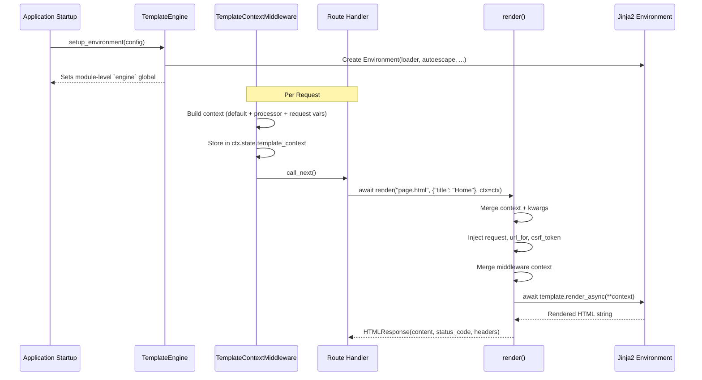
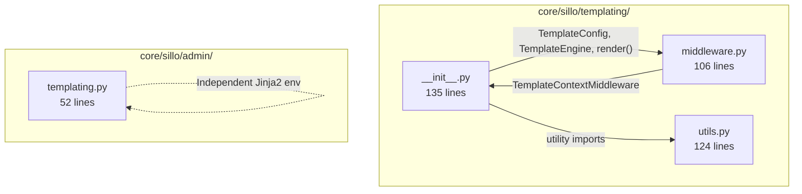
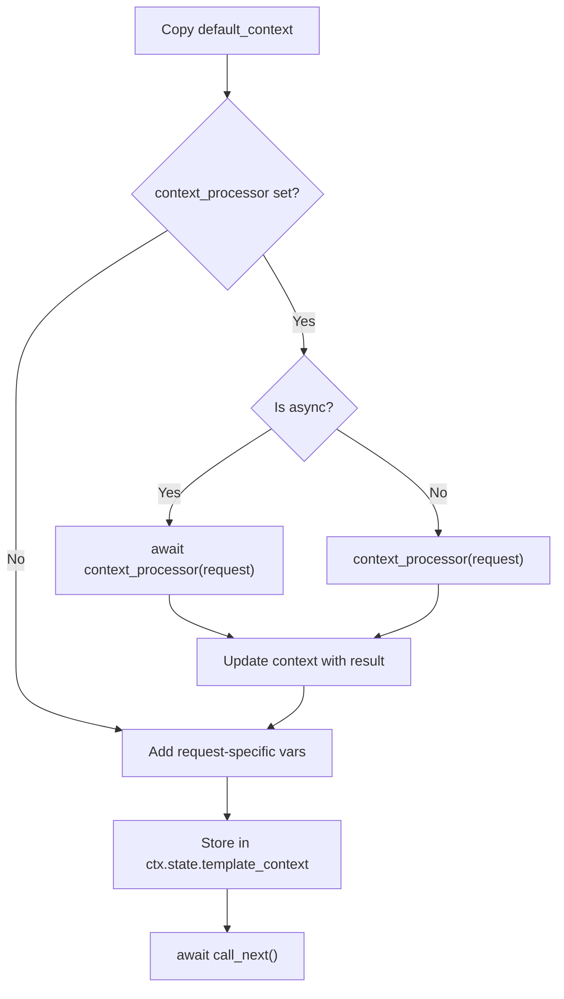

> Internal engineering reference for Sillo's Jinja2-based template system.
>
> Source: `core/sillo/templating/` (3 files, ~365 lines) +
> `core/sillo/admin/templating.py` (52 lines)

---

## 1. Overview and Architecture

The templating subsystem wraps Jinja2 to provide async template rendering with
auto-escaping, context middleware for injecting shared variables, and a
convenience `render()` function that returns `HTMLResponse` objects.

### Data Flow



### Module Layout



### File Inventory

| File | Path | Lines | Purpose |
|------|------|-------|---------|
| `__init__.py` | `core/sillo/templating/__init__.py` | 135 | `TemplateConfig`, `TemplateEngine`, `render()` |
| `middleware.py` | `core/sillo/templating/middleware.py` | 106 | `TemplateContextMiddleware`, `template_context()` |
| `utils.py` | `core/sillo/templating/utils.py` | 124 | Template utility functions |
| `templating.py` | `core/sillo/admin/templating.py` | 52 | Admin-specific sync rendering |

---

## 2. TemplateConfig

**File:** `core/sillo/templating/__init__.py`, line 22

```python
class TemplateConfig:
    def __init__(
        self,
        template_dir: str | Path = "templates",
        cache_size: int = 100,
        auto_reload: bool = True,
        encoding: str = "utf-8",
        enable_async: bool = True,
        trim_blocks: bool = True,
        lstrip_blocks: bool = True,
        custom_filters: dict[str, Callable[[Any], Any]] = {},
        custom_globals: dict[str, Any] = {},
    ):
```

### Parameters

| Parameter | Default | Purpose |
|-----------|---------|---------|
| `template_dir` | `"templates"` | Directory containing `.html` template files |
| `cache_size` | `100` | Number of templates to keep compiled in memory |
| `auto_reload` | `True` | Reload templates from disk when changed (dev mode) |
| `encoding` | `"utf-8"` | Template file encoding |
| `enable_async` | `True` | Use `template.render_async()` instead of `render()` |
| `trim_blocks` | `True` | Remove first newline after block tags |
| `lstrip_blocks` | `True` | Strip leading whitespace before block tags |
| `custom_filters` | `{}` | Additional Jinja2 filter functions |
| `custom_globals` | `{}` | Additional Jinja2 global variables |

### Custom Filters and Globals

```python
config = TemplateConfig(
    custom_filters={
        "currency": lambda v: f"${v:,.2f}",
        "relative_time": format_relative_time,
    },
    custom_globals={
        "app_name": "MyApp",
        "version": "2.0.0",
        "now": datetime.now,
    },
)
```

These are merged into the Jinja2 `Environment` during `setup_environment()`.

### Serialisation

`to_dict()` (line 48) returns all config attributes as a plain dictionary,
useful for debugging and logging.

**Known issue:** `custom_filters` and `custom_globals` default to mutable empty
dicts (`{}`). This is a Python anti-pattern. The same dict instance is shared
across all `TemplateConfig` instances that don't override these parameters.

---

## 3. TemplateEngine

**File:** `core/sillo/templating/__init__.py`, line 62

### Module-Level Singleton

```python
# core/sillo/templating/__init__.py, line 19
engine: TemplateEngine | None = None
```

The module-level `engine` global is set by `TemplateEngine.setup_environment()`
and read by the module-level `render()` function.

### `setup_environment(config)`

```python
# core/sillo/templating/__init__.py, line 65
def setup_environment(self, config: TemplateConfig = TemplateConfig()):
```

**Steps:**

1. Stores `config` as `self.config` (line 68).
2. Creates the template directory if it doesn't exist (line 70):
   `Path(config.template_dir).mkdir(parents=True, exist_ok=True)`.
3. Constructs a `jinja2.Environment` (lines 72-81):
   ```python
   self.env = Environment(
       loader=FileSystemLoader(config.template_dir),
       autoescape=select_autoescape(["html", "xml"]),
       cache_size=config.cache_size,
       auto_reload=config.auto_reload,
       enable_async=config.enable_async,
       trim_blocks=config.trim_blocks,
       lstrip_blocks=config.lstrip_blocks,
   )
   ```
4. Merges custom filters and globals (lines 83-86).
5. Sets the module-level `engine` global to `self` (line 87).

### `render(template_name, context, **kwargs)`

```python
# core/sillo/templating/__init__.py, line 89
async def render(
    self, template_name: str, context: dict[str, Any] | None = None, **kwargs
) -> str:
```

1. Merges `context` dict and `**kwargs` into a single dict (lines 94-95).
2. Loads the template via `self.env.get_template(template_name)` (line 97).
3. If `self.config.enable_async` is True, calls `await template.render_async(**context)` (line 99).
4. Otherwise, calls synchronous `template.render(**context)` (line 100).

**Note:** The engine's `render` returns a raw string.  The module-level `render`
function wraps it in an `HTMLResponse`.

---

## 4. Module-Level render()

**File:** `core/sillo/templating/__init__.py`, line 103

```python
from sillo import HttpContext

async def render(
    template_name: str,
    context: dict[str, Any] | None = None,
    status_code: int = 200,
    headers: dict[str, str] | None = None,
    ctx: HttpContext | None = None,
    **kwargs,
) -> HTMLResponse:
```

This is the primary entry point for route handlers.

### Context Enrichment

When a `ctx` is provided, the function enriches the template context with
request-specific variables:

```python
# core/sillo/templating/__init__.py, lines 116-132
final_context = {}
if context:
    final_context.update(context)
final_context.update(kwargs)

if ctx:
    final_context.setdefault("request", ctx)

    # Inject url_for if available
    if hasattr(ctx, "base_app") and hasattr(ctx.base_app, "url_for"):
        final_context.setdefault("url_for", ctx.base_app.url_for)

    # Inject CSRF token if available
    if hasattr(ctx, "state") and hasattr(ctx.state, "csrf_token"):
        final_context.setdefault("csrf_token", ctx.state.csrf_token)

    # Merge middleware-injected context
    if hasattr(ctx, "state") and hasattr(ctx.state, "template_context"):
        mw_ctx = ctx.state.template_context
        if mw_ctx:
            final_context.update(mw_ctx)
```

**Precedence:** Explicit context/kwargs > middleware context.  The `update` call
for middleware context runs *before* the final merge, so explicit values win.

### Return Value

```python
return HTMLResponse(
    content=await engine.render(template_name, final_context),
    status_code=status_code,
    headers=headers,
)
```

### Error Handling

Raises `NotImplementedError` if the module-level `engine` is `None` (i.e.,
`setup_environment()` was never called).

---

## 5. TemplateContextMiddleware

**File:** `core/sillo/templating/middleware.py`, line 13

### Purpose

Injects template context variables into every request, making them available to
all templates without explicit passing in each handler.

### Constructor

```python
from sillo import HttpContext

def __init__(
    self,
    default_context: dict[str, Any] | None = None,
    context_processor: Callable[[HttpContext], Awaitable[dict[str, Any]]] | None = None,
):
```

- `default_context`: Static variables available in every template.
- `context_processor`: Optional async callable that returns dynamic context
  based on the current request (e.g., current user, permissions).

### Request Processing

```python
# core/sillo/templating/middleware.py, line 47
async def __call__(self, ctx: HttpContext, call_next):
```



**Request-specific variables injected:**

| Variable | Source | Purpose |
|----------|--------|---------|
| `ctx` | The request's context | Access to request data in templates |
| `url_for` | `ctx.base_app.url_for` | URL generation helper |
| `csrf_token` | `ctx.state.csrf_token` | CSRF protection token |

### Factory Function

```python
# core/sillo/templating/middleware.py, line 88
def template_context(
    default_context: dict[str, Any] | None = None,
    context_processor: Callable[[HttpContext], Awaitable[dict[str, Any]]] | None = None,
):
    return TemplateContextMiddleware(default_context, context_processor)
```

Usage:

```python
app.use(template_context(
    default_context={"site_name": "MyApp", "version": "2.0"},
    context_processor=get_user_context,  # async def
))
```

---

## 6. Utility Functions

**File:** `core/sillo/templating/utils.py`

### `static_hash(filepath: str) -> str`

**Line 12.** Generates an MD5 content hash for cache-busting static files.

```python
def static_hash(filepath: str) -> str:
    try:
        with open(filepath, "rb") as f:
            return hashlib.md5(f.read()).hexdigest()[:8]
    except (OSError, IOError):
        return ""
```

Returns the first 8 hex characters of the MD5 digest, or `""` if the file
doesn't exist.  Used in templates as:

```html
<link rel="stylesheet" href="/static/css/app.css?v={{ static_hash('static/css/app.css') }}">
```

### `format_datetime(value: datetime, fmt: str = "%Y-%m-%d %H:%M:%S") -> str`

**Line 33.** Thin wrapper around `strftime` for use inside Jinja2 templates.

```html
<span>{{ format_datetime(post.created_at, "%B %d, %Y") }}</span>
```

### `truncate(text: str, length: int = 100, suffix: str = "...") -> str`

**Line 49.** Truncates text to a maximum length, breaking at word boundaries.

```python
def truncate(text: str, length: int = 100, suffix: str = "...") -> str:
    if len(text) <= length:
        return text
    truncated = text[:length]
    # Find last space to avoid cutting words
    last_space = truncated.rfind(" ")
    if last_space > 0:
        truncated = truncated[:last_space]
    return truncated + suffix
```

### `merge_dicts(*dicts: dict[str, Any]) -> dict[str, Any]`

**Line 70.** Merge two or more dictionaries.  Later dicts take precedence.
Returns a new dict without mutating inputs.

### `get_template_globals() -> dict[str, Any]`

**Line 89.** Returns default dictionary of template-global callables:

```python
{
    "now": datetime.now,
    "static_hash": static_hash,
    "format_datetime": format_datetime,
    "truncate": truncate,
}
```

### `create_template_dir(template_dir: str | Path | None = None) -> Path`

**Line 109.** Ensures a template directory exists (creates with parents if
needed).  Defaults to `"templates"`.  Returns the `Path` object.

---

## 7. Admin Templating

**File:** `core/sillo/admin/templating.py`, line 29

The admin subsystem has its own **independent** Jinja2 environment.  It does
*not* use the main `sillo.templating` module.

### Architecture

```python
# core/sillo/admin/templating.py, lines 22-26
_TEMPLATE_DIR = Path(__file__).parent / "templates"
_env = None
if HAS_JINJA2:
    _env = Environment(loader=FileSystemLoader(str(_TEMPLATE_DIR)), autoescape=True)
```

### Key Differences from Main Templating

| Aspect | Main (`sillo.templating`) | Admin (`sillo.admin.templating`) |
|--------|--------------------------|----------------------------------|
| Rendering | Async (`render_async`) | Sync (`render`) |
| Configuration | `TemplateConfig` class | Hard-coded defaults |
| Template location | User-configurable `templates/` | `admin/templates/` |
| Context middleware | Supported | Not supported |
| Custom filters/globals | Supported | Not supported |

### `render(name: str, **ctx) -> str`

```python
# core/sillo/admin/templating.py, line 29
def render(name: str, **ctx) -> str:
    if _env is None:
        raise ImportError("jinja2 is required for admin: pip install jinja2")
    return _env.get_template(name).render(**ctx)
```

Admin templates are rendered synchronously because the admin views are ASGI
handlers that call `render()` directly (not through the middleware chain).

---

## 8. Integration Patterns

### Basic Setup

```python
from sillo.templating import TemplateConfig, TemplateEngine, render
from sillo.templating.middleware import template_context

# At startup
from sillo import HttpContext

config = TemplateConfig(
    template_dir="my_templates",
    custom_filters={"currency": lambda v: f"${v:,.2f}"},
)
engine = TemplateEngine()
engine.setup_environment(config)

# Register middleware
app.use(template_context(
    default_context={"app_name": "MyApp"},
))

# In route handler
async def home(ctx: HttpContext):
    return await render("home.html", {"title": "Welcome"}, ctx=ctx)
```

### Dynamic Context Processor

```python
from sillo import HttpContext

async def get_user_context(ctx: HttpContext):
    """Inject current user into every template."""
    user = ctx.scope.get("session", {}).get("user")
    if user:
        return {
            "current_user": user,
            "is_authenticated": True,
        }
    return {"current_user": None, "is_authenticated": False}

app.use(template_context(context_processor=get_user_context))
```

### Template Inheritance

```html
{# base.html #}
<!DOCTYPE html>
<html>
<head><title>{{ app_name }}</title></head>
<body>
    
</body>
</html>

{# home.html #}

Home - {{ app_name }}

<h1>Welcome, {{ current_user.name if current_user else "Guest" }}</h1>

```

### Custom Filters

```python
from markupsafe import Markup

def format_currency(value, symbol="$"):
    return f"{symbol}{value:,.2f}"

def nl2br(value):
    return Markup(value.replace("\n", "<br>"))

config = TemplateConfig(
    custom_filters={
        "currency": format_currency,
        "nl2br": nl2br,
    },
)
```

---

## 9. Testing

### Testing Template Rendering

```python
import pytest
from sillo.templating import TemplateEngine, TemplateConfig, engine as global_engine

@pytest.fixture
def template_engine(tmp_path):
    templates_dir = tmp_path / "templates"
    templates_dir.mkdir()
    (templates_dir / "test.html").write_text("<h1>{{ title }}</h1>")

    config = TemplateConfig(template_dir=str(templates_dir))
    eng = TemplateEngine()
    eng.setup_environment(config)
    yield eng

async def test_render_template(template_engine):
    result = await template_engine.render("test.html", {"title": "Hello"})
    assert result == "<h1>Hello</h1>"
```

### Testing Context Middleware

```python
from sillo.templating.middleware import TemplateContextMiddleware

async def test_context_middleware():
    default_ctx = {"app_name": "Test"}
    mw = TemplateContextMiddleware(default_context=default_ctx)

    # Mock ctx with state
    ctx = MagicMock()
    ctx.state.template_context = {}
    ctx.state.csrf_token = "token123"
    ctx.base_app.url_for = lambda name: f"/{name}"

    response = MagicMock()
    call_next = AsyncMock(return_value=response)

    await mw(ctx, call_next)
    assert ctx.state.template_context["app_name"] == "Test"
    assert ctx.state.template_context["csrf_token"] == "token123"
```

### Testing Utility Functions

```python
from sillo.templating.utils import truncate, static_hash, format_datetime
from datetime import datetime

def test_truncate_short_text():
    assert truncate("Hello", length=100) == "Hello"

def test_truncate_at_word_boundary():
    result = truncate("Hello World Foo Bar", length=12)
    assert result == "Hello World..."

def test_format_datetime():
    dt = datetime(2024, 1, 15, 10, 30, 0)
    assert format_datetime(dt) == "2024-01-15 10:30:00"
    assert format_datetime(dt, "%B %d") == "January 15"

def test_static_hash_nonexistent():
    assert static_hash("/nonexistent/file.css") == ""
```

### Testing with TestClient

```python
from sillo.testclient import TestClient

def test_template_renders_in_response():
    with TestClient(app) as client:
        resp = client.get("/")
        assert resp.status_code == 200
        assert "<h1>Welcome</h1>" in resp.text
        assert "csrf_token" not in resp.text  # CSRF in form, not body
```
