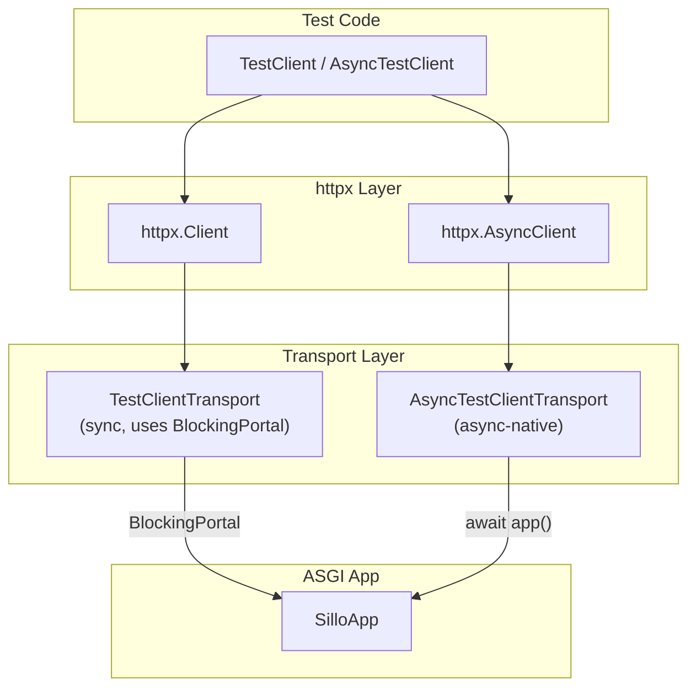
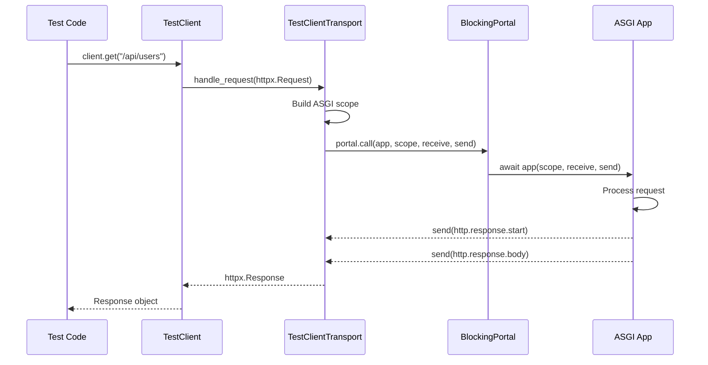
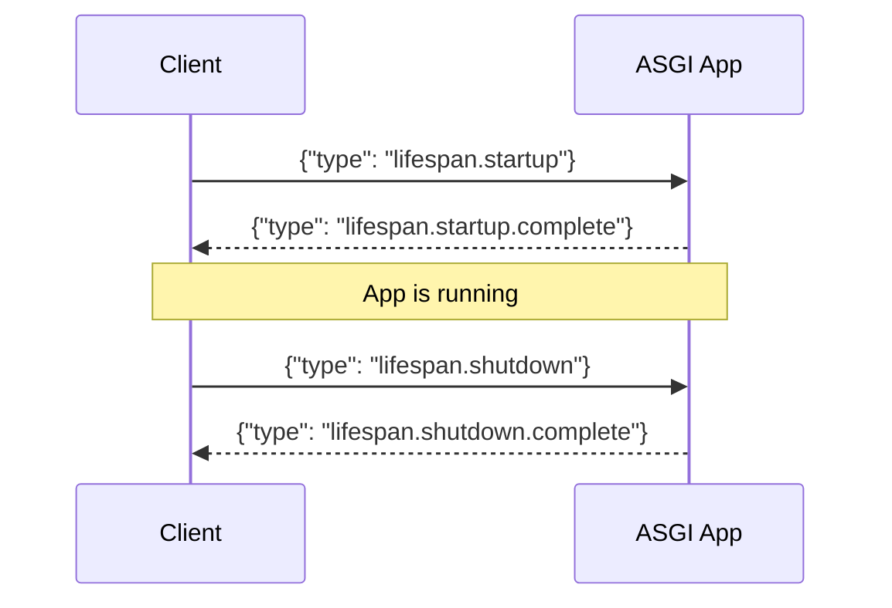
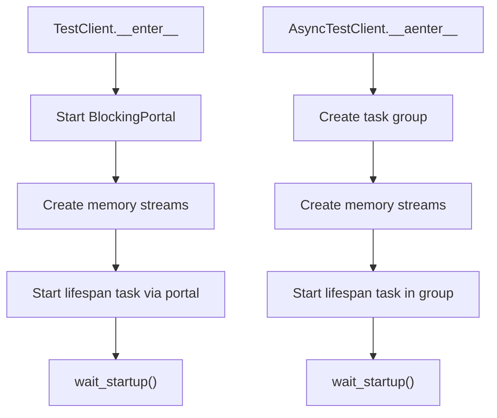

> Internal engineering reference for Sillo's test client.
>
> Source: `core/sillo/testclient/` (9 files, ~2,063 lines)

---

## 1. Overview and Architecture

The test client provides sync and async HTTP clients for testing ASGI
applications without a real server.  It subclasses `httpx.Client` and
`httpx.AsyncClient`, replacing the network transport with an in-process ASGI
adapter.

### Architecture Diagram



### Request Flow



### File Inventory

| File | Path | Lines | Purpose |
|------|------|-------|---------|
| `__init__.py` | `core/sillo/testclient/__init__.py` | 17 | Public API re-exports |
| `base.py` | `core/sillo/testclient/base.py` | 523 | `TestClient` (sync) |
| `async_client.py` | `core/sillo/testclient/async_client.py` | 273 | `AsyncTestClient` |
| `helpers.py` | `core/sillo/testclient/helpers.py` | 149 | `create_client`, `create_async_client` |
| `exceptions.py` | `core/sillo/testclient/exceptions.py` | 17 | `UpgradeException`, `ASGISpecViolation` |
| `_internal/transport.py` | `core/sillo/testclient/_internal/transport.py` | 697 | Transport implementations |
| `_internal/websockets.py` | `core/sillo/testclient/_internal/websockets.py` | 295 | WebSocket support |
| `_internal/utils.py` | `core/sillo/testclient/_internal/utils.py` | 37 | ASGI utilities |
| `_internal/inputs.py` | `core/sillo/testclient/_internal/inputs.py` | 47 | Request input defaults |
| `_internal/types.py` | `core/sillo/testclient/_internal/types.py` | 15 | Type aliases |

---

## 2. TestClient

**File:** `core/sillo/testclient/base.py`, line 49

```python
class TestClient(httpx.Client):
    __test__ = False  # Prevent pytest collection
```

### Constructor

```python
def __init__(
    self,
    app: ASGIApp,
    base_url: str = "http://testserver",
    raise_server_exceptions: bool = True,
    root_path: str = "",
    backend: Literal["asyncio", "trio"] = "asyncio",
    backend_options: dict[str, Any] | None = None,
    cookies: CookieTypes | None = None,
    headers: HeaderTypes | None = None,
    follow_redirects: bool = True,
    check_asgi_conformance: bool = True,
):
```

**Initialisation steps:**

1. Creates `AsyncBackend` dict with `backend` and `backend_options`.
2. Wraps ASGI2 apps via `WrapASGI2` if needed.
3. Creates `TestClientTransport` with the app and portal factory.
4. Sets default `user-agent: testclient` header.
5. Calls `super().__init__()` with the transport.

### Request Normalisation

```python
# core/sillo/testclient/base.py, line 129
def ctx(self, method, url, *, content, data, files, json, params,
            headers, cookies, auth, follow_redirects, timeout, extensions,
            stream) -> httpx.Response:
```

Normalises `data` when it's a list of `(key, value)` pairs into URL-encoded form
content.  Handles `stream=True` by entering a streaming context.

### HTTP Verb Convenience Methods

All delegate to `_process_request`:

| Method | Line |
|--------|------|
| `get(url, **kwargs)` | 265 |
| `head(url, **kwargs)` | 273 |
| `post(url, **kwargs)` | 281 |
| `put(url, **kwargs)` | 289 |
| `patch(url, **kwargs)` | 297 |
| `delete(url, **kwargs)` | 305 |
| `options(url, **kwargs)` | 313 |

### WebSocket Connection

```python
# core/sillo/testclient/base.py, line 321
def websocket_connect(self, url, subprotocols=None, **kwargs) -> WebSocketTestSession:
```

1. Prepares WebSocket headers (`connection: upgrade`, `sec-websocket-key`, etc.).
2. Issues a GET request with upgrade headers.
3. Catches `UpgradeException` raised by the transport.
4. Returns the `WebSocketTestSession` from the exception.

### Context Managers

#### `__enter__`: Sync

```python
# core/sillo/testclient/base.py, line 374
def __enter__(self) -> Self:
```

1. Starts a `BlockingPortal` via `anyio.from_thread.start_blocking_portal`.
2. Creates two `anyio` memory object streams (`stream_send`, `stream_receive`).
3. Starts the lifespan task.
4. Calls `wait_startup()`.

#### `__aenter__`: Async

```python
# core/sillo/testclient/base.py, line 411
async def __aenter__(self) -> Self:
```

1. Creates an `anyio.create_task_group()`.
2. Creates memory object streams.
3. Starts `_lifespan_runner` in the task group.
4. Calls `wait_startup()`.

---

## 3. AsyncTestClient

**File:** `core/sillo/testclient/async_client.py`, line 38

```python
class AsyncTestClient(httpx.AsyncClient):
    __test__ = False
```

Mirrors `TestClient` but is async-native.  Key differences:

| Aspect | TestClient | AsyncTestClient |
|--------|-----------|-----------------|
| Base class | `httpx.Client` | `httpx.AsyncClient` |
| Transport | `TestClientTransport` | `AsyncTestClientTransport` |
| Portal | `BlockingPortal` | None (direct await) |
| Context manager | `__enter__`/`__aenter__` | `__aenter__` only |
| HTTP verbs | Sync | Async |

### Constructor

Same parameters as `TestClient.__init__`.  Creates `AsyncTestClientTransport`
instead of `TestClientTransport`.

### Async Context Manager

```python
# core/sillo/testclient/async_client.py, line 201
async def __aenter__(self) -> Self:
    self._tg = anyio.create_task_group()
    await self._tg.__aenter__()
    # ... create streams, start lifespan, wait_startup
```

---

## 4. Lifespan Management

Both `TestClient` and `AsyncTestClient` manage the ASGI lifespan protocol.

### Lifespan Protocol



### Memory Object Streams

```python
stream_send, stream_receive = anyio.create_memory_object_stream()
```

- `stream_send`: Client → App (lifespan events).
- `stream_receive`: App → Client (lifespan responses).

### wait_startup

```python
# core/sillo/testclient/base.py, line 470
def wait_startup(self):
    self.stream_send.send_nowait({"type": "lifespan.startup"})
    message = self.stream_receive.receive_nowait()
    if message is None:
        raise RuntimeError("Lifespan startup failed: app did not respond")
    if message["type"] == "lifespan.startup.failed":
        raise RuntimeError(f"Lifespan startup failed: {message.get('message', '')}")
```

### wait_shutdown

```python
# core/sillo/testclient/base.py, line 491
def wait_shutdown(self):
    self.stream_send.send_nowait({"type": "lifespan.shutdown"})
    # ... wait for "lifespan.shutdown.complete" or "lifespan.shutdown.failed"
```

### Sync vs Async Modes



---

## 5. TestClientTransport

**File:** `core/sillo/testclient/_internal/transport.py`, line 18

```python
class TestClientTransport(httpx.BaseTransport):
    encoding: str = "ascii"
```

Synchronous HTTP transport that bridges httpx to the ASGI app via a blocking
portal.

### handle_request

```python
# core/sillo/testclient/_internal/transport.py, line 51
def handle_request(self, request: httpx.Request) -> httpx.Response:
```

1. Parses URL (scheme, netloc, path, raw_path, query).
2. Extracts host, port, default_port.
3. Builds ASGI-compatible header list as bytes tuples.
4. If scheme is `ws`/`wss`: delegates to `_handle_websocket_request` and raises
   `UpgradeException`.
5. Otherwise: builds HTTP scope and processes the request.

### _process_http_request

```python
# core/sillo/testclient/_internal/transport.py, line 245
def _process_http_request(self, scope, request: httpx.Request) -> httpx.Response:
```

Defines inner `receive()` and `send()` async functions implementing the ASGI
protocol:

#### receive()

| Body Type | Handling |
|-----------|----------|
| `str` | Raises `ASGISpecViolation` if conformance check enabled |
| Generator | Sends chunks, then `more_body=False` |
| `None` | Sends `{}` with `more_body=False` |
| `bytes` | Sends `{body: bytes, more_body: False}` |

#### send()

| Message Type | Handling |
|--------------|----------|
| `http.response.start` | Stores status, headers. Validates conformance. |
| `http.response.body` | Accumulates body chunks. |
| `http.response.debug` | Stores template/context for debug. |

#### Error Handling

- On exception: re-raises if `raise_server_exceptions`; otherwise returns 500.
- If no response started: raises `ASGISpecViolation` if conformance check
  enabled, else returns 500.

---

## 6. AsyncTestClientTransport

**File:** `core/sillo/testclient/_internal/transport.py`, line 455

```python
class AsyncTestClientTransport(httpx.AsyncBaseTransport):
    encoding: str = "ascii"
```

Same architecture as `TestClientTransport` but async-native, no portal needed.
Directly `await`s the ASGI app.

### Key Differences from Sync Transport

| Aspect | Sync | Async |
|--------|------|-------|
| App invocation | Via `BlockingPortal` | Direct `await app(scope, receive, send)` |
| Response complete | Manual event | `finally: response_complete.set()` |
| 500 body (no response) | Empty | `b"Internal Server Error"` |

---

## 7. WebSocket Support

**File:** `core/sillo/testclient/_internal/websockets.py`

### UpgradeException

```python
# core/sillo/testclient/_internal/exceptions.py, line 9
class UpgradeException(Exception):
    def __init__(self, session: WebSocketTestSession):
        self.session = session
```

Raised by the transport when a WebSocket request is detected.  The client's
`websocket_connect` catches this and returns the session.

### WebSocketTestSession

```python
# core/sillo/testclient/_internal/websockets.py, line 42
class WebSocketTestSession:
    def __init__(self, app, scope, portal_factory):
```

**Internal queues:**

| Queue | Direction | Type |
|-------|-----------|------|
| `_receive_queue` | Test → App | `queue.Queue[Message]` |
| `_send_queue` | App → Test | `queue.Queue[Message \| BaseException]` |

### Context Manager

```python
def __enter__(self) -> Self:
    # 1. Enter portal factory
    # 2. Start _run task
    # 3. Send websocket.connect
    # 4. Receive response
    # 5. Check for denial (websocket.http.response.start)
    # 6. Store accepted_subprotocol and extra_headers

def __exit__(self, *args):
    # 1. Send close (code 1000)
    # 2. Notify close (set should_close event)
    # 3. Close exit stack
    # 4. Drain _send_queue, re-raise exceptions
```

### Send Methods

| Method | Payload |
|--------|---------|
| `send(message)` | Raw message dict |
| `send_text(data)` | `{"type": "websocket.receive", "text": data}` |
| `send_bytes(data)` | `{"type": "websocket.receive", "bytes": data}` |
| `send_json(data, mode)` | JSON-serialized as text or bytes |
| `close(code, reason)` | `{"type": "websocket.disconnect", ...}` |

### Receive Methods

| Method | Returns |
|--------|---------|
| `receive()` | Raw message dict |
| `receive_text()` | `message["text"]` |
| `receive_bytes()` | `message["bytes"]` |
| `receive_json(mode)` | Deserialized JSON |

### WebSocketDenialResponse

```python
from sillo import WebSocketContext

class WebSocketDenialResponse(httpx.Response, WebSocketDisconnect):
    """Raised when WebSocketContext is closed before being accepted."""
```

Multiple inheritance from both `httpx.Response` and `WebSocketDisconnect`.
Carries both the HTTP response data and disconnect semantics.

---

## 8. Helper Functions

**File:** `core/sillo/testclient/helpers.py`

### `create_client(...)`

```python
def create_client(
    title="Test",
    version="0.1.0",
    description="",
    server_error_handler=None,
    lifespan=None,
    routes=(),
    dependencies=None,
    client_config=None,
) -> TestClient:
```

Builds a `SilloApp` with the given parameters, applies default client config
(with optional overrides), and returns a `TestClient` wrapping that app.

### `create_async_client(...)`

Same parameters but returns an `AsyncTestClient`.

### Usage

```python
from sillo.testclient import create_client

# Quick setup for route testing
client = create_client(routes=[user_routes, auth_routes])
with client:
    resp = client.get("/api/users")
    assert resp.status_code == 200
```

---

## 9. ASGI Conformance Checking

Both transports optionally validate ASGI spec compliance.

### Checks Performed

| Check | Message Type | Condition |
|-------|-------------|-----------|
| Body is bytes | `http.response.body` | `body` must be `bytes`, not `str` |
| Headers are bytes tuples | `http.response.start` | Each header must be `(bytes, bytes)` |
| No newlines in headers | `http.response.start` | `\n` not allowed in header names/values |
| Response started | End of request | At least one `http.response.start` sent |
| String body | `receive()` | `str` body raises violation |

### ASGISpecViolation

```python
class ASGISpecViolation(Exception):
    """Raised when the ASGI app violates the ASGI specification."""
```

### Disabling Checks

```python
client = TestClient(app, check_asgi_conformance=False)
```

Useful for testing apps that intentionally bend the spec.

---

## 10. Testing Patterns

### Basic Usage

```python
from sillo.testclient import TestClient

def test_home_page():
    with TestClient(app) as client:
        resp = client.get("/")
        assert resp.status_code == 200
        assert "Welcome" in resp.text
```

### Async Usage

```python
import pytest
from sillo.testclient import AsyncTestClient

@pytest.mark.asyncio
async def test_home_page():
    async with AsyncTestClient(app) as client:
        resp = await client.get("/")
        assert resp.status_code == 200
```

### POST with JSON

```python
def test_create_user():
    with TestClient(app) as client:
        resp = client.post("/api/users", json={
            "name": "Alice",
            "email": "alice@example.com",
        })
        assert resp.status_code == 201
        data = resp.json()
        assert data["name"] == "Alice"
```

### POST with Form Data

```python
def test_login():
    with TestClient(app) as client:
        resp = client.post("/login", data={
            "username": "admin",
            "password": "secret",
        })
        assert resp.status_code == 302
```

### File Upload

```python
def test_upload():
    with TestClient(app) as client:
        resp = client.post("/upload", files={
            "file": ("test.txt", b"hello world", "text/plain"),
        })
        assert resp.status_code == 200
```

### Cookies and Sessions

```python
def test_session():
    with TestClient(app) as client:
        # Login (sets session cookie)
        client.post("/login", json={"username": "admin", "password": "secret"})

        # Subsequent requests include the cookie
        resp = client.get("/dashboard")
        assert resp.status_code == 200
```

### WebSocket Testing

```python
def test_websocket():
    with TestClient(app) as client:
        with client.websocket_connect("/ws") as ws:
            ws.send_text("Hello")
            data = ws.receive_text()
            assert data == "Hello from server"
```

### Exception Handling

```python
def test_server_error():
    with TestClient(app, raise_server_exceptions=False) as client:
        resp = client.get("/crash")
        assert resp.status_code == 500
```

### Custom Headers

```python
def test_auth_header():
    with TestClient(app, headers={"Authorization": "Bearer token123"}) as client:
        resp = client.get("/api/me")
        assert resp.status_code == 200
```

### Lifespan Events

```python
def test_startup_shutdown():
    events = []
    app.on_startup(lambda: events.append("startup"))
    app.on_shutdown(lambda: events.append("shutdown"))

    with TestClient(app) as client:
        assert events == ["startup"]
    assert events == ["startup", "shutdown"]
```
