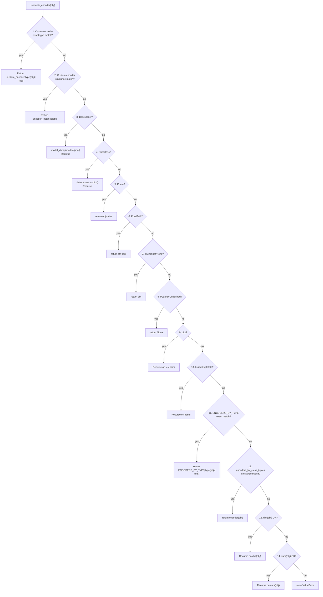
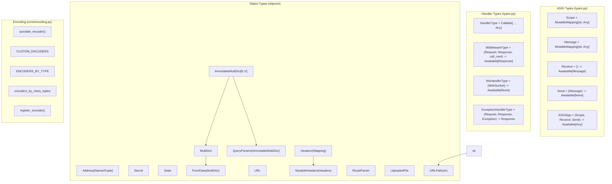

## 1. Core Type Aliases

**Source**: `core/sillo/types.py` (41 lines)

These type aliases define the ASGI protocol interface and Sillo's middleware
contract. They are the foundation every other module builds on.

### ASGI Protocol Types

```python
Scope   = typing.MutableMapping[str, typing.Any]
Message = typing.MutableMapping[str, typing.Any]
Receive = typing.Callable[[], typing.Awaitable[Message]]
Send    = typing.Callable[[Message], typing.Awaitable[None]]
ASGIApp = typing.Callable[[Scope, Receive, Send], typing.Awaitable[Any]]
```

| Type | Description | Used By |
|------|-------------|---------|
| `Scope` | Mutable dict representing connection metadata | All ASGI apps, middleware, routers |
| `Message` | Mutable dict representing a single ASGI message | Receive/Send callbacks |
| `Receive` | Async callable yielding messages from the client | `__call__`, middleware chain |
| `Send` | Async callable sending messages to the client | `__call__`, response objects |
| `ASGIApp` | The core application callable signature | `SilloApp.__call__`, middleware wrapping |

### Sillo-Specific Types

```python
from sillo import HttpContext, WebSocketContext

HandlerType = Callable[..., Any]

MiddlewareType = typing.Callable[
    [HttpContext, BaseResponse, RequestResponseEndpoint],
    typing.Awaitable[BaseResponse | StreamingResponse],
]

RequestResponseEndpoint = typing.Callable[
    [], typing.Awaitable[BaseResponse | StreamingResponse]
]

WsHandlerType = typing.Callable[[WebSocketContext], typing.Awaitable[None]]

ExceptionHandlerType = Callable[[HttpContext, BaseResponse, Exception], BaseResponse]

ArgsType = Any  # Route model arguments — accepts type[BaseModel] or dict mappings

Schema = type[BaseModel] | type[list[BaseModel]]
```

| Type | Signature | Purpose |
|------|-----------|---------|
| `HandlerType` | `Callable[..., Any]` | Route handler functions (flexible signature) |
| `MiddlewareType` | `(Request, Response, call_next) -> Awaitable[Response]` | Dispatch-style middleware |
| `RequestResponseEndpoint` | `() -> Awaitable[Response]` | The `call_next` callable in middleware |
| `WsHandlerType` | `(WebSocket) -> Awaitable[None]` | WebSocket handler functions |
| `ExceptionHandlerType` | `(Request, Response, Exception) -> Response` | Exception handler functions |
| `ArgsType` | `Any` | Route model arguments (Pydantic models or dict mappings) |
| `Schema` | `type[BaseModel] \| type[list[BaseModel]]` | Response schema types |

### Re-exports from objects/

The `objects/` package provides the same ASGI types with additional wrapper
classes:

```python
# objects/common.py
Scope   = typing.MutableMapping[str, typing.Any]
Message = typing.MutableMapping[str, typing.Any]
Receive = typing.Callable[[], typing.Awaitable[Message]]
Send    = typing.Callable[[Message], typing.Awaitable[None]]

# Plus wrapper classes:
class Address(typing.NamedTuple):
    host: str
    port: int

class Secret:
    """Holds a value that is masked in repr/traceback output."""

class State:
    """Attribute-style dict for ctx/app state."""
```

---

## 2. jsonable_encoder Priority Chain

**Source**: `core/sillo/core/encoding.py` (393 lines)

`jsonable_encoder` is the single serialization function used by all Sillo JSON
responses. It recursively converts any Python object into a JSON-serializable
representation.

### Priority Chain (Pseudocode)

```python
def jsonable_encoder(obj, include=None, exclude=None, by_alias=True,
                     exclude_unset=False, exclude_defaults=False,
                     exclude_none=False, custom_encoder=None):
    # Merge global + per-call custom encoders
    custom_encoder = {**CUSTOM_ENCODERS, **(custom_encoder or {})}

    # ── PRIORITY 1: Custom encoders (exact type match) ──
    if custom_encoder:
        if type(obj) in custom_encoder:
            return custom_encoder[type(obj)](obj)
        # ── PRIORITY 2: Custom encoders (isinstance match) ──
        for encoder_type, encoder_instance in custom_encoder.items():
            if isinstance(obj, encoder_type):
                return encoder_instance(obj)

    # ── PRIORITY 3: Pydantic BaseModel ──
    if isinstance(obj, BaseModel):
        obj_dict = obj.model_dump(
            mode="json", include=include, exclude=exclude,
            by_alias=by_alias, exclude_unset=exclude_unset,
            exclude_none=exclude_none, exclude_defaults=exclude_defaults,
        )
        return jsonable_encoder(obj_dict, ...)  # Recurse

    # ── PRIORITY 4: Dataclass ──
    if dataclasses.is_dataclass(obj):
        obj_dict = dataclasses.asdict(obj)
        return jsonable_encoder(obj_dict, ...)  # Recurse

    # ── PRIORITY 5: Enum ──
    if isinstance(obj, Enum):
        return obj.value

    # ── PRIORITY 6: PurePath ──
    if isinstance(obj, PurePath):
        return str(obj)

    # ── PRIORITY 7: JSON primitives (passthrough) ──
    if isinstance(obj, (str, int, float, type(None))):
        return obj

    # ── PRIORITY 8: PydanticUndefined ──
    if isinstance(obj, PydanticUndefinedType):
        return None

    # ── PRIORITY 9: Dict (recursive) ──
    if isinstance(obj, dict):
        encoded_dict = {}
        for key, value in obj.items():
            if (value is not None or not exclude_none) and key in allowed_keys:
                encoded_dict[jsonable_encoder(key, ...)] = jsonable_encoder(value, ...)
        return encoded_dict

    # ── PRIORITY 10: List/Set/Frozenset/Generator/Tuple/Deque (recursive) ──
    if isinstance(obj, (list, set, frozenset, GeneratorType, tuple, deque)):
        return [jsonable_encoder(item, ...) for item in obj]

    # ── PRIORITY 11: ENCODERS_BY_TYPE (exact type match) ──
    if type(obj) in ENCODERS_BY_TYPE:
        return ENCODERS_BY_TYPE[type(obj)](obj)

    # ── PRIORITY 12: encoders_by_class_tuples (isinstance match) ──
    for encoder, classes_tuple in encoders_by_class_tuples.items():
        if isinstance(obj, classes_tuple):
            return encoder(obj)

    # ── PRIORITY 13: dict() fallback ──
    try:
        data = dict(obj)
    except Exception as e:
        errors = [e]
        try:
            # ── PRIORITY 14: vars() fallback ──
            data = vars(obj)
        except Exception as e:
            errors.append(e)
            raise ValueError(errors) from e

    return jsonable_encoder(data, ...)  # Recurse
```

### Priority Diagram



### Encoding Examples

```python
from sillo.core.encoding import jsonable_encoder
from datetime import datetime
from uuid import UUID
from enum import Enum
from decimal import Decimal
from pathlib import Path

# Primitives pass through
jsonable_encoder("hello")       # "hello"
jsonable_encoder(42)            # 42
jsonable_encoder(3.14)          # 3.14
jsonable_encoder(None)          # None
jsonable_encoder(True)          # True

# Date/time → ISO format
jsonable_encoder(datetime(2026, 1, 15, 10, 30))
# "2026-01-15T10:30:00"

# UUID → string
jsonable_encoder(UUID("12345678-1234-5678-1234-567812345678"))
# "12345678-1234-5678-1234-567812345678"

# Enum → value
class Color(Enum):
    RED = "red"
jsonable_encoder(Color.RED)     # "red"

# Decimal → int or float
jsonable_encoder(Decimal("42"))     # 42 (int)
jsonable_encoder(Decimal("3.14"))   # 3.14 (float)

# Path → string
jsonable_encoder(Path("/tmp/file.txt"))  # "/tmp/file.txt"

# Set/frozenset → list
jsonable_encoder({1, 2, 3})     # [1, 2, 3] (unordered)

# Pydantic model → dict
from pydantic import BaseModel
class User(BaseModel):
    name: str
    age: int
jsonable_encoder(User(name="Alice", age=30))
# {"name": "Alice", "age": 30}

# Recursive structures
jsonable_encoder({"users": [User(name="Alice", age=30)], "count": 1})
# {"users": [{"name": "Alice", "age": 30}], "count": 1}
```

### Custom Encoder Per Call

```python
from decimal import Decimal

# Global custom encoder
jsonable_encoder(
    {"price": Decimal("19.99")},
    custom_encoder={Decimal: lambda d: f"${d:.2f}"},
)
# {"price": "$19.99"}
```

---

## 3. CUSTOM_ENCODERS Registry

**Source**: `core/sillo/core/encoding.py`

`CUSTOM_ENCODERS` is the global registry of user-defined encoders. It is a
module-level dict that is consulted first during encoding.

### Definition

```python
CUSTOM_ENCODERS: dict[type[Any], Callable[[Any], Any]] = {}
```

### Registration

```python
def register_encoder(type_: type, encoder: Callable[[Any], Any]) -> None:
    CUSTOM_ENCODERS[type_] = encoder
```

### Application-Level Registration

```python
# In SilloApp (application.py)
def add_encoder(self, type_: type, encoder: Callable[[Any], Any]) -> None:
    self.custom_encoders[type_] = encoder
    CUSTOM_ENCODERS[type_] = encoder           # Global registry
    register_encoder(type_, encoder)            # Also via register_encoder
```

### Re-export Facade

`core/sillo/encoding.py` re-exports everything from `core/sillo/core/encoding.py`:

```python
# encoding.py (facade)
from sillo.core.encoding import (
    CUSTOM_ENCODERS,
    ENCODERS_BY_TYPE,
    encoders_by_class_tuples,
    generate_encoders_by_class_tuples,
    get_custom_encoders,
    jsonable_encoder,
    register_encoder,
)
```

Both import paths refer to the same objects:

```python
from sillo.encoding import register_encoder
from sillo.core.encoding import register_encoder
# Same function, same CUSTOM_ENCODERS dict
```

### Precedence

Custom encoders take precedence over everything else:

1. `CUSTOM_ENCODERS` (global + per-call): checked first
2. `ENCODERS_BY_TYPE`: checked second
3. `encoders_by_class_tuples`: checked third

### Inheritance Handling

```python
from enum import Enum

class MyEnum(Enum):
    A = 1
    B = 2

# Register encoder for base Enum class
register_encoder(Enum, lambda e: e.name)

# This encoder also matches MyEnum (isinstance check)
jsonable_encoder(MyEnum.A)  # "A"
```

The `isinstance` check in the custom encoder loop means base class encoders
cover subclasses unless a more specific encoder is registered.

---

## 4. ENCODERS_BY_TYPE

**Source**: `core/sillo/core/encoding.py` lines 154-179

`ENCODERS_BY_TYPE` is the built-in registry mapping Python types to their
default JSON encoders.

### Full Registry

```python
ENCODERS_BY_TYPE: dict[type, Callable[[Any], Any]] = {
    bytes:           lambda o: o.decode(),
    datetime.date:   isoformat,                    # → "YYYY-MM-DD"
    datetime.datetime: isoformat,                  # → "YYYY-MM-DDTHH:MM:SS"
    datetime.time:   isoformat,                    # → "HH:MM:SS"
    datetime.timedelta: lambda td: td.total_seconds(),  # → float (seconds)
    Decimal:         decimal_encoder,              # → int or float
    Enum:            lambda o: o.value,            # → enum value
    frozenset:       list,                         # → list
    deque:           list,                         # → list
    GeneratorType:   list,                         # → list (consumes generator)
    IPv4Address:     str,                          # → "x.x.x.x"
    IPv4Interface:   str,                          # → "x.x.x.x/n"
    IPv4Network:     str,                          # → "x.x.x.x/n"
    IPv6Address:     str,                          # → "xxxx:xxxx:..."
    IPv6Interface:   str,                          # → "xxxx:xxxx:.../n"
    IPv6Network:     str,                          # → "xxxx:xxxx:.../n"
    NameEmail:       str,                          # → "Name <email>"
    Path:            str,                          # → "/path/to/file"
    Pattern:         lambda o: o.pattern,          # → regex pattern string
    SecretBytes:     str,                          # → "**********"
    SecretStr:       str,                          # → "**********"
    set:             list,                         # → list
    UUID:            str,                          # → "xxxxxxxx-xxxx-..."
    AnyUrl:          str,                          # → "https://example.com"
}
```

### Inverted Index

`generate_encoders_by_class_tuples` inverts the mapping for efficient
`isinstance` checks:

```python
encoders_by_class_tuples = generate_encoders_by_class_tuples(ENCODERS_BY_TYPE)

# Result:
# {
#     str:    (IPv4Address, IPv4Interface, IPv4Network, IPv6Address, ...),
#     list:   (frozenset, deque, GeneratorType, set),
#     isoformat: (datetime.date, datetime.datetime, datetime.time),
#     ...
# }
```

This allows a single `isinstance(obj, classes_tuple)` check per encoder
rather than one check per type.

### decimal_encoder

```python
def decimal_encoder(dec_value: Decimal) -> int | float:
    exponent = dec_value.as_tuple().exponent
    if isinstance(exponent, int) and exponent >= 0:
        return int(dec_value)      # Decimal("42") → 42
    else:
        return float(dec_value)    # Decimal("3.14") → 3.14
```

This preserves precision for integer-valued Decimals by avoiding float conversion.

### isoformat

```python
def isoformat(o: datetime.date | datetime.time) -> str:
    return o.isoformat()
```

Works for `date`, `time`, and `datetime` (since `datetime` is a subclass of `date`).

---

## 5. Object Types

**Source**: `core/sillo/objects/`

### 5.1 Address

**Source**: `objects/common.py`

```python
class Address(typing.NamedTuple):
    host: str
    port: int
```

Immutable named tuple for TCP/UDP network addresses. Used in ASGI connection
scopes to represent client and server addresses.

### 5.2 Secret

**Source**: `objects/common.py`

```python
class Secret:
    def __init__(self, value: str):
        self._value = value

    def __repr__(self) -> str:
        return f"Secret('**********')"

    def __str__(self) -> str:
        return self._value

    def __bool__(self) -> bool:
        return bool(self._value)
```

Holds a sensitive string value. `repr()` masks the value with asterisks.
`str()` returns the actual value. Supports truthiness testing.

```python
secret = Secret("my-api-key")
print(repr(secret))     # Secret('**********')
print(str(secret))      # my-api-key
print(bool(secret))     # True
```

### 5.3 State

**Source**: `objects/common.py`

```python
class State:
    _state: dict[str, Any]

    def __init__(self, state: dict[str, Any] | None = None):
        super().__setattr__("_state", state or {})

    def __setattr__(self, key, value):
        self._state[key] = value

    def __getattr__(self, key):
        try:
            return self._state[key]
        except KeyError:
            return None  # Never raises AttributeError

    def __delattr__(self, key):
        del self._state[key]

    def update(self, values: dict[str, Any]):
        for key, value in values.items():
            self._state[key] = value
```

Attribute-style dict for per-request and per-app state. Missing keys return
`None` instead of raising `AttributeError`.

```python
state = State()
state.user = "Alice"
print(state.user)       # "Alice"
print(state.missing)    # None (no AttributeError)
```

### 5.4 ImmutableMultiDict

**Source**: `objects/datastructures.py`

```python
class ImmutableMultiDict(Mapping[KT, VT]):
    _dict: dict[KT, VT]       # Last value per key (fast lookup)
    _list: list[tuple[KT, VT]] # All values (preserves duplicates)
```

An immutable mapping that supports multiple values per key. Internally stores
both a dict (last value per key) and a list of tuples (all values including
duplicates).

| Method | Returns | Description |
|--------|---------|-------------|
| `__getitem__(key)` | `VT` | Last value for key |
| `getlist(key)` | `list[VT]` | All values for key |
| `keys()` | `KeysView` | Unique keys |
| `values()` | `ValuesView` | Last value per key |
| `items()` | `ItemsView` | Unique key-value pairs |
| `multi_items()` | `list[tuple]` | All pairs including duplicates |

```python
md = ImmutableMultiDict([("color", "red"), ("color", "blue"), ("size", "M")])
md["color"]         # "blue" (last value)
md.getlist("color") # ["red", "blue"]
md.multi_items()    # [("color", "red"), ("color", "blue"), ("size", "M")]
```

### 5.5 MultiDict

**Source**: `objects/datastructures.py`

```python
class MultiDict(ImmutableMultiDict[Any, Any]):
```

Mutable variant with `__setitem__`, `__delitem__`, `pop`, `popitem`, `poplist`,
`clear`, `setdefault`, `setlist`, `append`, `update`.

| Method | Description |
|--------|-------------|
| `__setitem__(key, value)` | Replace all values for key |
| `__delitem__(key)` | Remove all values for key |
| `pop(key, default)` | Remove and return last value |
| `poplist(key)` | Remove and return all values |
| `clear()` | Remove all entries |
| `setdefault(key, default)` | Set if not present, return value |
| `setlist(key, values)` | Replace all values for key with list |
| `append(key, value)` | Add value without removing existing |
| `update(*args, **kwargs)` | Merge from another source |

```python
md = MultiDict()
md.append("color", "red")
md.append("color", "blue")
md["color"]         # "blue"
md.getlist("color") # ["red", "blue"]
md.setlist("color", ["green"])
md.getlist("color") # ["green"]
```

### 5.6 QueryParams

**Source**: `objects/http.py`

```python
class QueryParams(ImmutableMultiDict[str, str]):
```

Specialized `ImmutableMultiDict` for URL query parameters. All keys and values
are coerced to strings. Accepts initialization from query strings, bytes,
mappings, or iterables.

```python
qp = QueryParams("color=red&color=blue&size=M")
qp["color"]         # "blue"
qp.getlist("color") # ["red", "blue"]
str(qp)             # "color=red&color=blue&size=M"
qp()                # {"color": "blue", "size": "M"} (dict via __call__)
```

### 5.7 Headers

**Source**: `objects/http.py`

```python
class Headers(Mapping[str, str]):
    _list: list[tuple[bytes, bytes]]  # Raw byte tuples
```

Immutable, case-insensitive multidict for HTTP headers. Stores headers as raw
byte tuples internally. Header lookups are case-insensitive (lowercased).

| Method | Returns | Description |
|--------|---------|-------------|
| `__getitem__(key)` | `str \| None` | Header value (None if missing, no KeyError) |
| `get(key, default)` | `str \| Any` | Header value with default |
| `getlist(key)` | `list[str]` | All values for header |
| `keys()` | `list[str]` | All header names |
| `values()` | `list[str]` | All header values |
| `items()` | `list[tuple[str, str]]` | All name-value pairs |
| `raw` | `list[tuple[bytes, bytes]]` | Raw byte tuples (copy) |
| `mutablecopy()` | `MutableHeaders` | Mutable copy |

```python
headers = Headers(raw=[(b"content-type", b"application/json"), (b"x-custom", b"yes")])
headers["content-type"]     # "application/json"
headers["Content-Type"]     # "application/json" (case-insensitive)
headers.getlist("x-custom") # ["yes"]
```

### 5.8 MutableHeaders

**Source**: `objects/http.py`

```python
class MutableHeaders(Headers):
```

Mutable variant with `__setitem__`, `__delitem__`, `setdefault`, `update`,
`append`, `add_vary_header`. The `raw` property returns the actual internal
list (not a copy) for direct ASGI message construction.

| Method | Description |
|--------|-------------|
| `__setitem__(key, value)` | Set header, remove duplicates |
| `__delitem__(key)` | Remove all entries for header |
| `setdefault(key, value)` | Set only if not present |
| `update(other)` | Merge from mapping |
| `append(key, value)` | Add without removing duplicates |
| `add_vary_header(vary)` | Append to Vary header |
| `\|=`, `\|` operators | In-place and copy merge |

```python
mh = Headers(raw=[]).mutablecopy()
mh["Content-Type"] = "application/json"
mh["X-Custom"] = "value"
mh.append("Set-Cookie", "a=1")
mh.append("Set-Cookie", "b=2")
mh.getlist("Set-Cookie")  # ["a=1", "b=2"]
```

### 5.9 URL

**Source**: `objects/routing.py`

```python
class URL:
    _url: str
```

Immutable URL with lazy parsing. Constructed from a string, ASGI scope, or
individual components.

| Property | Returns | Description |
|----------|---------|-------------|
| `scheme` | `str` | `http`, `https`, `ws`, `wss` |
| `netloc` | `str` | `host:port` |
| `path` | `str` | URL path |
| `query` | `str` | Query string (without `?`) |
| `fragment` | `str` | Fragment (without `#`) |
| `hostname` | `str \| None` | Hostname only |
| `port` | `int \| None` | Port number |
| `username` | `str \| None` | Username from authority |
| `password` | `str \| None` | Password from authority |
| `is_secure` | `bool` | `True` for `https`/`wss` |

| Method | Returns | Description |
|--------|---------|-------------|
| `replace(**kwargs)` | `URL` | New URL with replaced components |
| `include_query_params(**kwargs)` | `URL` | New URL with added/merged query params |
| `replace_query_params(**kwargs)` | `URL` | New URL with replaced query params |
| `remove_query_params(keys)` | `URL` | New URL with removed query params |

```python
url = URL("https://example.com/path?key=value#frag")
url.scheme       # "https"
url.path         # "/path"
url.query        # "key=value"
url.hostname     # "example.com"
url.is_secure    # True

new_url = url.include_query_params(page=2)
# "https://example.com/path?key=value&page=2#frag"
```

### 5.10 URLPath

**Source**: `objects/routing.py`

```python
class URLPath(str):
    protocol: str  # "http", "websocket", or ""
    host: str
```

A `str` subclass that also carries protocol and host metadata. Used by
`url_for()` for reverse URL generation.

```python
path = URLPath("/users/42", protocol="http", host="example.com")
str(path)  # "/users/42"
path.make_absolute_url("https://api.example.com")
# URL("https://example.com/users/42")
```

### 5.11 RouteParam

**Source**: `objects/routing.py`

```python
class RouteParam:
    data: dict[str, Any]
```

Wrapper around route parameter data with attribute-style access. Supports
`__getitem__`, `__getattribute__`, `get`, `keys`, `values`, `items`, `len`,
`iter`, and `__call__`.

```python
params = RouteParam({"user_id": "42", "action": "edit"})
params.user_id      # "42"
params["user_id"]   # "42"
params.get("user_id")  # "42"
params.get("missing")  # None
params.missing      # None (no AttributeError)
params()            # {"user_id": "42", "action": "edit"}
```

### 5.12 UploadedFile

**Source**: `objects/http.py`

```python
class UploadedFile:
    filename: str | None
    file: Any          # BytesIO or SpooledTemporaryFile
    size: int | None
    headers: Headers
```

Represents an uploaded file from multipart form data. Supports async read,
write, seek, close, and save operations. In-memory files are accessed directly;
disk-backed files delegate to `run_in_threadpool`.

| Property/Method | Description |
|-----------------|-------------|
| `content_type` | MIME type from headers |
| `_in_memory` | `True` if file is in memory (not rolled to disk) |
| `read(size)` | Async read |
| `write(data)` | Async write |
| `seek(offset)` | Async seek |
| `close()` | Async close |
| `save(destination)` | Async save to disk path |

```python
file = ctx.files.get("avatar")
if file:
    content = await file.read()
    await file.save("/uploads/avatar.png")
```

`UploadedFile` also provides Pydantic integration:

```python
# __get_pydantic_core_schema__ → validates as bytes
# __get_pydantic_json_schema__ → {"type": "string", "format": "binary"}
```

### 5.13 FormData

**Source**: `objects/http.py`

```python
class FormData(MultiDict):
```

Mutable multidict for HTTP form data. Values can be `str` or `UploadedFile`.
Provides `async close()` to clean up uploaded file resources.

```python
form = await ctx.form
username = form.get("username")       # str
avatar = form.get("avatar")           # UploadedFile

# Cleanup
await form.close()
```

---

## Appendix: Type Hierarchy Diagram



---

## Appendix: Encoding Registry Quick Reference

### ENCODERS_BY_TYPE (Built-in)

| Type | Encoder | Output |
|------|---------|--------|
| `bytes` | `lambda o: o.decode()` | `str` |
| `datetime.date` | `isoformat` | `"YYYY-MM-DD"` |
| `datetime.datetime` | `isoformat` | `"YYYY-MM-DDTHH:MM:SS"` |
| `datetime.time` | `isoformat` | `"HH:MM:SS"` |
| `datetime.timedelta` | `total_seconds()` | `float` (seconds) |
| `Decimal` | `decimal_encoder` | `int` or `float` |
| `Enum` | `lambda o: o.value` | enum value |
| `frozenset` | `list` | `list` |
| `deque` | `list` | `list` |
| `GeneratorType` | `list` | `list` (consumed) |
| `IPv4Address` | `str` | `"x.x.x.x"` |
| `IPv4Interface` | `str` | `"x.x.x.x/n"` |
| `IPv4Network` | `str` | `"x.x.x.x/n"` |
| `IPv6Address` | `str` | `"xxxx:..."` |
| `IPv6Interface` | `str` | `"xxxx:.../n"` |
| `IPv6Network` | `str` | `"xxxx:.../n"` |
| `NameEmail` | `str` | `"Name <email>"` |
| `Path` | `str` | `"/path/to/file"` |
| `Pattern` | `lambda o: o.pattern` | regex string |
| `SecretBytes` | `str` | `"**********"` |
| `SecretStr` | `str` | `"**********"` |
| `set` | `list` | `list` |
| `UUID` | `str` | `"xxxxxxxx-..."` |
| `AnyUrl` | `str` | `"https://..."` |

### Inverted Index (encoders_by_class_tuples)

| Encoder Function | Handles Types |
|-----------------|---------------|
| `str` | `IPv4Address`, `IPv4Interface`, `IPv4Network`, `IPv6Address`, `IPv6Interface`, `IPv6Network`, `NameEmail`, `Path`, `SecretBytes`, `SecretStr`, `UUID`, `AnyUrl` |
| `list` | `frozenset`, `deque`, `GeneratorType`, `set` |
| `isoformat` | `datetime.date`, `datetime.datetime`, `datetime.time` |
| `decimal_encoder` | `Decimal` |
| `lambda o: o.value` | `Enum` |
| `lambda o: o.pattern` | `Pattern` |
| `lambda o: o.decode()` | `bytes` |
| `lambda td: td.total_seconds()` | `datetime.timedelta` |
