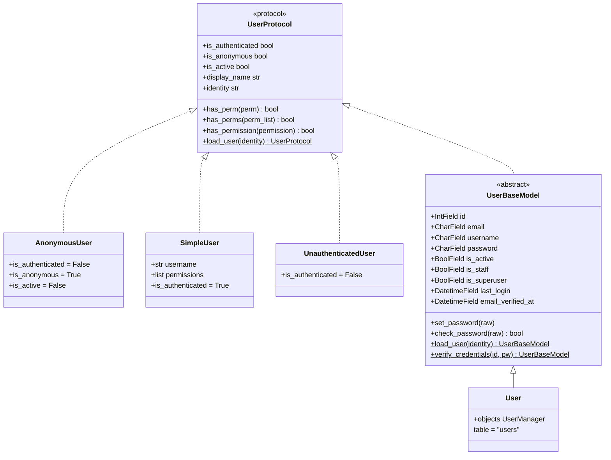
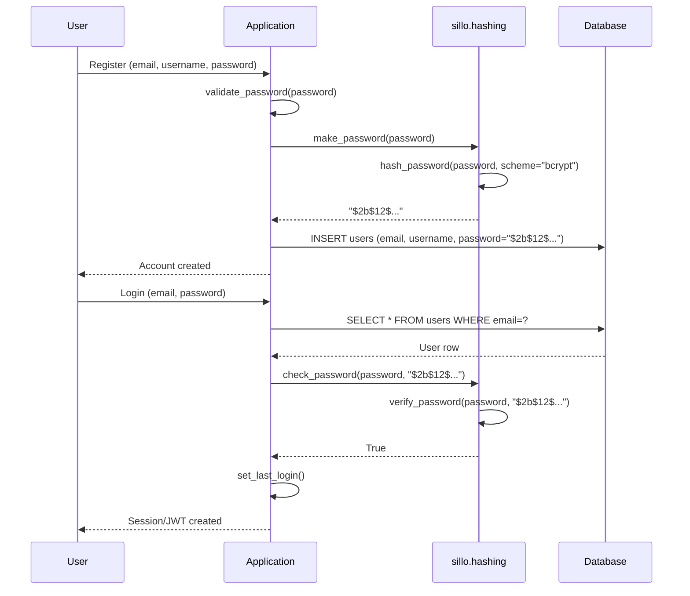

**Version:** 2026-08-11
**Audience:** Core maintainers, application developers, framework architects
**Purpose:** Document the user protocol, model hierarchy, concrete user model, manager, and management commands

---

## Overview

Sillo's user system is built on a protocol-first design: a pure Python protocol
(`UserProtocol`) defines the authentication contract, and concrete
implementations (both in-memory and database-backed) satisfy it. This lets the
authentication layer work without requiring the ORM.



---

## User Type Hierarchy

The hierarchy serves different runtime contexts:

| Type | DB Required | Purpose |
|------|-------------|---------|
| `UserProtocol` | No | Pure interface: defines the contract |
| `BaseUser` | No | Alias for `UserProtocol` |
| `AnonymousUser` | No | Sentinel for unauthenticated requests (all permissions return `False`) |
| `SimpleUser` | No | Lightweight in-memory user for testing and simple cases |
| `UnauthenticatedUser` | No | Used by `AuthenticationMiddleware` when no backend succeeds |
| `UserBaseModel` | Yes (Tortoise) | Abstract base with fields, password handling, credential verification |
| `User` | Yes (Tortoise) | Concrete model with `UserManager`, table `"users"` |

**Import paths:**

```python
# No ORM required
from sillo.users import UserProtocol, BaseUser, AnonymousUser, SimpleUser, UnauthenticatedUser

# ORM required
from sillo.users.base import UserBaseModel, User
```

The split exists because `sillo.users.protocol` defines types that need no database, while `sillo.users.base` defines Tortoise models. Importing `sillo.users.base` pulls in `tortoise`, which is why the protocol lives separately.

---

## UserProtocol: The Authentication Contract

**File:** `core/sillo/users/protocol.py` (lines 107 to 190)

```python
class UserProtocol:
    REQUIRED_FIELDS: ClassVar[list[str]] = []

    @property
    def is_authenticated(self) -> bool: return True

    @property
    def is_anonymous(self) -> bool: return not self.is_authenticated

    is_active: bool = True

    @property
    def display_name(self) -> str: raise NotImplementedError

    @property
    def identity(self) -> str: raise NotImplementedError

    def get_id(self) -> str: return self.identity
    def get_display_name(self) -> str: return self.display_name

    def has_perm(self, perm: str) -> bool: return False
    def has_perms(self, perm_list: list[str]) -> bool: return all(self.has_perm(p) for p in perm_list)
    def has_permission(self, permission: str) -> bool: raise NotImplementedError
    def has_module_perms(self, app_label: str) -> bool: return self.is_active and self.is_staff

    @classmethod
    async def load_user(cls, identity: str) -> UserProtocol | None: raise NotImplementedError

    @classmethod
    def get_email_field_name(cls) -> str: return "email"
```

**Key design points:**
- `is_authenticated` defaults to `True`: concrete classes override for
  anonymous/unauthenticated
- `has_perm` defaults to `False`: subclasses override with actual permission
  logic
- `has_permission` raises `NotImplementedError`: it's the method callers should
  use, but the base has no implementation
- `load_user` is a classmethod that loads a user by identity string: the auth
  middleware calls this
- `__eq__` and `__hash__` are based on `get_id()`, so users with the same identity are equal

### BaseUser Alias

```python
BaseUser = UserProtocol
```

Used throughout the auth layer as `type[BaseUser]`. It is the pure contract, so `BaseUser()` raises `NotImplementedError` for abstract ops.

---

## AnonymousUser: The Unauthenticated Sentinel

**File:** `core/sillo/users/protocol.py` (lines 197 to 240)

```python
class AnonymousUser:
    is_authenticated: bool = False
    is_anonymous: bool = True
    is_active: bool = False
    is_staff: bool = False
    is_superuser: bool = False
    display_name: str = ""
    identity: str = ""
```

All permission methods return `False`. All identity methods return empty
strings. This is a sentinel, not a real user. It is used in contexts where a
user object is required but no authentication has occurred.

**Note:** `AnonymousUser` is distinct from `UnauthenticatedUser`. `AnonymousUser` is a general-purpose sentinel; `UnauthenticatedUser` is specifically placed on the request scope by the authentication middleware.

---

## SimpleUser: The Lightweight Stand-In

**File:** `core/sillo/users/simple.py` (lines 4 to 34)

```python
class SimpleUser(UserProtocol):
    def __init__(self, username, permissions=None):
        self.username = username
        self.permissions = permissions or []

    @property
    def is_authenticated(self) -> bool: return True

    @property
    def display_name(self) -> str: return self.username

    @property
    def identity(self) -> str: return self.username

    def has_permission(self, permission: str) -> bool:
        return permission in self.permissions

    @classmethod
    async def load_user(cls, identity: str):
        return cls(identity, [identity])
```

Used as the default `user_model` in `AuthenticationMiddleware` and `useAuth`.
The `load_user` classmethod creates a `SimpleUser` from the identity string,
giving it a permission matching its own identity. This is useful for testing
but not for production. Production apps should use `User` or a custom
`UserBaseModel` subclass.

---

## UnauthenticatedUser: The Middleware Fallback

**File:** `core/sillo/users/simple.py` (lines 37 to 62)

```python
class UnauthenticatedUser(UserProtocol):
    @property
    def is_authenticated(self) -> bool: return False

    @property
    def display_name(self) -> str: return ""

    @property
    def identity(self) -> str: return ""

    def has_permission(self, permission: str) -> bool: return False

    @classmethod
    async def load_user(cls, identity: str):
        return cls()
```

Placed on `ctx.scope["user"]` by `AuthenticationMiddleware` when no backend succeeds. All permission checks return `False`. The `load_user` classmethod always returns a new instance (ignoring the identity).

---

## UserBaseModel: The Database-Backed Base

**File:** `core/sillo/users/base.py` (lines 42 to 178)

### Fields

| Field | Type | Default | Purpose |
|-------|------|---------|---------|
| `id` | `IntField(pk=True)` |  | Primary key |
| `email` | `CharField(255, unique=True, index=True)` |  | Email address |
| `username` | `CharField(150, unique=True, index=True)` |  | Username |
| `password` | `CharField(128)` |  | Hashed password |
| `is_active` | `BooleanField(default=True)` | `True` | Account active flag |
| `is_staff` | `BooleanField(default=False)` | `False` | Admin access flag |
| `is_superuser` | `BooleanField(default=False)` | `False` | Superuser flag |
| `last_login` | `DatetimeField(null=True, default=None)` | `None` | Last login timestamp |
| `email_verified_at` | `DatetimeField(null=True, default=None)` | `None` | Email verification timestamp |

### Properties

```python
@property
def is_authenticated(self) -> bool:
    return bool(self.is_active)

@property
def display_name(self) -> str:
    return self.username

@property
def identity(self) -> str:
    return str(self.id)
```

### Permission Checking: Superuser Bypass

```python
def has_perm(self, perm: str) -> bool:
    if self.is_superuser:
        return True
    return perm in getattr(self, "_permissions", [])

def has_permission(self, permission: str) -> bool:
    return self.has_perm(permission)
```

Superusers always pass permission checks. For non-superusers, the `_permissions` attribute (set by `PermissionMixin.load_permissions()`) is checked. If `_permissions` is not set (no `PermissionMixin`), all permission checks return `False`.

### Password Handling

```python
def set_password(self, raw_password: str) -> None:
    self.password = make_password(raw_password)

def check_password(self, raw_password: str) -> bool:
    return check_password(raw_password, self.password)

def set_unusable_password(self) -> None:
    self.password = UNUSABLE_PASSWORD_PREFIX  # "!"

def has_usable_password(self) -> bool:
    return is_password_usable(self.password)
```

`set_password` hashes the raw password via `make_password()` from `sillo.users.protocol`, which delegates to `sillo.hashing.hash_password`. `check_password` verifies against any supported algorithm (auto-detected from hash prefix).

### load_user

```python
@classmethod
async def load_user(cls, identity: str) -> UserBaseModel | None:
    try:
        uid = int(identity)
    except (TypeError, ValueError):
        return None
    user = await cls.filter(id=uid, is_active=True).first()
    if user is not None and hasattr(user, "load_permissions"):
        await user.load_permissions()
    return user
```

Loads a user by integer ID. If the user model has `PermissionMixin`, `load_permissions()` is called automatically to populate the in-memory permission cache.

### verify_credentials

```python
@classmethod
async def verify_credentials(cls, identifier: str, password: str) -> UserBaseModel | None:
    manager = UserManager()
    manager.model = cls
    user = await manager.get_by_natural_key(identifier)
    if user is None or not getattr(user, "is_active", False):
        return None
    if not user.check_password(password):
        return None
    await user.set_last_login()
    if hasattr(user, "load_permissions"):
        await user.load_permissions()
    return user
```

Authenticates by email or username + password. On success, stamps `last_login` and loads permissions. Returns `None` on failure.

---

## User: The Concrete Model

**File:** `core/sillo/users/base.py` (lines 180 to 193)

```python
class User(UserBaseModel):
    objects = UserManager()

    class Meta:
        table = "users"
```

The minimal concrete user model. Attaches `UserManager` as `objects` and sets
the table name. Deliberately minimal: subclass to add profile fields,
relationships, or override behavior.

---

## UserManager: The Query Interface

**File:** `core/sillo/users/managers.py`

```python
class UserManager:
    model = None

    def contribute_to_class(self, model, name: str):
        self.model = model
```

| Method | Purpose |
|--------|---------|
| `create_user(email, username, password, **extra_fields)` | Creates a user. Sets unusable password if no password provided. |
| `create_superuser(email, username, password, **extra_fields)` | Creates a superuser. Validates password policy. Sets `is_staff`, `is_superuser`, `is_active`. |
| `get_by_id(user_id)` | Looks up by integer ID, filtered to `is_active=True`. |
| `get_by_email(email)` | Looks up by email, filtered to `is_active=True`. |
| `get_by_username(username)` | Looks up by username, filtered to `is_active=True`. |
| `get_by_natural_key(identifier)` | Looks up by email first, then username. Used by auth backends. |

**`contribute_to_class`** is called by the Tortoise ORM metaclass when the manager is assigned to a model. It sets `self.model` so the manager knows which model it operates on.

**`create_superuser`** validates the password against `validate_password()` from `sillo.hashing` before creating the user. This enforces the password policy (minimum 8 characters, uppercase, lowercase, digit, special character).

---

## Management Commands

**File:** `core/sillo/users/commands.py`

Plain async functions that operate on user models. They take the model explicitly rather than reaching for a global, so an application with a custom `User` subclass is served by the same functions.

| Function | Purpose |
|----------|---------|
| `create_user(email, username, password, model, **fields)` | Creates an ordinary user. Checks for duplicate email/username. |
| `create_admin(email, username, password, model, **fields)` | Creates a user with `is_staff=True`. |
| `find_user(identifier, model, include_inactive)` | Looks up by email or username. Can include deactivated accounts. |
| `set_password(identifier, password, model)` | Changes a user's password. |
| `set_active(identifier, active, model)` | Enables or disables an account. |
| `set_staff(identifier, staff, model)` | Grants or withdraws admin access. |
| `list_users(model, limit, offset, staff_only)` | Lists users, newest first. |

**Usage:**

```python
from sillo.users.commands import create_admin

user = await create_admin("ada@example.com", "ada", "Str0ng!pass")
```

Every function assumes the ORM is already initialized (`setup_record` during application startup, or `Tortoise.init` in a script).

### Duplicate Prevention

`_refuse_duplicates()` checks for existing email/username before writing, raising `ValueError` with a human-readable message rather than letting the database constraint raise an integrity error.

### find_user Behavior

`find_user` queries the model directly rather than through `objects.get_by_email`, which filters on `is_active`. This is intentional: administering an account means reaching deactivated accounts too. The `include_inactive` parameter defaults to `True`.

---

## Console Commands

**File:** `core/sillo/users/console.py`

CLI commands that wrap the management functions with names, arguments, output formatting, and password prompting.

| Command | Name | Purpose |
|---------|------|---------|
| `Create` | `user:create` | Create a user (with optional `--admin` flag) |
| `CreateAdmin` | `user:admin` | Create an administrator |
| `ListUsers` | `user:list` | List users, newest first |
| `Show` | `user:show` | Show one account |
| `SetPassword` | `user:password` | Change a password |
| `SetActive` | `user:active` | Activate or deactivate an account |
| `SetStaff` | `user:staff` | Grant or revoke admin access |

### Password Reading

```python
def read_password(self, question="Password", confirm=True) -> str:
    from_environment = os.environ.get(PASSWORD_VARIABLE)  # "SILLO_PASSWORD"
    if from_environment:
        return from_environment
    if not self.prompt.interactive:
        self.fail(f"No terminal to read a password from. Set {PASSWORD_VARIABLE} instead.")
    return self.secret(question, confirm=confirm)
```

Passwords are read from a hidden prompt in interactive terminals, or from the `SILLO_PASSWORD` environment variable in non-interactive contexts (CI, scripts).

### Registering Commands

```python
from sillo.console import Console
from sillo.users.console import user_commands

console = Console(prog="python tools.py")
console.add_many(user_commands(context=database))
```

The `context` parameter is an async context manager (or callable returning one) opened around every command. The ORM must be initialized before these operate on models.

The `only` parameter filters which commands to include:

```python
user_commands(context=database, only=["user:admin", "user:list"])
```

---

## Password Handling

**File:** `core/sillo/users/protocol.py` (lines 33 to 104)

### make_password

```python
def make_password(raw_password=None, scheme=None, **kwargs) -> str:
    if raw_password is None:
        return UNUSABLE_PASSWORD_PREFIX + secrets.token_hex(40)
    return hash_password(raw_password, scheme=scheme, **kwargs)
```

- If `raw_password` is `None`, creates an unusable password marker (`"!" + 80 hex chars`)
- Otherwise delegates to `sillo.hashing.hash_password`
- The `scheme` parameter selects the algorithm (bcrypt, argon2, scrypt, pbkdf2)

### check_password

```python
def check_password(raw_password, encoded) -> bool:
    if raw_password is None or not raw_password:
        return False
    if not encoded or encoded.startswith(UNUSABLE_PASSWORD_PREFIX):
        return False
    try:
        return verify_password(raw_password, encoded)
    except Exception:
        return False
```

- Returns `False` for empty/unusable passwords
- Auto-detects algorithm from hash prefix (`$2b$` for bcrypt, `$argon2$` for argon2, etc.)
- Catches all exceptions and returns `False` (malformed hashes, unsupported algorithms)

---

## Design Decisions

### Why protocol-first?

The authentication contract (`UserProtocol`) has no database dependency. This lets the auth middleware, route gates, and exception handlers work without importing Tortoise ORM. Only code that actually queries users needs the ORM.

### Why split `protocol.py` and `base.py`?

`protocol.py` defines types that need no database. `base.py` defines Tortoise models. Importing `sillo` (which reaches the exception handler, which reaches the auth layer) must not require the `record` extra. The split keeps the import tree clean.

### Why `UnauthenticatedUser` instead of `None`?

Setting `ctx.scope["user"]` to `None` would require every handler to null-check before accessing `user.is_authenticated`. `UnauthenticatedUser` satisfies the protocol with `is_authenticated = False`, so handlers can always call `ctx.user.is_authenticated` safely.

### Why `SimpleUser` as the default?

`SimpleUser` is the default `user_model` because it has no database dependency. It works immediately for testing and prototyping. Production apps should replace it with `User` or a custom `UserBaseModel` subclass.

### Why `find_user` includes inactive by default?

Administering users means reaching deactivated accounts. A deactivated user you cannot find is a user you can never reactivate. The `include_inactive=True` default is intentional.

### Why `UserManager.get_by_natural_key` tries email first?

Email is the more unique identifier (unique constraint + index). Username is tried second as a fallback. This order matches the most common authentication flow (email + password).

---

## Source Map

| Component | File | Lines |
|-----------|------|-------|
| `UserProtocol` | `core/sillo/users/protocol.py` | 107-190 |
| `BaseUser` alias | `core/sillo/users/protocol.py` | 194 |
| `AnonymousUser` | `core/sillo/users/protocol.py` | 197-240 |
| `make_password` | `core/sillo/users/protocol.py` | 33-63 |
| `check_password` | `core/sillo/users/protocol.py` | 66-104 |
| `SimpleUser` | `core/sillo/users/simple.py` | 4-34 |
| `UnauthenticatedUser` | `core/sillo/users/simple.py` | 37-62 |
| `UserBaseModel` | `core/sillo/users/base.py` | 42-178 |
| `User` | `core/sillo/users/base.py` | 180-193 |
| `UserManager` | `core/sillo/users/managers.py` | 6-97 |
| `create_user` | `core/sillo/users/commands.py` | 40-62 |
| `create_admin` | `core/sillo/users/commands.py` | 65-88 |
| `find_user` | `core/sillo/users/commands.py` | 106-136 |
| `set_password` | `core/sillo/users/commands.py` | 139-157 |
| `set_active` | `core/sillo/users/commands.py` | 160-180 |
| `set_staff` | `core/sillo/users/commands.py` | 183-200 |
| `list_users` | `core/sillo/users/commands.py` | 203-217 |
| `Create` command | `core/sillo/users/console.py` | 144-177 |
| `CreateAdmin` command | `core/sillo/users/console.py` | 179-207 |
| `ListUsers` command | `core/sillo/users/console.py` | 210-234 |
| `Show` command | `core/sillo/users/console.py` | 237-262 |
| `SetPassword` command | `core/sillo/users/console.py` | 265-285 |
| `SetActive` command | `core/sillo/users/console.py` | 288-314 |
| `SetStaff` command | `core/sillo/users/console.py` | 317-337 |
| `user_commands` | `core/sillo/users/console.py` | 352-389 |

---

## Implementation Deep Dive

### UserProtocol: Complete Interface Contract

The `UserProtocol` at `core/sillo/users/protocol.py` defines every method and property that the authentication system depends on. Here is the complete interface with implementation notes:

```python
class UserProtocol:
    # Class variable — list of field names required by the protocol.
    # Empty by default; subclasses can declare required fields.
    REQUIRED_FIELDS: ClassVar[list[str]] = []

    @property
    def is_authenticated(self) -> bool:
        """Default: True. Override to return False for anonymous users."""
        return True

    @property
    def is_anonymous(self) -> bool:
        """Derived from is_authenticated — never override directly."""
        return not self.is_authenticated

    # Instance attribute — set by concrete models.
    is_active: bool = True

    @property
    def display_name(self) -> str:
        """Human-readable name. Must be overridden."""
        raise NotImplementedError

    @property
    def identity(self) -> str:
        """Unique identifier string. Must be overridden."""
        raise NotImplementedError

    def get_id(self) -> str:
        """Alias for identity — used by __eq__ and __hash__."""
        return self.identity

    def get_display_name(self) -> str:
        """Alias for display_name — used by __str__."""
        return self.display_name

    def has_perm(self, perm: str) -> bool:
        """Default: False. Override with actual permission logic."""
        return False

    def has_perms(self, perm_list: list[str]) -> bool:
        """Check multiple permissions — all must pass."""
        return all(self.has_perm(p) for p in perm_list)

    def has_permission(self, permission: str) -> bool:
        """Primary permission check — must be overridden."""
        raise NotImplementedError

    def has_module_perms(self, app_label: str) -> bool:
        """Django compatibility — checks is_active and is_staff."""
        return self.is_active and self.is_staff

    @classmethod
    async def load_user(cls, identity: str) -> UserProtocol | None:
        """Load a user by identity string. Must be overridden."""
        raise NotImplementedError

    @classmethod
    def get_email_field_name(cls) -> str:
        """Returns 'email' by default. Override for custom field names."""
        return "email"

    def __str__(self) -> str:
        return self.get_display_name()

    def __repr__(self) -> str:
        return f"<{self.__class__.__name__}: {self}>"

    def __eq__(self, other: object) -> bool:
        if not isinstance(other, UserProtocol):
            return NotImplemented
        return self.get_id() == other.get_id()

    def __hash__(self) -> int:
        return hash(self.get_id())
```

### AnonymousUser: Complete Implementation

```python
class AnonymousUser:
    """The unauthenticated user sentinel.

    All attributes are class-level constants — instances share them.
    All permission methods return False.
    All identity methods return empty strings.
    """
    is_authenticated: bool = False
    is_anonymous: bool = True
    is_active: bool = False
    is_staff: bool = False
    is_superuser: bool = False
    display_name: str = ""
    identity: str = ""

    def get_id(self) -> str: return ""
    def get_display_name(self) -> str: return ""
    def has_perm(self, perm: str) -> bool: return False
    def has_perms(self, perm_list: list[str]) -> bool: return False
    def has_module_perms(self, app_label: str) -> bool: return False

    def __str__(self) -> str: return "AnonymousUser"

    def __eq__(self, other: object) -> bool:
        if not isinstance(other, AnonymousUser):
            return NotImplemented
        return True  # All AnonymousUsers are equal

    def __hash__(self) -> int:
        return 0  # Constant hash — all instances hash the same
```

### SimpleUser: Complete Implementation

```python
class SimpleUser(UserProtocol):
    """Lightweight in-memory user for testing and simple cases.

    The load_user classmethod creates a SimpleUser from the identity
    string, giving it a permission matching its own identity. This
    is useful for testing but not for production.
    """

    def __init__(self, username: str, permissions: list[str] | None = None):
        self.username = username
        self.permissions = permissions or []

    @property
    def is_authenticated(self) -> bool: return True

    @property
    def display_name(self) -> str: return self.username

    @property
    def identity(self) -> str: return self.username

    def has_permission(self, permission: str) -> bool:
        return permission in self.permissions

    @classmethod
    async def load_user(cls, identity: str):
        # Creates a user with a permission matching its own identity
        return cls(identity, [identity])
```

### UnauthenticatedUser: Complete Implementation

```python
class UnauthenticatedUser(UserProtocol):
    """Placed on ctx.scope["user"] when no backend succeeds.

    All permission checks return False.
    The load_user classmethod always returns a new instance.
    """

    @property
    def is_authenticated(self) -> bool: return False

    @property
    def display_name(self) -> str: return ""

    @property
    def identity(self) -> str: return ""

    def has_permission(self, permission: str) -> bool: return False

    @classmethod
    async def load_user(cls, identity: str):
        return cls()
```

### UserBaseModel: Complete Field Reference

| Field | Type | Constraints | Default | Purpose |
|-------|------|-------------|---------|---------|
| `id` | `IntField` | Primary key | Auto | User ID |
| `email` | `CharField(255)` | Unique, indexed |  | Email address |
| `username` | `CharField(150)` | Unique, indexed |  | Username |
| `password` | `CharField(128)` |  |  | Hashed password |
| `is_active` | `BooleanField` |  | `True` | Account active |
| `is_staff` | `BooleanField` |  | `False` | Admin access |
| `is_superuser` | `BooleanField` |  | `False` | Superuser |
| `last_login` | `DatetimeField` | Nullable | `None` | Last login |
| `email_verified_at` | `DatetimeField` | Nullable | `None` | Email verification |

### UserBaseModel: Method Reference

#### `set_password(raw_password)`

```python
def set_password(self, raw_password: str) -> None:
    self.password = make_password(raw_password)
```

Hashes the raw password using `sillo.hashing.hash_password`. The hash is stored in the `password` field. The raw password is never stored.

#### `check_password(raw_password)`

```python
def check_password(self, raw_password: str) -> bool:
    return check_password(raw_password, self.password)
```

Verifies the raw password against the stored hash. Auto-detects the algorithm from the hash prefix. Returns `False` for unusable passwords.

#### `set_unusable_password()`

```python
def set_unusable_password(self) -> None:
    self.password = UNUSABLE_PASSWORD_PREFIX  # "!"
```

Marks the password as unusable. The user cannot log in with a password. Used for SSO-only accounts or invite flows.

#### `has_usable_password()`

```python
def has_usable_password(self) -> bool:
    return is_password_usable(self.password)
```

Returns `True` if the password is usable (not marked with `UNUSABLE_PASSWORD_PREFIX`).

#### `set_last_login()`

```python
async def set_last_login(self) -> None:
    self.last_login = datetime.now(timezone.utc)
    await self.save(update_fields=["last_login"])
```

Updates only the `last_login` field (partial save for efficiency).

#### `mark_email_verified()`

```python
async def mark_email_verified(self) -> None:
    self.email_verified_at = datetime.now(timezone.utc)
    await self.save(update_fields=["email_verified_at"])
```

#### `load_user(identity)`

```python
@classmethod
async def load_user(cls, identity: str) -> UserBaseModel | None:
    try:
        uid = int(identity)
    except (TypeError, ValueError):
        return None
    user = await cls.filter(id=uid, is_active=True).first()
    if user is not None and hasattr(user, "load_permissions"):
        await user.load_permissions()
    return user
```

- Converts identity to integer (returns `None` if not a valid integer)
- Filters to `is_active=True`
- Calls `load_permissions()` if `PermissionMixin` is present
- Returns `None` if user not found or inactive

#### `verify_credentials(identifier, password)`

```python
@classmethod
async def verify_credentials(cls, identifier: str, password: str) -> UserBaseModel | None:
    manager = UserManager()
    manager.model = cls
    user = await manager.get_by_natural_key(identifier)
    if user is None or not getattr(user, "is_active", False):
        return None
    if not user.check_password(password):
        return None
    await user.set_last_login()
    if hasattr(user, "load_permissions"):
        await user.load_permissions()
    return user
```

- Looks up by email or username
- Checks `is_active`
- Verifies password
- Stamps `last_login`
- Loads permissions
- Returns `None` on any failure

### UserManager: Complete Method Reference

#### `create_user(email, username, password, **extra_fields)`

```python
async def create_user(self, email, username, password=None, **extra_fields):
    extra_fields.setdefault("is_active", True)
    user = self.model(email=email, username=username, **extra_fields)
    if password:
        user.set_password(password)
    else:
        user.set_unusable_password()
    await user.save()
    return user
```

- Sets `is_active=True` by default
- If no password provided, sets unusable password (for invite/SSO flows)
- Saves to database

#### `create_superuser(email, username, password, **extra_fields)`

```python
async def create_superuser(self, email, username, password, **extra_fields):
    extra_fields.setdefault("is_staff", True)
    extra_fields.setdefault("is_superuser", True)
    extra_fields.setdefault("is_active", True)

    if not password:
        raise ValueError("Superuser must have a password.")

    errors = validate_password(password)
    if errors:
        raise ValueError(" ".join(errors))

    return await self.create_user(email=email, username=username, password=password, **extra_fields)
```

- Sets `is_staff`, `is_superuser`, `is_active` by default
- Requires a password
- Validates password against policy (8+ chars, uppercase, lowercase, digit, special char)

#### `get_by_natural_key(identifier)`

```python
async def get_by_natural_key(self, identifier: str):
    user = await self.get_by_email(identifier)
    if user is None:
        user = await self.get_by_username(identifier)
    return user
```

Tries email first, then username. Used by `verify_credentials` and auth backends.

### Management Commands: Complete Reference

#### `create_user`

```python
async def create_user(email, username, password, *, model=None, **fields) -> UserModel:
    user_model = _resolve(model)
    await _refuse_duplicates(user_model, email, username)
    return await user_model.objects.create_user(
        email=email, username=username, password=password, **fields
    )
```

#### `create_admin`

```python
async def create_admin(email, username, password, *, model=None, **fields) -> UserModel:
    user_model = _resolve(model)
    await _refuse_duplicates(user_model, email, username)
    return await user_model.objects.create_superuser(
        email=email, username=username, password=password, **fields
    )
```

#### `find_user`

```python
async def find_user(identifier, *, model=None, include_inactive=True) -> UserModel | None:
    user_model = _resolve(model)
    query = user_model.filter(email=identifier)
    if not include_inactive:
        query = query.filter(is_active=True)
    found = await query.first()
    if found is not None:
        return found
    query = user_model.filter(username=identifier)
    if not include_inactive:
        query = query.filter(is_active=True)
    return await query.first()
```

#### `set_password`

```python
async def set_password(identifier, password, *, model=None) -> UserModel:
    user = await _require(identifier, model)
    user.set_password(password)
    await user.save()
    return user
```

#### `set_active`

```python
async def set_active(identifier, active, *, model=None) -> UserModel:
    user = await _require(identifier, model)
    user.is_active = active
    await user.save()
    return user
```

#### `set_staff`

```python
async def set_staff(identifier, staff, *, model=None) -> UserModel:
    user = await _require(identifier, model)
    user.is_staff = staff
    await user.save()
    return user
```

#### `list_users`

```python
async def list_users(*, model=None, limit=50, offset=0, staff_only=False) -> list[UserModel]:
    user_model = _resolve(model)
    query = user_model.filter(is_staff=True) if staff_only else user_model.all()
    return await query.order_by("-id").offset(offset).limit(limit)
```

### Console Commands: Complete Reference

#### `user:create`

```
$ python tools.py user:create user@example.com myuser
Password: ********
Confirm: ********
✓ Created user@example.com.

$ python tools.py user:create admin@example.com admin --admin
Password: ********
Confirm: ********
✓ Created admin@example.com.
  Sign in at /admin/
```

#### `user:admin`

```
$ python tools.py user:admin admin@example.com
Username. Defaults to the mailbox: admin
Password: ********
Confirm: ********
✓ Created admin@example.com.
  Sign in at /admin/
```

#### `user:list`

```
$ python tools.py user:list
  id  email               username  admin  active
  42  admin@example.com   admin     yes    yes
  41  user@example.com    user             yes

  2 shown

$ python tools.py user:list --staff --limit 10
  id  email               username  admin  active
  42  admin@example.com   admin     yes    yes

  1 shown
```

#### `user:show`

```
$ python tools.py user:show user@example.com
  id       41
  email    user@example.com
  username user
  admin    no
  active   yes
```

#### `user:password`

```
$ python tools.py user:password user@example.com
New password: ********
Confirm: ********
✓ Password changed.
```

#### `user:active`

```
$ python tools.py user:active user@example.com
✓ user@example.com is now active.

$ python tools.py user:active user@example.com --off
✓ user@example.com is now deactivated.
```

#### `user:staff`

```
$ python tools.py user:staff user@example.com
✓ user@example.com now has access.

$ python tools.py user:staff user@example.com --revoke
✓ user@example.com no longer has access.
```

### Password Flow Diagram



### Custom User Model Pattern

```python
from sillo.users.base import UserBaseModel
from sillo.users.managers import UserManager
from sillo.permissions.mixins import PermissionMixin
from sillo.auth.jwt_auth.mixins import JWTUserMixin
from sillo.auth.session_auth.mixins import SessionUserMixin

class Account(PermissionMixin, JWTUserMixin, SessionUserMixin, UserBaseModel):
    """Custom user model with permissions, JWT, and session support."""

    # Additional fields
    avatar_url = fields.CharField(max_length=500, null=True, default=None)
    bio = fields.TextField(null=True, default=None)
    timezone = fields.CharField(max_length=50, default="UTC")

    objects = UserManager()

    class Meta:
        table = "accounts"

    @property
    def display_name(self) -> str:
        return self.username

    # has_permission is inherited from PermissionMixin
    # issue_token_pair is inherited from JWTUserMixin
    # create_session is inherited from SessionUserMixin
```

### Admin Panel Integration

The admin panel at `core/sillo/admin/` uses its own auth system:

```python
# core/sillo/admin/auth.py
class SessionAuth(AuthBackend):
    @staticmethod
    def may_enter(user) -> bool:
        return user.is_staff or user.is_superuser

    async def current_user(self, ctx: HttpContext):
        # Loads from session, checks may_enter
        ...

    async def login(self, ctx: HttpContext, username, password):
        # Uses verify_credentials, calls sillo_login
        ...
```

The admin requires `is_staff=True` or `is_superuser=True`. The `create_admin` command and `user:create --admin` command both set `is_staff=True`.
