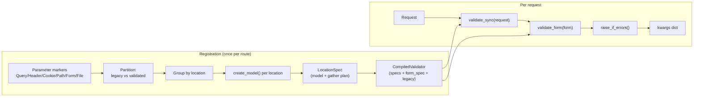
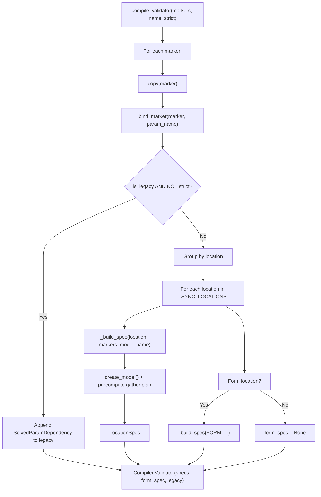
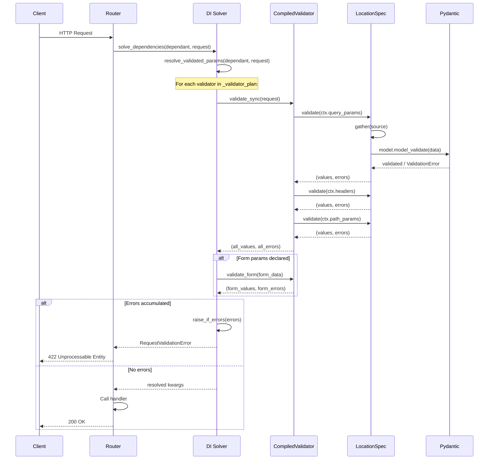
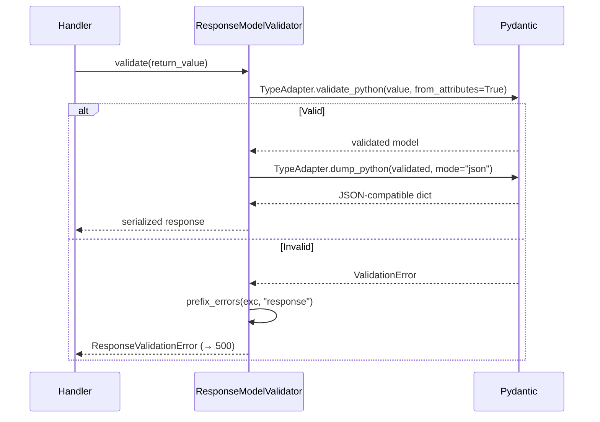
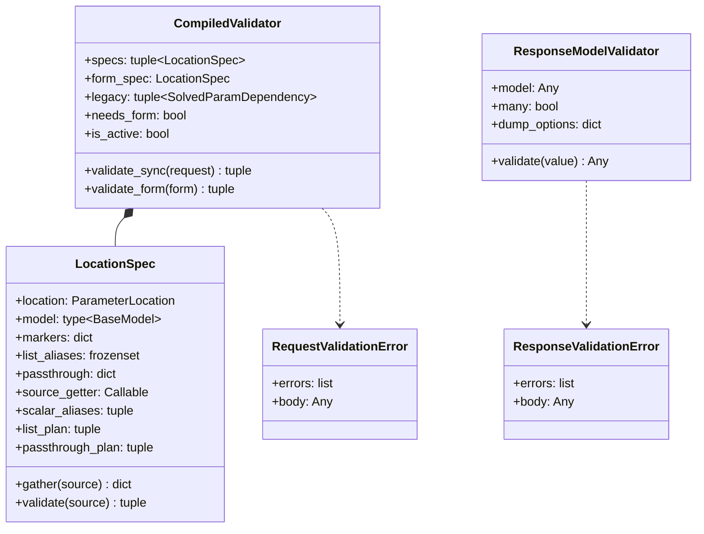

> **Source files:**
> - `core/sillo/validation/compiler.py`: `LocationSpec`, `CompiledValidator`, `compile_validator`, `ResponseModelValidator`, `raise_if_errors`, `_build_spec`
> - `core/sillo/validation/errors.py`: `prefix_errors`, `RequestValidationError`, `ResponseValidationError`
> - `core/sillo/validation/fields.py`: `ParameterExtractor`, `ParameterLocation`, `bind_marker`
> - `core/sillo/validation/__init__.py`, Package docstring and public re-exports
> - `core/sillo/core/dependencies/base.py`, `resolve_validated_params` (runtime caller)

---

## 13.1  Architecture Overview

Sillo's validation system converts every declared parameter into a Pydantic
model **once at registration time**, then validates all parameters of a given
location in a single `model_validate()` call per request. This gives you:

- **All errors at once**: a client with a bad query param and a malformed body
  sees both failures in one 422 response
- **Schema = validation**: the same Pydantic model generates the OpenAPI
  document and enforces constraints at runtime, so they cannot drift
- **Zero introspection per request.** Everything is compiled up front



---

## 13.2  `LocationSpec`

```python
# core/sillo/validation/compiler.py:73-204
@dataclass(slots=True)
class LocationSpec:
    location: ParameterLocation
    model: type[BaseModel]
    markers: dict[str, ParameterExtractor] = field(default_factory=dict)
    list_aliases: frozenset = frozenset()
    passthrough: dict[str, str] = field(default_factory=dict)
    source_getter: Callable[[Any], Any] | None = None
    scalar_aliases: tuple[str, ...] = ()
    list_plan: tuple[str, ...] = ()
    passthrough_plan: tuple[tuple[str, str, Any, bool], ...] = ()
    location_value: str = ""
```

### 13.2.1  Field Reference

| Field              | Type                                      | Description |
|--------------------|-------------------------------------------|-------------|
| `location`         | `ParameterLocation`                       | Which part of the request this spec reads from. |
| `model`            | `type[BaseModel]`                         | Synthetic Pydantic model whose fields are the parameters. |
| `markers`          | `dict[str, ParameterExtractor]`           | Handler parameter name → marker mapping. |
| `list_aliases`     | `frozenset`                               | Wire names that must be gathered with `getlist`. |
| `passthrough`      | `dict[str, str]`                          | Handler param name → wire name for `File` markers that bypass Pydantic. |
| `source_getter`    | `Callable \| None`                        | C-level `attrgetter` for the request attribute (e.g., `ctx.query_params`). |
| `scalar_aliases`   | `tuple[str, ...]`                         | Wire names for scalar (non-list) fields. |
| `list_plan`        | `tuple[str, ...]`                         | Wire names for sequence fields (need `getlist`). |
| `passthrough_plan` | `tuple[tuple[str, str, Any, bool], ...]`  | `(param_name, alias, default, is_required)` for file passthrough. |
| `location_value`   | `str`                                     | `self.location.value`, cached to avoid enum lookup on error path. |

### 13.2.2  Pre-Computed Source Getters

```python
# compiler.py:47-52
_SOURCE_GETTERS = {
    ParameterLocation.QUERY: attrgetter("query_params"),
    ParameterLocation.HEADER: attrgetter("headers"),
    ParameterLocation.COOKIE: attrgetter("cookies"),
    ParameterLocation.PATH: attrgetter("path_params"),
}
```

These are C-level `operator.attrgetter` objects resolved once at registration.
At request time, `spec.source_getter(request)` is a single C function call
with no Python-level branching.

### 13.2.3  Gathering: `LocationSpec.gather()`

```python
# compiler.py:115-155
def gather(self, source: Any) -> dict[str, Any]:
    data: dict[str, Any] = {}
    if source is None:
        return data

    get = source.get
    for alias in self.scalar_aliases:
        value = get(alias)
        if value is not None:
            data[alias] = value

    if self.list_plan:
        getlist = getattr(source, "getlist", None)
        for alias in self.list_plan:
            if getlist is None:
                value = get(alias)
                if value is not None:
                    data[alias] = value
                continue
            values = getlist(alias)
            if values:
                data[alias] = values

    return data
```

**Design decisions:**

1. **Absent keys are omitted** rather than set to `None`. This lets Pydantic
   distinguish "not supplied" (apply default / report missing) from "explicitly
   null".
2. **`getlist` fallback**: if the source mapping lacks `getlist` (unlikely but
   possible with custom request objects), it falls back to `get`.
3. **Pre-computed alias tuples**: the hot path iterates tuples built at
   registration rather than re-deriving aliases from markers.

### 13.2.4  Validation: `LocationSpec.validate()`

```python
# compiler.py:157-204
def validate(self, source: Any) -> tuple[dict[str, Any], Any]:
    try:
        validated = self.model.model_validate(self.gather(source))
    except ValidationError as exc:
        return {}, prefix_errors(exc, self.location_value)

    values = dict(validated.__dict__)

    if not self.passthrough_plan:
        return values, ()

    missing = None
    for param_name, alias, default, required in self.passthrough_plan:
        found = source.get(alias) if source is not None else None
        if found is not None:
            values[param_name] = found
        elif required:
            if missing is None:
                missing = []
            missing.append((alias,))
        else:
            values[param_name] = default

    if missing:
        return {}, [
            {"loc": [self.location_value, alias], "msg": "Field required", "type": "missing"}
            for (alias,) in missing
        ]

    return values, ()
```

Returns `(values, errors)`, on success, `errors` is empty; on failure, `values`
is empty and every failure is reported.

**Passthrough handling:** File parameters bypass Pydantic validation. They are
extracted directly from the source mapping and appended to the values dict
after Pydantic has validated the remaining fields.

---

## 13.3  `CompiledValidator`

```python
# compiler.py:207-293
@dataclass(slots=True)
class CompiledValidator:
    specs: tuple[LocationSpec, ...] = ()
    form_spec: LocationSpec | None = None
    legacy: tuple[SolvedParamDependency, ...] = ()
```

### 13.3.1  Field Reference

| Field       | Type                                | Description |
|-------------|-------------------------------------|-------------|
| `specs`     | `tuple[LocationSpec, ...]`          | Per-location models for path, query, header, cookie. |
| `form_spec` | `LocationSpec \| None`              | Model for Form/File parameters. `None` when none declared. |
| `legacy`    | `tuple[SolvedParamDependency, ...]` | Markers on the pre-Pydantic extraction path. |

### 13.3.2  Properties

```python
@property
def needs_form(self) -> bool:
    return self.form_spec is not None

@property
def is_active(self) -> bool:
    return bool(self.specs) or self.needs_form
```

- `needs_form`: whether the route must parse a form body
- `is_active`: whether this validator has any validated-mode work. Routes using
  only legacy markers compile to an inactive validator and skip the Pydantic
  path entirely.

### 13.3.3  Sync Validation: `validate_sync()`

```python
# compiler.py:254-278
from sillo import HttpContext

def validate_sync(self, ctx: HttpContext) -> tuple[dict[str, Any], list[dict[str, Any]]]:
    values: dict[str, Any] = {}
    errors: list[dict[str, Any]] = []

    for spec in self.specs:
        if spec.source_getter is None:
            continue
        spec_values, spec_errors = spec.validate(spec.source_getter(ctx))
        values.update(spec_values)
        if spec_errors:
            errors.extend(spec_errors)

    return values, errors
```

Validates every synchronously-available location (path, query, header, cookie)
in a single pass. Errors from all locations are accumulated.

### 13.3.4  Form Validation: `validate_form()`

```python
# compiler.py:280-293
def validate_form(self, form: Any) -> tuple[dict[str, Any], list[dict[str, Any]]]:
    if self.form_spec is None:
        return {}, []
    return self.form_spec.validate(form)
```

Validates parsed form data against the route's form declarations. Form data
is read through the request's own caching accessor, so declaring form fields
across several dependencies parses the payload only once.

---

## 13.4  `compile_validator()`

```python
# compiler.py:371-437
def compile_validator(
    markers: list[tuple[str, ParameterExtractor]],
    *,
    name: str = "Route",
    strict: bool = False,
) -> CompiledValidator:
```

This is the compilation entry point, called once per route at registration.
It partitions markers, groups them by location, and builds synthetic Pydantic
models.

### 13.4.1  Compilation Flow



### 13.4.2  Copy-on-Bind

```python
# compiler.py:400-405
for param_name, marker in markers:
    marker = copy(marker)
    bind_marker(marker, param_name)
```

Markers are copied before binding. A marker held in a module constant and
reused across handlers would otherwise keep whichever parameter name bound
it first.

### 13.4.3  Location Ordering

```python
# compiler.py:36-41
_SYNC_LOCATIONS = (
    ParameterLocation.PATH,
    ParameterLocation.QUERY,
    ParameterLocation.HEADER,
    ParameterLocation.COOKIE,
)
```

Sync locations are validated in this fixed order. Form is handled separately
because it requires awaiting the request body.

### 13.4.4  `_build_spec()`: Model Construction

```python
# compiler.py:296-368
def _build_spec(
    location: ParameterLocation,
    markers: list[tuple[str, ParameterExtractor]],
    model_name: str,
) -> LocationSpec:
```

For each location:

1. **Collect field definitions**: `marker.resolve_type()` +
   `marker.to_field_info()`
2. **Detect sequence types**: fields that need `getlist`
3. **Separate passthroughs.** `File` markers bypass Pydantic
4. **Build model**: `pydantic.create_model(model_name,
   __config__=_MODEL_CONFIG, **definitions)`
5. **Precompute gather plan**: scalar aliases, list plan, passthrough plan

```python
# compiler.py:32-33
_MODEL_CONFIG = ConfigDict(arbitrary_types_allowed=True, populate_by_name=True)
```

`arbitrary_types_allowed` is needed because `UploadedFile` is not a native
Pydantic type. `populate_by_name` allows both the field name and alias to be
used when constructing model instances.

---

## 13.5  Strict Mode

```python
# compiler.py:407-409
if marker.is_legacy and not strict:
    legacy.append(SolvedParamDependency(marker, param_name))
    continue
```

When `strict=True`, the `is_legacy` check is bypassed and **all** markers
are compiled onto the Pydantic path. This is the application-level opt-in:

```python
app = SilloApp(strict_validation=True)
```

### 13.5.1  Effect on Error Responses

| Scenario                | Legacy (default)          | Strict                    |
|-------------------------|---------------------------|---------------------------|
| Missing required param  | `ValueError` → 500        | `ValidationError` → 422   |
| Bad type coercion       | `ValueError` → 500        | `ValidationError` → 422   |
| Invalid enum value      | Returns raw string        | `ValidationError` → 422   |

### 13.5.2  Per-Parameter Opt-In

Individual markers opt into validation by supplying `type=` or any constraint,
regardless of the global strict setting:

```python
# This marker is validated even without strict mode
page = Query(1, type=int, ge=1)

# This marker is legacy unless strict mode is on
page = Query(1)
```

---

## 13.6  `ResponseModelValidator`

```python
# compiler.py:440-520
class ResponseModelValidator:
    __slots__ = ("_adapter", "dump_options", "many", "model")

    def __init__(
        self,
        model: Any,
        *,
        many: bool = False,
        exclude_none: bool = False,
        exclude_unset: bool = False,
        exclude_defaults: bool = False,
        by_alias: bool = True,
    ) -> None:
```

### 13.6.1  Purpose

`ResponseModelValidator` validates and shapes a handler's return value against
a declared response model. It:

1. **Validates** the return value against the model
2. **Drops** undeclared fields
3. **Coerces** declared fields
4. **Serializes** to JSON-compatible primitives

### 13.6.2  Implementation

```python
# compiler.py:479-487
from pydantic import TypeAdapter

self.model = model
self.many = many
self.dump_options = { ... }
self._adapter = TypeAdapter(list[model] if many else model)
```

Uses `pydantic.TypeAdapter` for validation (handles both single models and
lists).

### 13.6.3  Validation Method

```python
# compiler.py:489-520
def validate(self, value: Any) -> Any:
    try:
        validated = self._adapter.validate_python(value, from_attributes=True)
    except ValidationError as exc:
        raise ResponseValidationError(
            prefix_errors(exc, "response"), body=value
        ) from exc
    return self._adapter.dump_python(
        validated,
        mode="json",
        exclude_none=self.dump_options["exclude_none"],
        exclude_unset=self.dump_options["exclude_unset"],
        exclude_defaults=self.dump_options["exclude_defaults"],
        by_alias=self.dump_options["by_alias"],
    )
```

- `from_attributes=True` allows ORM objects (with `.field` attributes) as
  well as dicts
- `mode="json"` ensures the output is JSON-native (no `datetime` objects,
  no `Decimal`, etc.)
- Validation failure raises `ResponseValidationError` (HTTP 500)

---

## 13.7  `prefix_errors()`

```python
# core/sillo/validation/errors.py:15-65
def prefix_errors(
    exc: ValidationError,
    location: str,
    *,
    alias_map: dict[str, str] | None = None,
) -> list[dict[str, Any]]:
```

### 13.7.1  Purpose

Pydantic reports `loc` tuples relative to the model it validated. A field
failure arrives as `("page",)` with no indication of *where* `page` came from.
`prefix_errors()` prepends the request location so clients can tell a bad query
string from a bad JSON body.

### 13.7.2  Transformation

```python
# Input (from Pydantic)
{"loc": ("page",), "msg": "Input should be a valid integer", "type": "int_parsing"}

# Output (location-prefixed)
{"loc": ["query", "page"], "msg": "Input should be a valid integer", "type": "int_parsing"}
```

### 13.7.3  Alias Restoration

```python
# errors.py:54-56
first = loc[0] if loc else None
if alias_map and isinstance(first, str) and first in alias_map:
    loc = (alias_map[first], *loc[1:])
```

Field names in synthetic models are Python identifiers. When an alias is in
play (e.g., `Header` converts `x_api_key` to `X-Api-Key`), the `alias_map`
restores the wire name so the error path matches what the client actually sent.

### 13.7.4  URL Stripping

Pydantic includes a `url` key pointing at pydantic.dev docs. This is stripped
from API responses. It is noise for API consumers.

### 13.7.5  Input Preservation

```python
# errors.py:62-63
if "input" in err:
    item["input"] = err["input"]
```

The `input` field (what the client actually sent) is preserved when present,
aiding debugging.

---

## 13.8  `RequestValidationError`

```python
# core/sillo/validation/errors.py:68-99
class RequestValidationError(Exception):
    def __init__(self, errors: list[dict[str, Any]], *, body: Any = None) -> None:
        self.errors = errors
        self.body = body
        super().__init__(f"{len(errors)} validation error(s) in request")
```

### 13.8.1  HTTP Mapping

`RequestValidationError` maps to **HTTP 422 Unprocessable Entity**: the request
was well-formed enough to route, but its contents did not satisfy the declared
schema.

### 13.8.2  Attributes

| Attribute | Type                      | Description |
|-----------|---------------------------|-------------|
| `errors`  | `list[dict[str, Any]]`    | Location-prefixed error dictionaries. |
| `body`    | `Any`                     | The raw request payload that failed (for debugging). |

### 13.8.3  Error Accumulation

A single `RequestValidationError` can contain errors from **multiple locations**.
The DI system's `resolve_validated_params()` accumulates errors from all
validators before raising:

```python
# base.py:421-447
errors: list[dict[str, Any]] = []
for node_id, validator in dependant._validator_plan:
    node_values, node_errors = validator.validate_sync(ctx)
    if node_errors:
        errors.extend(node_errors)
    if validator.form_spec is not None:
        form_values, form_errors = validator.validate_form(form)
        if form_errors:
            errors.extend(form_errors)
if errors:
    raise_if_errors(errors)
```

### 13.8.4  `raise_if_errors()`

```python
# compiler.py:523-534
def raise_if_errors(errors: list[dict[str, Any]], *, body: Any = None) -> None:
    if errors:
        raise RequestValidationError(errors, body=body)
```

Convenience function that raises only when there are actual errors.

---

## 13.9  `ResponseValidationError`

```python
# core/sillo/validation/errors.py:102-126
class ResponseValidationError(Exception):
    def __init__(self, errors: list[dict[str, Any]], *, body: Any = None) -> None:
        self.errors = errors
        self.body = body
        super().__init__(f"{len(errors)} validation error(s) in response")
```

### 13.9.1  HTTP Mapping

`ResponseValidationError` maps to **HTTP 500 Internal Server Error**. Unlike
`RequestValidationError`, this is **not** a client error. The client sent a
valid request; the application produced a response that does not match its
published contract. Returning 422 would wrongly blame the caller.

### 13.9.2  When It Fires

The `ResponseModelValidator.validate()` method raises this when a handler's
return value violates the declared `response_model`:

```python
# compiler.py:504-509
try:
    validated = self._adapter.validate_python(value, from_attributes=True)
except ValidationError as exc:
    raise ResponseValidationError(
        prefix_errors(exc, "response"), body=value
    ) from exc
```

---

## 13.10  Validation Data Flow

### 13.10.1  Complete Request Validation Flow



### 13.10.2  Response Validation Flow



---

## 13.11  Error Dictionary Format

Every validation error follows this structure:

```json
{
    "loc": ["query", "page"],
    "msg": "Input should be a valid integer, unable to parse string as an integer",
    "type": "int_parsing",
    "input": "abc"
}
```

| Field   | Type       | Description |
|---------|------------|-------------|
| `loc`   | `list`     | Location path. First element is the request location (`query`, `header`, `cookie`, `path`, `body`, `form`, `response`). Subsequent elements are field names and list indices. |
| `msg`   | `str`      | Human-readable error message from Pydantic. |
| `type`  | `str`      | Pydantic error type code (e.g., `missing`, `int_parsing`, `string_too_short`). |
| `input` | `Any`      | The value the client sent. Present when Pydantic provides it. |

### 13.11.1  Multi-Location Error Example

```json
{
    "detail": [
        {"loc": ["query", "page"], "msg": "Input should be greater than or equal to 1", "type": "greater_than_equal", "input": 0},
        {"loc": ["header", "X-Token"], "msg": "Field required", "type": "missing"},
        {"loc": ["body", "name"], "msg": "String should have at least 1 character", "type": "string_too_short", "input": ""}
    ]
}
```

All three errors from three different locations appear in a single response.

---

## 13.12  Integration Points

### 13.12.1  With the DI System

The DI system calls validation in `resolve_validated_params()`:

```python
# base.py:389-448
async def resolve_validated_params(dependant, ctx):
    ...
    for node_id, validator in dependant._validator_plan:
        node_values, node_errors = validator.validate_sync(ctx)
        ...
```

### 13.12.2  With the Parameter System

`compile_validator()` accepts markers from the parameter system and
partitions them:

```python
# compiler.py:396-411
for param_name, marker in markers:
    marker = copy(marker)
    bind_marker(marker, param_name)
    if marker.is_legacy and not strict:
        legacy.append(SolvedParamDependency(marker, param_name))
        continue
    grouped.setdefault(marker.location, []).append((param_name, marker))
```

### 13.12.3  With OpenAPI

The same Pydantic models used for validation generate the OpenAPI schema:

```python
# _builder.py:674-681
def _schemas_for_spec(self, spec):
    raw = spec.model.model_json_schema(by_alias=True, ref_template="#/$defs/{model}")
    processed = self._extract_and_add_nested_schemas(raw)
    return {
        name: Schema(**prop)
        for name, prop in (processed.get("properties") or {}).items()
    }
```

This is why documented constraints cannot drift from enforced ones. There is
exactly one model for both.

---

## 13.13  Performance Characteristics

| Operation             | When          | Cost                      |
|-----------------------|---------------|---------------------------|
| `compile_validator()` | Registration  | O(markers × locations)    |
| `create_model()`      | Registration  | O(fields) per location    |
| `model_validate()`    | Per request   | O(fields) per location    |
| `prefix_errors()`     | On failure    | O(errors)                 |
| `validate_sync()`     | Per request   | O(locations)              |
| `validate_form()`     | Per request   | O(1): usually skipped |

**Key optimizations:**

- **One `model_validate()` per location**, not per parameter
- **Pre-computed source getters** (C-level `attrgetter`) avoid branching
- **`is_active` check**: inactive validators (legacy-only routes) skip the
  Pydantic path entirely
- **`_validator_plan` emptiness test**: routes with no validated params never
  allocate a coroutine for validation
- **Form parsed once.** `_needs_form` flag prevents redundant parsing
- **`_NO_VALIDATED` sentinel**: shared empty dict avoids allocation

---

## 13.14  Pydantic Model Configuration

All synthetic models share a single config:

```python
# compiler.py:32-33
_MODEL_CONFIG = ConfigDict(arbitrary_types_allowed=True, populate_by_name=True)
```

| Setting                    | Purpose |
|----------------------------|---------|
| `arbitrary_types_allowed`  | Permits `UploadedFile` and other non-Pydantic types as field annotations. |
| `populate_by_name`         | Allows construction by both field name and alias. Needed because the gather phase uses wire names (aliases) while the validated output uses handler parameter names. |

---

## 13.15  Validation Error Type Codes

Pydantic assigns specific error type codes. Common ones in sillo:

| Type Code              | Trigger                          | Location |
|------------------------|----------------------------------|----------|
| `missing`              | Required field absent            | Any      |
| `int_parsing`          | String cannot parse to int       | Any      |
| `float_parsing`        | String cannot parse to float     | Any      |
| `bool_parsing`         | String cannot parse to bool      | Any      |
| `greater_than`         | Value violates `gt` constraint   | Any      |
| `greater_than_equal`   | Value violates `ge` constraint   | Any      |
| `less_than`            | Value violates `lt` constraint   | Any      |
| `less_than_equal`      | Value violates `le` constraint   | Any      |
| `string_too_short`     | String shorter than `min_length` | Any      |
| `string_too_long`      | String longer than `max_length`  | Any      |
| `string_pattern_mismatch` | String doesn't match `pattern` | Any      |

These type codes appear in the `type` field of error dictionaries and are
documented in Pydantic's error reference.

---

## 13.16  Sequence Type Handling

### 13.16.1  Detection

```python
# compiler.py:55-70
def _is_sequence_type(tp: Any) -> bool:
    origin = typing.get_origin(tp) or tp
    return origin in (list, tuple, set, frozenset)
```

### 13.16.2  Gathering Strategy

When a field is a sequence type, the `LocationSpec` gathers values using
`getlist` instead of `get`:

```python
# compiler.py:143-154
if self.list_plan:
    getlist = getattr(source, "getlist", None)
    for alias in self.list_plan:
        if getlist is None:
            # Fallback for sources without getlist
            value = get(alias)
            if value is not None:
                data[alias] = value
            continue
        values = getlist(alias)
        if values:
            data[alias] = values
```

This handles repeated query parameters: `?tag=a&tag=b` → `["a", "b"]`.

### 13.16.3  Plan Pre-Computation

The `LocationSpec` pre-computes which aliases need `getlist` at registration:

```python
# compiler.py:338-345
scalar_aliases = []
list_plan = []
for param_name in definitions:
    alias = by_name[param_name]._get_param_name() or param_name
    if alias in list_aliases:
        list_plan.append(alias)
    else:
        scalar_aliases.append(alias)
```

The overwhelmingly common case is zero list parameters, so `list_plan` is
usually an empty tuple and the `if self.list_plan:` branch is skipped entirely.

---

## 13.17  File Passthrough Mechanism

### 13.17.1  Why Files Bypass Pydantic

`UploadedFile` wraps a spooled temporary file handle. Pydantic cannot
meaningfully validate it. There are no string constraints, no type coercion,
and no JSON representation. Files are passed through directly.

### 13.17.2  Passthrough Plan

```python
# compiler.py:315-316
passthrough: dict[str, str] = {}
# ...
if isinstance(marker, File):
    passthrough[param_name] = alias
    continue  # Skip Pydantic model construction
```

File markers are excluded from the Pydantic model and stored in the
`passthrough` dict. At request time, `LocationSpec.validate()` handles them
after Pydantic validation:

```python
# compiler.py:183-203
for param_name, alias, default, required in self.passthrough_plan:
    found = source.get(alias) if source is not None else None
    if found is not None:
        values[param_name] = found
    elif required:
        missing.append((alias,))
    else:
        values[param_name] = default
```

### 13.17.3  Passthrough Plan Tuple

```python
# compiler.py:347-355
passthrough_plan = tuple(
    (
        param_name,
        alias,
        by_name[param_name].default,
        by_name[param_name].default is ...,  # is_required
    )
    for param_name, alias in passthrough.items()
)
```

Each entry is `(handler_param_name, wire_alias, default_value, is_required)`.

---

## 13.18  Validation Class Hierarchy



---

## 13.19  Error Handling in the Exception Handler

When `RequestValidationError` is raised, the exception handler catches it
and produces a 422 response:

```json
HTTP/1.1 422 Unprocessable Entity
Content-Type: application/json

{
    "detail": [
        {
            "loc": ["query", "page"],
            "msg": "Input should be greater than or equal to 1",
            "type": "greater_than_equal",
            "input": 0
        }
    ]
}
```

When `ResponseValidationError` is raised, the exception handler produces a
500 response:

```json
HTTP/1.1 500 Internal Server Error
Content-Type: application/json

{
    "detail": [
        {
            "loc": ["response", "name"],
            "msg": "Field required",
            "type": "missing"
        }
    ]
}
```

The key semantic difference: 422 means the **client** made an error; 500 means
the **server** made an error (the handler returned something it shouldn't have).

---

## 13.20  Example: End-to-End Validation

```python
from sillo import HttpContext, Query, Path
from pydantic import BaseModel

class UserOut(BaseModel):
    id: int
    name: str
    email: str

@app.get("/users/{user_id}", response_model=UserOut)
async def get_user(
    ctx: HttpContext, response,
    user_id=Path(type=int),
    include_email=Query(False, type=bool),
):
    user = await db.get_user(user_id)
    if not include_email:
        user.email = None
    return user
```

### 13.20.1  Registration

1. `get_dependant(get_user)` inspects the signature
2. Two markers found: `Path(type=int)`, `Query(False, type=bool)`
3. Both have `type=` → not legacy → grouped by location
4. `compile_validator()` builds:
   - `LocationSpec` for PATH with model `{user_id: int}` (always required)
   - `LocationSpec` for QUERY with model `{include_email: bool}` (default=False)
5. `CompiledValidator(specs=(path_spec, query_spec), form_spec=None, legacy=())`

### 13.20.2  Request: `GET /users/42`

1. `resolve_validated_params(dependant, request)` called
2. PATH validation: `model_validate({"user_id": "42"})` → `{"user_id": 42}`
3. QUERY validation: `model_validate({})` → `{"include_email": False}`
4. No errors → `resolved = {id(path_node): {"user_id": 42}, id(query_node): {"include_email": False}}`

### 13.20.3  Request: `GET /users/abc?include_email=notabool`

1. PATH validation: `model_validate({"user_id": "abc"})` →
   `ValidationError: Input should be a valid integer`
2. QUERY validation: `model_validate({"include_email": "notabool"})` →
   `ValidationError: Input should be a valid boolean`
3. Both errors accumulated:
   ```json
   {
       "detail": [
           {"loc": ["path", "user_id"], "msg": "Input should be a valid integer", "type": "int_parsing", "input": "abc"},
           {"loc": ["query", "include_email"], "msg": "Input should be a valid boolean", "type": "bool_parsing", "input": "notabool"}
       ]
   }
   ```
4. `RequestValidationError` raised → 422 response

### 13.20.4  Response Validation

If the handler returns `{"id": 42, "name": "Alice"}` (missing `email`):

1. `ResponseModelValidator.validate({"id": 42, "name": "Alice"})` called
2. Pydantic validates against `UserOut`
3. `email` is required and missing → `ResponseValidationError`
4. 500 response (server error: the handler broke its own contract)

---

## 13.21  Edge Cases

### 13.21.1  Empty Validator

When a route declares no validated parameters:

```python
CompiledValidator(specs=(), form_spec=None, legacy=())
```

- `is_active` → `False`
- `validate_sync()` → `({}, [])` immediately
- No Pydantic overhead per request

### 13.21.2  All Legacy Parameters

When all markers are legacy and `strict=False`:

```python
CompiledValidator(specs=(), form_spec=None, legacy=(SolvedParamDependency(...), ...))
```

The legacy extractors handle everything. The Pydantic path is completely
skipped, preserving byte-for-byte backward compatibility.

### 13.21.3  Mixed Legacy and Validated

When a handler has both legacy and validated markers:

```python
from sillo import HttpContext

async def handler(
    ctx: HttpContext, response,
    page=Query(1, type=int, ge=1),  # Validated
    token=Header(),                    # Legacy
):
```

- `page` → compiled into PATH location model
- `token` → legacy `SolvedParamDependency`
- Both are resolved: validated params from `CompiledValidator`, legacy params
  from `_collect_kwargs()` calling `extractor.extract(request)`

### 13.21.4  Form with No Files

```python
from sillo import HttpContext

async def handler(ctx: HttpContext, name=Form(), email=Form(type=str)):
```

- Content type: `application/x-www-form-urlencoded`
- Both fields in the Pydantic model
- No `passthrough` entries

### 13.21.5  Form with Files

```python
from sillo import HttpContext

async def handler(ctx: HttpContext, name=Form(), avatar=File()):
```

- Content type: `multipart/form-data`
- `name` in Pydantic model
- `avatar` in `passthrough` (bypasses Pydantic)
- Schema includes `{"avatar": {"type": "string", "format": "binary"}}
