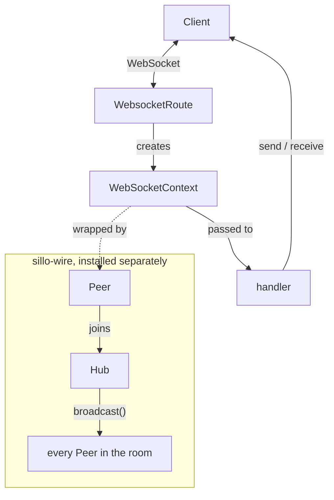
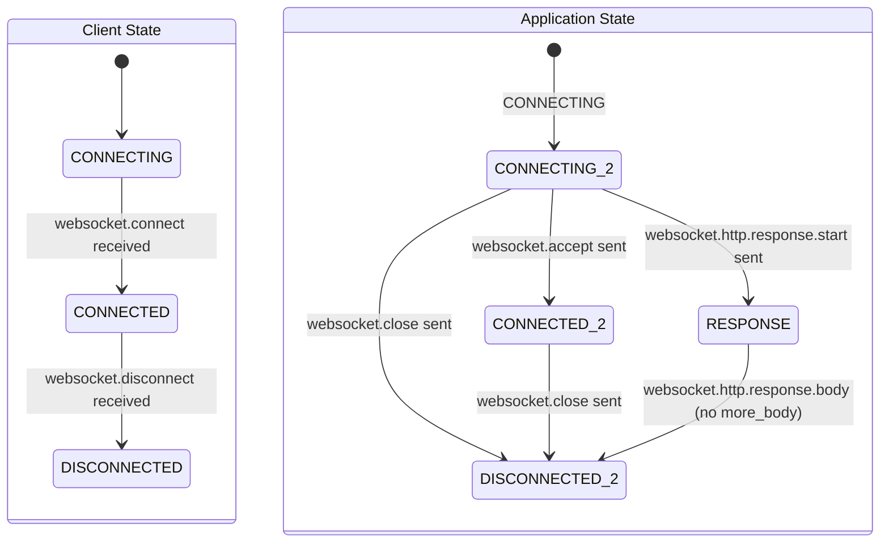

**Module:** `sillo.websockets`
**Source files:**
- `/Users/admin/sillo.build/core/sillo/websockets/base.py` (231 lines)
- `/Users/admin/sillo.build/core/sillo/websockets/consumers.py` (213 lines)
- `/Users/admin/sillo.build/core/sillo/websockets/channels.py` (277 lines)
- `/Users/admin/sillo.build/core/sillo/websockets/history.py` (124 lines)
- `/Users/admin/sillo.build/core/sillo/websockets/errors.py` (40 lines)
- `/Users/admin/sillo.build/core/sillo/websockets/status.py` (66 lines)
- `/Users/admin/sillo.build/core/sillo/websockets/utils.py` (48 lines)
- `/Users/admin/sillo.build/core/sillo/core/routing/websocket.py` (308 lines)

**Version:** 2026-08-11
**Audience:** Core maintainers, framework architects
**Purpose:** Deep documentation of the WebSocket state machine, consumers, channels, groups, history management, and error handling

---

## 1. Overview

The WebSocket subsystem provides a **full-duplex communication layer** built on the ASGI protocol. In the core it is the connection and nothing above it:
- A strict state machine for connection lifecycle
- Error middleware for exception handling
- Close-code constants and routing

Rooms, broadcast, presence and message history live in
[`sillo-wire`](/packages/wire/).



---

## 2. WebSocketState

**File:** `/Users/admin/sillo.build/core/sillo/websockets/base.py`, line 15

```python
class WebSocketState(enum.Enum):
    CONNECTING = 0
    CONNECTED = 1
    DISCONNECTED = 2
    RESPONSE = 3
```

The `RESPONSE` state is used for HTTP upgrade denial. When a WebSocket
connection is rejected, the response is sent as an HTTP response.

---

## 3. The WebSocket Class

**File:** `/Users/admin/sillo.build/core/sillo/websockets/base.py` (231 lines)

```python
from sillo import WebSocketContext, BaseContext

class WebSocketContext(BaseContext):
    def __init__(self, scope: Scope, receive: Receive, send: Send) -> None:
        super().__init__(scope, receive)
        assert scope["type"] == "websocket"
        self._receive = receive
        self._send = send
        self.client_state = WebSocketState.CONNECTING
        self.application_state = WebSocketState.CONNECTING
```

### 3.1 Dual State Machine

The WebSocket maintains **two independent state tracks:**

| Track | Variable | Purpose |
|-------|----------|---------|
| Client | `client_state` | Tracks messages received from the client |
| Application | `application_state` | Tracks messages sent by the application |



### 3.2 `receive()`: State-Validated Input

```python
async def receive(self) -> Message:
    if self.client_state == WebSocketState.CONNECTING:
        message = await self._receive()
        message_type = message["type"]
        if message_type != "websocket.connect":
            raise RuntimeError(f'Expected "websocket.connect", got {message_type!r}')
        self.client_state = WebSocketState.CONNECTED
        return message
    elif self.client_state == WebSocketState.CONNECTED:
        message = await self._receive()
        message_type = message["type"]
        if message_type not in {"websocket.receive", "websocket.disconnect"}:
            raise RuntimeError(f'Expected "websocket.receive" or "websocket.disconnect", got {message_type!r}')
        if message_type == "websocket.disconnect":
            self.client_state = WebSocketState.DISCONNECTED
        return message
    else:
        raise RuntimeError('Cannot call "receive" once a disconnect message has been received.')
```

### 3.3 `send()`: State-Validated Output

```python
async def send(self, message: Message) -> None:
    if self.application_state == WebSocketState.CONNECTING:
        message_type = message["type"]
        if message_type not in {"websocket.accept", "websocket.close", "websocket.http.response.start"}:
            raise RuntimeError(...)
        if message_type == "websocket.close":
            self.application_state = WebSocketState.DISCONNECTED
        elif message_type == "websocket.http.response.start":
            self.application_state = WebSocketState.RESPONSE
        else:
            self.application_state = WebSocketState.CONNECTED
        await self._send(message)
    elif self.application_state == WebSocketState.CONNECTED:
        message_type = message["type"]
        if message_type not in {"websocket.send", "websocket.close"}:
            raise RuntimeError(...)
        if message_type == "websocket.close":
            self.application_state = WebSocketState.DISCONNECTED
        try:
            await self._send(message)
        except OSError:
            self.application_state = WebSocketState.DISCONNECTED
            raise WebSocketDisconnect(code=1006)
    elif self.application_state == WebSocketState.RESPONSE:
        message_type = message["type"]
        if message_type != "websocket.http.response.body":
            raise RuntimeError(...)
        if not message.get("more_body", False):
            self.application_state = WebSocketState.DISCONNECTED
        await self._send(message)
    else:
        raise RuntimeError('Cannot call "send" once a close message has been sent.')
```

### 3.4 `accept()`

```python
async def accept(
    self,
    subprotocol: str | None = None,
    headers: Iterable[tuple[bytes, bytes]] | None = None,
) -> None:
    headers = headers or []
    if self.client_state == WebSocketState.CONNECTING:
        await self.receive()  # Wait for websocket.connect
    await self.send({
        "type": "websocket.accept",
        "subprotocol": subprotocol,
        "headers": headers,
    })
```

### 3.5 Receive Methods

```python
from sillo import WebSocketContext

async def receive_text(self) -> str:
    if self.application_state != WebSocketState.CONNECTED:
        raise RuntimeError('WebSocketContext is not connected. Need to call "accept" first.')
    message = await self.receive()
    self._raise_on_disconnect(message)
    return message["text"]

async def receive_bytes(self) -> bytes:
    # Similar pattern

async def receive_json(self, mode: str = "text") -> Any:
    message = await self.receive()
    self._raise_on_disconnect(message)
    if mode == "text":
        text = message["text"]
    else:
        text = message["bytes"].decode("utf-8")
    return json.loads(text)
```

### 3.6 Iterators

```python
async def iter_text(self) -> AsyncIterator[str]:
    try:
        while True:
            yield await self.receive_text()
    except WebSocketDisconnect:
        pass

async def iter_bytes(self) -> AsyncIterator[bytes]:
    try:
        while True:
            yield await self.receive_bytes()
    except WebSocketDisconnect:
        pass

async def iter_json(self) -> AsyncIterator[Any]:
    try:
        while True:
            yield await self.receive_json()
    except WebSocketDisconnect:
        pass
```

All iterators silently catch `WebSocketDisconnect` to end the iteration cleanly.

### 3.7 Send Methods

```python
async def send_text(self, data: str) -> None:
    await self.send({"type": "websocket.send", "text": data})

async def send_bytes(self, data: bytes) -> None:
    await self.send({"type": "websocket.send", "bytes": data})

async def send_json(self, data: Any, mode: str = "text") -> None:
    text = json.dumps(data, separators=(",", ":"), ensure_ascii=False)
    if mode == "text":
        await self.send({"type": "websocket.send", "text": text})
    else:
        await self.send({"type": "websocket.send", "bytes": text.encode("utf-8")})
```

### 3.8 `close()` and `is_connected()`

```python
async def close(self, code: int = 1000, reason: str | None = None) -> None:
    await self.send({"type": "websocket.close", "code": code, "reason": reason or ""})

def is_connected(self) -> bool:
    return (
        self.client_state == WebSocketState.CONNECTED
        and self.application_state == WebSocketState.CONNECTED
    )
```

### 3.9 WebSocketDisconnect Exception

```python
class WebSocketDisconnect(Exception):
    def __init__(self, code: int = 1000, reason: str | None = None) -> None:
        self.code = code
        self.reason = reason or ""
```

---

## 4. Rooms, consumers and history

These moved to [`sillo-wire`](/packages/wire/) in v1 and are documented there.
The core keeps the connection; the package adds everything about addressing
more than one of them at once.

| Was, in this module | Is, in `sillo.wire` |
|---|---|
| `WebSocketConsumer` | `RoomConsumer` |
| `Channel` | `Peer` |
| `ChannelBox` | `Hub` — an object, not process-global class state |
| `BaseHistoryManager` | `Backlog` protocol, with `MemoryBacklog` and `NullBacklog` |

The split is a dependency direction: the room layer needs a socket, a socket
needs nothing from the room layer, and fan-out is the part that grows a backend
once groups have to outlive a single worker process.


## 5. Error Handling

**File:** `/Users/admin/sillo.build/core/sillo/websockets/errors.py` (40 lines)

### 8.1 WebSocketErrorMiddleware

```python
from sillo import WebSocketContext

class WebSocketErrorMiddleware:
    def __init__(self, app: ASGIApp):
        self.app = app

    async def __call__(self, scope: Scope, receive: Receive, send: Send):
        if scope["type"] == "websocket":
            websocket = WebSocketContext(scope, receive, send)
            try:
                await self.app(scope, receive, send)
            except WebSocketException as exc:
                await websocket_exception_handler(websocket, exc)
        else:
            await self.app(scope, receive, send)
```

### 8.2 Default Exception Handler

```python
from sillo import WebSocketContext

async def websocket_exception_handler(websocket: WebSocketContext, exc: WebSocketException):
    await websocket.close(code=exc.code, reason=str(exc))
```

---

## 6. IANA Status Codes

**File:** `/Users/admin/sillo.build/core/sillo/websockets/status.py` (66 lines)

| Constant | Code | Description |
|----------|------|-------------|
| `WS_1000_NORMAL_CLOSURE` | 1000 | Normal closure |
| `WS_1001_GOING_AWAY` | 1001 | Endpoint going away |
| `WS_1002_PROTOCOL_ERROR` | 1002 | Protocol error |
| `WS_1003_UNSUPPORTED_DATA` | 1003 | Unsupported data type |
| `WS_1005_NO_STATUS_RCVD` | 1005 | No status received |
| `WS_1006_ABNORMAL_CLOSURE` | 1006 | Abnormal closure |
| `WS_1007_INVALID_FRAME_PAYLOAD_DATA` | 1007 | Invalid frame payload |
| `WS_1008_POLICY_VIOLATION` | 1008 | Policy violation |
| `WS_1009_MESSAGE_TOO_BIG` | 1009 | Message too big |
| `WS_1010_MANDATORY_EXT` | 1010 | Mandatory extension |
| `WS_1011_INTERNAL_ERROR` | 1011 | Internal server error |
| `WS_1012_SERVICE_RESTART` | 1012 | Service restart |
| `WS_1013_TRY_AGAIN_LATER` | 1013 | Try again later |
| `WS_1014_BAD_GATEWAY` | 1014 | Bad gateway |
| `WS_1015_TLS_HANDSHAKE` | 1015 | TLS handshake failure |

**Deprecated aliases:**
- `WS_1004_NO_STATUS_RCVD` → 1004 (reserved, should not be used)
- `WS_1005_ABNORMAL_CLOSURE` → 1005 (duplicate of `WS_1005_NO_STATUS_RCVD`)

---

## 7. WebSocket Routing

**File:** `/Users/admin/sillo.build/core/sillo/core/routing/websocket.py` (308 lines)

```python
from sillo import WebSocketContext

class WebsocketRoute(BaseRoute):
    def __init__(self, path: str, handler: WsHandlerType):
        # Compile path pattern
        # Store handler

    def match(self, scope: Scope) -> tuple[Any, Any]:
        # Match path against compiled pattern
        # Return (path_params, remaining_scope) or raise/no-match

    async def handle(self, scope: Scope, receive: Receive, send: Send) -> None:
        # Create WebSocketContext from scope
        # Apply error middleware
        # Call handler(websocket, **path_params)

    def url_path_for(self, name: str, **path_params) -> URLPath:
        # Generate URL for this route
```

---

## 8. Usage Patterns

### 8.1 Direct WebSocket Handler

```python
from sillo import WebSocketContext

async def websocket_handler(websocket: WebSocketContext):
    await websocket.accept()
    try:
        while True:
            data = await websocket.receive_json()
            await websocket.send_json({"echo": data})
    except WebSocketDisconnect:
        pass

app.websocket("/ws/echo")(websocket_handler)
```

### 8.2 Rooms and broadcast

Both live in [`sillo-wire`](/packages/wire/):

```python
from sillo.wire import Hub, Peer

hub = Hub()

async def chat(socket: WebSocketContext, room: str):
    await socket.accept()
    peer = Peer(socket)
    await hub.join(peer, room)
    try:
        async for message in socket.iter_json():
            await hub.broadcast(room, message)
    finally:
        await hub.disconnect(peer)
```

---

## 9. Supporting Enums

**File:** `/Users/admin/sillo.build/core/sillo/websockets/utils.py`

```python
class ChannelAddStatusEnum(Enum):
    CHANNEL_ADDED = "CHANNEL_ADDED"
    CHANNEL_EXIST = "CHANNEL_EXIST"

class ChannelRemoveStatusEnum(Enum):
    CHANNEL_REMOVED = "CHANNEL_REMOVED"
    CHANNEL_DOES_NOT_EXIST = "CHANNEL_DOES_NOT_EXIST"
    GROUP_REMOVED = "GROUP_REMOVED"
    GROUP_DOES_NOT_EXIST = "GROUP_DOES_NOT_EXIST"

class GroupSendStatusEnum(Enum):
    GROUP_SEND = "GROUP_SEND"
    NO_SUCH_GROUP = "NO_SUCH_GROUP"

class PayloadTypeEnum(Enum):
    JSON = "json"
    TEXT = "text"
    BYTES = "bytes"
```

---

## 10. Design Decisions

### D-1: Dual State Machine
The client/application state split mirrors the ASGI spec's design. The client state tracks what the client has sent; the application state tracks what the server has sent. Both must be `CONNECTED` for `is_connected()` to return `True`.

### D-2: Rooms live outside the core
The group registry was class-level state on a `ChannelBox`, which made it a
process-wide singleton every consumer shared — untestable in isolation and
impossible to scope per tenant. It is now a `Hub` object in
[`sillo-wire`](/packages/wire/), which also gives the fan-out somewhere to grow
a cross-process backend without the core acquiring a Redis dependency.

---

## 11. Source Traceability

| Component | File | Lines |
|-----------|------|-------|
| `WebSocketState` enum | `core/sillo/websockets/base.py` | 15-21 |
| `WebSocketDisconnect` | `core/sillo/websockets/base.py` | 24-30 |
| `WebSocketContext` class | `core/sillo/websockets/base.py` | 33-231 |
| `WebSocketErrorMiddleware` | `core/sillo/websockets/errors.py` | 20-40 |
| Status codes | `core/sillo/websockets/status.py` | 1-66 |
| `Hub`, `Peer`, `RoomConsumer`, `Backlog` | [`sillo-wire`](/packages/wire/) | separate package |
| `WebsocketRoute` | `core/sillo/core/routing/websocket.py` | 21-308 |
