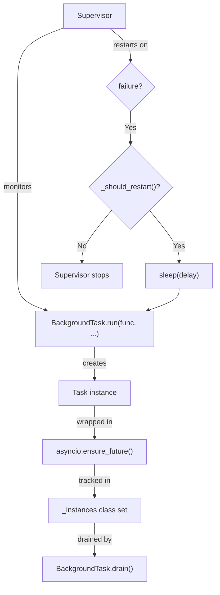
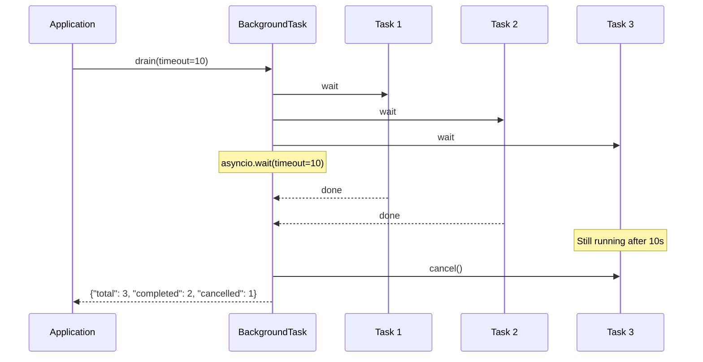
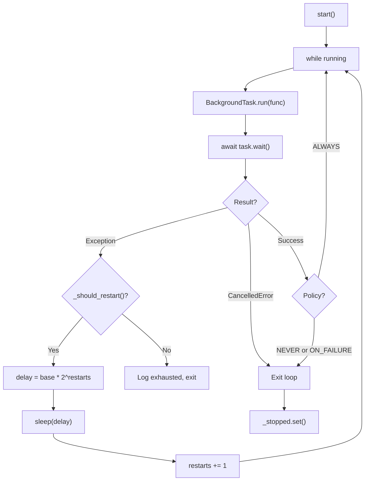
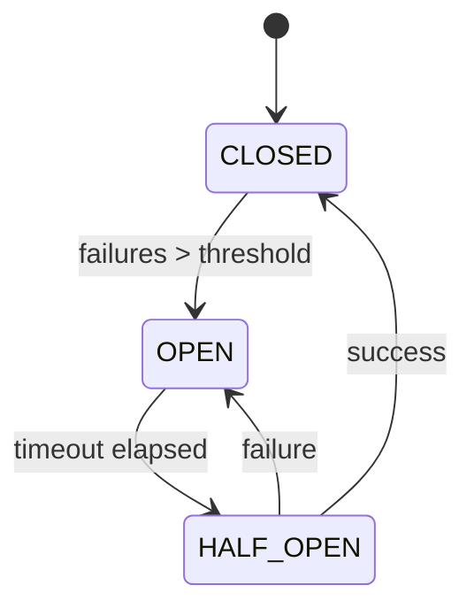
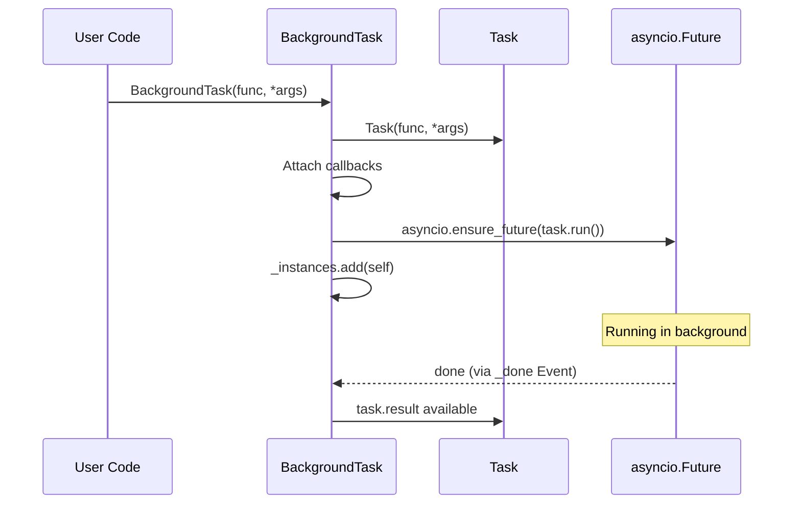
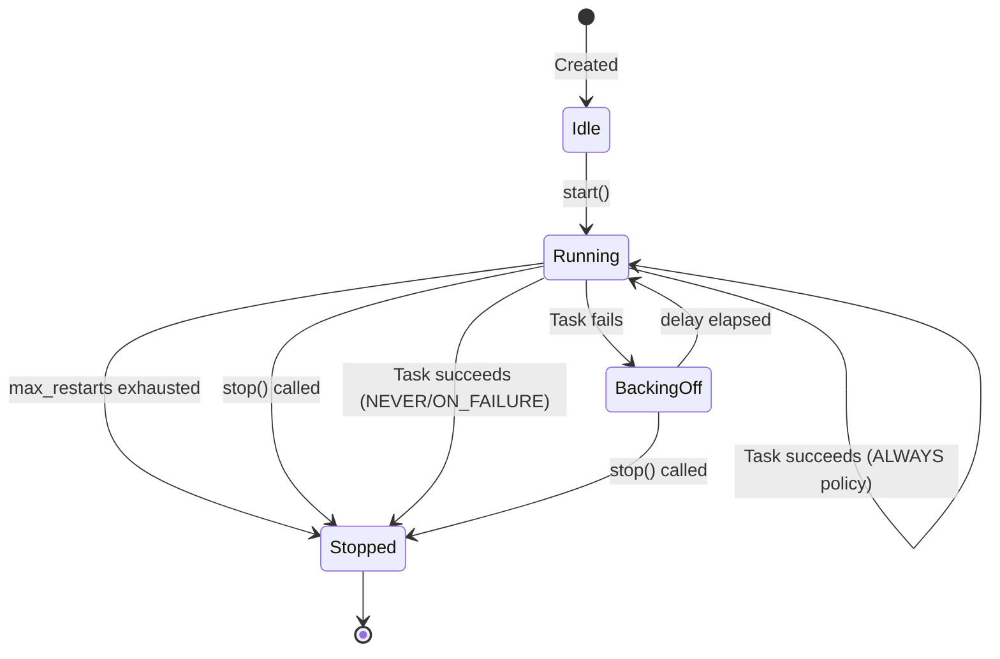
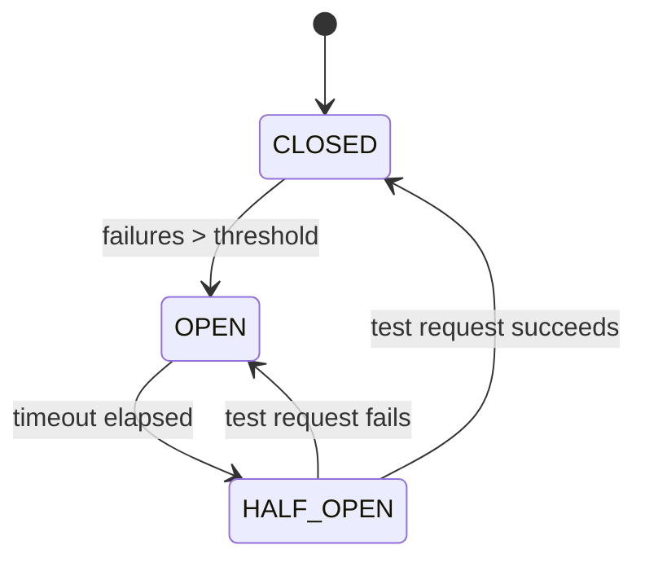
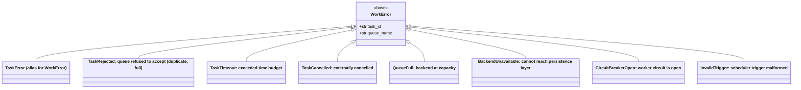

**Module:** `sillo.work.background`
**Source files:**
- `/Users/admin/sillo.build/core/sillo/work/background/tasks.py` (235 lines)
- `/Users/admin/sillo.build/core/sillo/work/background/supervisor.py` (137 lines)
- `/Users/admin/sillo.build/core/sillo/work/__init__.py` (73 lines)
- `/Users/admin/sillo.build/core/sillo/work/types.py` (300 lines)

**Version:** 2026-08-11
**Audience:** Core maintainers, framework architects
**Purpose:** Deep documentation of BackgroundTask, Supervisor, restart policies, circuit breaker, health/stats, and setup_work wiring

---

## 1. Overview

The background task subsystem provides **fire-and-forget async execution** with lifecycle tracking, supervision, and graceful shutdown. It sits above the `Task` class and provides a simpler API for common patterns.



---

## 2. BackgroundTask

**File:** `/Users/admin/sillo.build/core/sillo/work/background/tasks.py` (235 lines)

### 2.1 Class-Level Tracking

```python
class BackgroundTask:
    _instances: ClassVar[set[BackgroundTask]] = set()
    _lock = asyncio.Lock()
```

Every `BackgroundTask` instance is automatically added to `_instances` on construction and (implicitly) removed when garbage collected. This enables:
- `drain()`: wait for all tracked tasks before shutdown
- `count()`: monitoring dashboard metrics

### 2.2 Constructor

```python
def __init__(
    self,
    func: Callable[..., Awaitable[Any]],
    *args: Any,
    name: str | None = None,
    on_done: Callable[[TaskResult], Awaitable[None]] | None = None,
    on_success: Callable[[TaskResult], Awaitable[None]] | None = None,
    on_failure: Callable[[TaskResult], Awaitable[None]] | None = None,
    timeout: float | None = None,
    metadata: dict[str, Any] | None = None,
    **kwargs: Any,
) -> None:
```

**Key behavior:**
1. Creates a `Task` instance internally
2. Attaches `on_done` as both success and failure callback
3. Attaches `on_success` and `on_failure` individually
4. Launches immediately via `asyncio.ensure_future(self._task_obj.run())`
5. Adds `self` to `BackgroundTask._instances`

```python
self._task_obj = Task(func, *args, name=name or func.__name__, metadata=metadata, timeout=timeout, **kwargs)
if on_done:
    self._task_obj.on_success(on_done).on_failure(on_done)
if on_success:
    self._task_obj.on_success(on_success)
if on_failure:
    self._task_obj.on_failure(on_failure)
self._asyncio_task = asyncio.ensure_future(self._task_obj.run())
BackgroundTask._instances.add(self)
```

### 2.3 Properties

| Property | Type | Description |
|----------|------|-------------|
| `done` | `bool` | `True` if completed, failed, or cancelled |
| `running` | `bool` | `True` if currently executing |
| `result` | `TaskResult \| None` | Result if completed, else `None` |
| `id` | `str` | UUID4 task identifier |
| `name` | `str` | Human-readable task name |
| `elapsed` | `float` | Seconds since launch |

### 2.4 `wait()`

```python
async def wait(self, timeout: float | None = None) -> Any:
    return await self._task_obj.wait(timeout=timeout)
```

Blocks until the task completes. Raises the original exception if the task failed.

### 2.5 `cancel()`

```python
def cancel(self) -> bool:
    if self._asyncio_task and not self._asyncio_task.done():
        return self._asyncio_task.cancel()
    return False
```

### 2.6 `run()`: Class Method Factory

```python
@classmethod
def run(cls, func, *args, **kwargs) -> BackgroundTask:
    try:
        asyncio.get_running_loop()
    except RuntimeError:
        raise RuntimeError("BackgroundTask.run() requires an async context")
    return cls(func, *args, **kwargs)
```

Must be called from within an async context (running event loop).

### 2.7 `run_sync()`: Auto-Wrap Sync Functions

```python
@classmethod
def run_sync(cls, func, *args, **kwargs) -> BackgroundTask:
    if not inspect.iscoroutinefunction(func):
        async def _wrapper(*a, **kw):
            return func(*a, **kw)
        return cls(_wrapper, *args, **kwargs)
    return cls(func, *args, **kwargs)
```

Automatically wraps synchronous functions in an async wrapper.

### 2.8 `drain()`: Graceful Shutdown

```python
@classmethod
async def drain(cls, timeout=10.0, cancel_remaining=True) -> dict:
    instances = list(cls._instances)
    if not instances:
        return {"total": 0, "completed": 0, "cancelled": 0}

    tasks = [i._asyncio_task for i in instances]
    done, pending = await asyncio.wait(tasks, timeout=timeout)

    cancelled = 0
    if cancel_remaining and pending:
        for t in pending:
            t.cancel()
        cancelled = len(pending)

    return {
        "total": len(instances),
        "completed": len(done) - cancelled,
        "cancelled": cancelled,
    }
```



### 2.9 `count()`: Status Summary

```python
@classmethod
def count(cls) -> dict[str, int]:
    total = len(cls._instances)
    running = sum(1 for t in cls._instances if t.running)
    done = sum(1 for t in cls._instances if t.done)
    return {
        "total": total,
        "running": running,
        "done": done,
        "pending": total - running - done,
    }
```

### 2.10 `to_dict()`

```python
def to_dict(self) -> dict[str, Any]:
    return {
        "id": self.id,
        "name": self.name,
        "done": self.done,
        "running": self.running,
        "elapsed": self.elapsed,
        "status": self._task_obj.status.value,
        "result": self.result.to_dict() if self.result else None,
    }
```

---

## 3. Supervisor

**File:** `/Users/admin/sillo.build/core/sillo/work/background/supervisor.py` (137 lines)

### 3.1 RestartPolicy Enum

```python
class RestartPolicy(Enum):
    NEVER = "never"
    ALWAYS = "always"
    ON_FAILURE = "on_failure"
    EXPONENTIAL_BACKOFF = "exponential_backoff"
```

| Policy | Behavior |
|--------|----------|
| `NEVER` | Task runs once; no restarts |
| `ALWAYS` | Restart on success or failure (up to `max_restarts`) |
| `ON_FAILURE` | Restart only on failure (up to `max_restarts`) |
| `EXPONENTIAL_BACKOFF` | Restart on failure with exponential delay |

### 3.2 Supervisor Class

```python
class Supervisor:
    def __init__(
        self,
        func: Callable[..., Awaitable[Any]],
        policy: RestartPolicy = RestartPolicy.ON_FAILURE,
        *,
        max_restarts: int = 3,
        base_delay: float = 1.0,
        max_delay: float = 60.0,
        name: str | None = None,
    ):
        self.func = func
        self.policy = policy
        self.max_restarts = max_restarts
        self.base_delay = base_delay
        self.max_delay = max_delay
        self.name = name or func.__name__
        self._restarts = 0
        self._current_task: BackgroundTask | None = None
        self._running = False
        self._stopped = asyncio.Event()
```

### 3.3 `start()`: Monitoring Loop

```python
async def start(self, *args, **kwargs) -> None:
    self._running = True
    self._restarts = 0
    self._stopped.clear()

    while self._running:
        self._current_task = BackgroundTask.run(self.func, *args, name=self.name, **kwargs)
        try:
            await self._current_task.wait()
        except asyncio.CancelledError:
            break
        except Exception as exc:
            logger.warning("Supervised task %s failed: %s", self.name, exc)
            if not self._should_restart():
                logger.error("Supervised task %s exhausted restarts (%d)", self.name, self.max_restarts)
                break
            delay = min(self.base_delay * (2 ** self._restarts), self.max_delay)
            logger.info("Restarting %s in %.1fs (attempt %d)", self.name, delay, self._restarts + 1)
            await asyncio.sleep(delay)
            self._restarts += 1
        else:
            if self.policy == RestartPolicy.NEVER or self.policy == RestartPolicy.ON_FAILURE:
                break

    self._stopped.set()
```



### 3.4 `_should_restart()`

```python
def _should_restart(self) -> bool:
    if self.policy == RestartPolicy.NEVER:
        return False
    if self.policy == RestartPolicy.ALWAYS:
        return self.max_restarts == 0 or self._restarts < self.max_restarts
    if self.policy in (RestartPolicy.ON_FAILURE, RestartPolicy.EXPONENTIAL_BACKOFF):
        return self.max_restarts == 0 or self._restarts < self.max_restarts
    return False
```

**Note:** `max_restarts=0` means unlimited restarts.

### 3.5 `stop()` and `wait()`

```python
def stop(self) -> None:
    self._running = False
    if self._current_task:
        self._current_task.cancel()

async def wait(self, timeout: float | None = None) -> None:
    await asyncio.wait_for(self._stopped.wait(), timeout=timeout)
```

### 3.6 Exponential Backoff Calculation

```python
delay = min(self.base_delay * (2 ** self._restarts), self.max_delay)
```

| Restart # | Delay (base=1.0) | Delay (base=2.0) |
|-----------|------------------|------------------|
| 0 | 1.0s | 2.0s |
| 1 | 2.0s | 4.0s |
| 2 | 4.0s | 8.0s |
| 3 | 8.0s | 16.0s |
| 4 | 16.0s | 32.0s |
| 5 | 32.0s | 60.0s (capped) |

---

## 4. Circuit Breaker

**File:** `/Users/admin/sillo.build/core/sillo/work/types.py`

### 4.1 CircuitState Enum

```python
class CircuitState(enum.Enum):
    CLOSED = "closed"      # Normal operation
    OPEN = "open"          # Failures exceeded threshold
    HALF_OPEN = "half_open"  # Testing recovery
```



The circuit breaker pattern prevents cascading failures:
- **CLOSED**: Normal operation; requests flow through
- **OPEN.** Failures exceeded threshold; requests are shed immediately
- **HALF_OPEN**: After a timeout, one test request is allowed through

### 4.2 CircuitBreakerOpen Exception

```python
class CircuitBreakerOpen(WorkError):
    """Worker circuit is open — requests are being shed."""
```

---

## 5. Health and Stats

### 5.1 QueueHealth

```python
class QueueHealth(enum.Enum):
    HEALTHY = "healthy"
    DEGRADED = "degraded"  # High backlog
    STALLED = "stalled"    # No consumers
```

### 5.2 QueueStats

```python
@dataclasses.dataclass
class QueueStats:
    name: str
    size: int = 0
    completed: int = 0
    failed: int = 0
    oldest_age_ms: int = 0
    status: QueueHealth = QueueHealth.HEALTHY
```

### 5.3 WorkerStats

```python
@dataclasses.dataclass
class WorkerStats:
    processed: int = 0
    failed: int = 0
    active: int = 0
    workers: int = 0
    circuit: CircuitState = CircuitState.CLOSED
    uptime_seconds: float = 0.0
```

### 5.4 SchedulerStats

```python
@dataclasses.dataclass
class SchedulerStats:
    jobs_total: int = 0
    jobs_active: int = 0
    jobs_paused: int = 0
    runs_total: int = 0
    errors_total: int = 0
```

### 5.5 TaskResult

```python
@dataclasses.dataclass(frozen=True, slots=True)
class TaskResult:
    task_id: str
    name: str
    status: TaskStatus
    result: Any = None
    error: str | None = None
    attempt: int = 0
    max_attempts: int = 0
    priority: TaskPriority = TaskPriority.NORMAL
    queue_name: str = "default"
    created_at: float = ...
    started_at: float = 0.0
    completed_at: float = 0.0
    metadata: dict[str, Any] = ...
    worker_id: str = ""
```

---

## 6. `setup_work()` Wiring

**File:** `/Users/admin/sillo.build/core/sillo/work/__init__.py`

```python
def setup_work(app, *, queue_backend=None, queue_name="default") -> dict:
```

### 6.1 Wiring Steps

1. **Create connection**: `SyncConnection()` or `RedisConnection()` based on
   `queue_backend`
2. **Store in app.state**: `app.state["queue_connection"]`,
   `app.state["default_queue"]`
3. **Register DI providers**: `scheduler`, `queue_connection`, `events`,
   `default_queue`
4. **Hook lifecycle**: Scheduler start/stop via `app.on_startup` /
   `app.on_shutdown`
5. **Import commands**: `sillo.work.commands` at module level for CLI
   registration

### 6.2 DI Providers

**File:** `/Users/admin/sillo.build/core/sillo/work/dependency.py`

```python
scheduler = _make_provider("scheduler")
queue_connection = _make_provider("queue_connection")
events = _make_provider("events")
default_queue = _make_provider("default_queue")
```

Each provider is an async function that pulls from `app.state` via the DI system.

### 6.3 Usage

```python
from sillo.work import setup_work

app = SilloApp()
work = setup_work(app, queue_backend="redis")

# Or with defaults (in-memory)
work = setup_work(app)
```

---

## 7. Usage Patterns

### 7.1 Fire-and-Forget

```python
bt = BackgroundTask.run(send_email, user.email)
# Don't wait — just fire and forget
```

### 7.2 With Completion Callback

```python
async def notify(result: TaskResult):
    await send_notification(f"Task {result.name} completed: {result.status.value}")

bt = BackgroundTask.run(process_file, path, on_done=notify)
```

### 7.3 Supervised Task

```python
supervisor = Supervisor(
    websocket_listener,
    RestartPolicy.EXPONENTIAL_BACKOFF,
    max_restarts=5,
    base_delay=1.0,
    max_delay=60.0,
)
await supervisor.start(url="wss://stream.example.com")
```

### 7.4 Graceful Shutdown

```python
@app.on_shutdown
async def shutdown():
    result = await BackgroundTask.drain(timeout=30.0, cancel_remaining=True)
    logger.info("Drained: %s", result)
```

---

## 8. Design Decisions

### D-1: Class-Level Instance Tracking
Using a class-level `set` enables `drain()` and `count()` without requiring a
global registry. The trade-off is that instances are never explicitly removed
from the set. They are garbage collected when no references remain.

### D-2: Immediate Launch on Construction
`BackgroundTask` launches immediately on construction (via `asyncio.ensure_future`). This is intentional for fire-and-forget patterns but means the task cannot be configured after construction.

### D-3: Supervisor as a Separate Class
The `Supervisor` is decoupled from `BackgroundTask` so it can monitor any async callable, not just tasks created through the background task API.

### D-4: Exponential Backoff with Cap
The `min(base * 2^n, max_delay)` formula prevents unbounded delay growth while still providing meaningful backoff for transient failures.

---

## 9. Source Traceability

| Component | File | Lines |
|-----------|------|-------|
| `BackgroundTask` | `core/sillo/work/background/tasks.py` | 27-235 |
| `RestartPolicy` enum | `core/sillo/work/background/supervisor.py` | 24-30 |
| `Supervisor` | `core/sillo/work/background/supervisor.py` | 33-137 |
| `CircuitState` enum | `core/sillo/work/types.py` | 75-80 |
| `QueueHealth` enum | `core/sillo/work/types.py` | 83-88 |
| `QueueStats` | `core/sillo/work/types.py` | 236-256 |
| `WorkerStats` | `core/sillo/work/types.py` | 259-279 |
| `SchedulerStats` | `core/sillo/work/types.py` | 282-300 |
| `TaskResult` | `core/sillo/work/types.py` | 138-233 |
| `setup_work()` | `core/sillo/work/__init__.py` | 1-73 |
| DI providers | `core/sillo/work/dependency.py` | 1-49 |

---

## 10. BackgroundTask Internal Mechanics

### 10.1 Instance Lifecycle



### 10.2 The `_instances` Set

```python
_instances: ClassVar[set[BackgroundTask]] = set()
```

**Key properties:**
- Class-level, shared across all `BackgroundTask` instances
- Instances are added on construction
- Instances are **not** explicitly removed: they are garbage collected when no
  external references remain
- `drain()` snapshots the set at call time: `instances = list(cls._instances)`
- `count()` iterates the set to compute status breakdowns

**Memory consideration:** In long-running applications with many fire-and-forget tasks, the `_instances` set may hold references to completed tasks. If this becomes a concern, periodically call `count()` or `drain()` which implicitly triggers cleanup through Python's garbage collector.

### 10.3 Callback Attachment

```python
if on_done:
    self._task_obj.on_success(on_done).on_failure(on_done)
if on_success:
    self._task_obj.on_success(on_success)
if on_failure:
    self._task_obj.on_failure(on_failure)
```

The `on_done` callback is registered for **both** success and failure. The `on_success` and `on_failure` callbacks are registered individually. All callbacks receive a `TaskResult` instance.

### 10.4 Sync Function Wrapping

```python
@classmethod
def run_sync(cls, func, *args, **kwargs) -> BackgroundTask:
    if not inspect.iscoroutinefunction(func):
        async def _wrapper(*a, **kw):
            return func(*a, **kw)
        return cls(_wrapper, *args, **kwargs)
    return cls(func, *args, **kwargs)
```

The wrapper is a simple async function that calls the sync function. No thread
pool is used. The sync function runs on the event loop thread. For CPU-bound
work, consider using `asyncio.to_thread()` instead.

### 10.5 Error Handling in `wait()`

```python
async def wait(self, timeout: float | None = None) -> Any:
    return await self._task_obj.wait(timeout=timeout)
```

Delegates to `Task.wait()`, which:
1. Checks if result is already available (fast path)
2. Otherwise, awaits `_done` event with optional timeout
3. Calls `_unwrap_result()` which raises `TaskError` on failure or `TaskCancelled` on cancellation

---

## 11. Supervisor Deep Dive

### 11.1 State Machine



### 11.2 Restart Decision Matrix

| Policy | Task Succeeds | Task Fails | Max Restarts Reached |
|--------|--------------|------------|---------------------|
| `NEVER` | Stop | Stop | N/A |
| `ALWAYS` | Restart | Restart | Stop |
| `ON_FAILURE` | Stop | Restart | Stop |
| `EXPONENTIAL_BACKOFF` | Stop | Restart with delay | Stop |

### 11.3 Backoff Calculation

```python
delay = min(self.base_delay * (2 ** self._restarts), self.max_delay)
```

| `base_delay` | `max_delay` | Restart 0 | Restart 1 | Restart 2 | Restart 3 | Restart 4 | Restart 5 |
|--------------|-------------|-----------|-----------|-----------|-----------|-----------|-----------|
| 1.0 | 60.0 | 1.0s | 2.0s | 4.0s | 8.0s | 16.0s | 32.0s |
| 2.0 | 60.0 | 2.0s | 4.0s | 8.0s | 16.0s | 32.0s | 60.0s |
| 0.5 | 30.0 | 0.5s | 1.0s | 2.0s | 4.0s | 8.0s | 16.0s |

### 11.4 `stop()` Behavior

```python
def stop(self) -> None:
    self._running = False
    if self._current_task:
        self._current_task.cancel()
```

**Important:** `stop()` sets `_running = False` and cancels the current task. The `start()` loop will exit on the next iteration. If the task is in a backoff sleep, the sleep will be interrupted by the cancellation.

### 11.5 `wait()` with Timeout

```python
async def wait(self, timeout: float | None = None) -> None:
    await asyncio.wait_for(self._stopped.wait(), timeout=timeout)
```

Blocks until the supervisor stops (either by exhausting restarts or by calling `stop()`). Raises `asyncio.TimeoutError` if the timeout elapses.

### 11.6 Supervisor vs. BackgroundTask

| Feature | BackgroundTask | Supervisor |
|---------|---------------|------------|
| Launch | Immediate on construction | Explicit `start()` |
| Restart | None | Configurable policy |
| Backoff | None | Exponential |
| Max restarts | None | Configurable |
| Monitoring | `_instances` class set | `to_dict()` |
| Blocking | Non-blocking | `start()` blocks |

---

## 12. Circuit Breaker Deep Dive

### 12.1 State Diagram



### 12.2 State Descriptions

| State | Meaning | Requests |
|-------|---------|----------|
| `CLOSED` | Normal operation | All pass through |
| `OPEN` | Failures exceeded threshold | All rejected immediately |
| `HALF_OPEN` | Testing recovery | One test request allowed |

### 12.3 Integration Pattern

```python
from sillo.work.types import CircuitState, CircuitBreakerOpen

class CircuitBreaker:
    def __init__(self, failure_threshold=5, recovery_timeout=30.0):
        self.state = CircuitState.CLOSED
        self.failure_count = 0
        self.failure_threshold = failure_threshold
        self.recovery_timeout = recovery_timeout
        self.last_failure_time = 0.0

    async def call(self, func, *args, **kwargs):
        if self.state == CircuitState.OPEN:
            if time.time() - self.last_failure_time > self.recovery_timeout:
                self.state = CircuitState.HALF_OPEN
            else:
                raise CircuitBreakerOpen("Circuit is open")

        try:
            result = await func(*args, **kwargs)
            if self.state == CircuitState.HALF_OPEN:
                self.state = CircuitState.CLOSED
                self.failure_count = 0
            return result
        except Exception as exc:
            self.failure_count += 1
            self.last_failure_time = time.time()
            if self.failure_count >= self.failure_threshold:
                self.state = CircuitState.OPEN
            raise
```

### 12.4 CircuitBreakerOpen Exception

```python
class CircuitBreakerOpen(WorkError):
    """Worker circuit is open — requests are being shed."""
```

Inherits from `WorkError` and carries `task_id` and `queue_name` context.

---

## 13. Health and Stats Deep Dive

### 13.1 QueueHealth Assessment

```python
class QueueHealth(enum.Enum):
    HEALTHY = "healthy"
    DEGRADED = "degraded"  # High backlog
    STALLED = "stalled"    # No consumers
```

**Assessment logic:**
- `HEALTHY`: Queue size is within normal bounds, consumers are active
- `DEGRADED`: Queue size is growing (backlog exceeds threshold)
- `STALLED`: No consumers are connected or processing

### 13.2 QueueStats Fields

```python
@dataclasses.dataclass
class QueueStats:
    name: str
    size: int = 0           # Pending jobs
    completed: int = 0      # Total completed
    failed: int = 0         # Total failed
    oldest_age_ms: int = 0  # Age of oldest pending job
    status: QueueHealth = QueueHealth.HEALTHY
```

### 13.3 WorkerStats Fields

```python
@dataclasses.dataclass
class WorkerStats:
    processed: int = 0          # Total jobs processed
    failed: int = 0             # Total jobs failed
    active: int = 0             # Currently executing
    workers: int = 0            # Number of worker coroutines
    circuit: CircuitState = CircuitState.CLOSED
    uptime_seconds: float = 0.0
```

### 13.4 SchedulerStats Fields

```python
@dataclasses.dataclass
class SchedulerStats:
    jobs_total: int = 0
    jobs_active: int = 0
    jobs_paused: int = 0
    runs_total: int = 0
    errors_total: int = 0
```

### 13.5 TaskResult Derived Properties

```python
@property
def duration_ms(self) -> int:
    """Wall-clock execution time in milliseconds."""
    if not self.started_at or not self.completed_at:
        return 0
    return int((self.completed_at - self.started_at) * 1000)

@property
def latency_ms(self) -> int:
    """Time from creation to start in milliseconds (queue wait)."""
    if not self.created_at or not self.started_at:
        return 0
    return int((self.started_at - self.created_at) * 1000)

@property
def ok(self) -> bool:
    return self.status == TaskStatus.COMPLETED

@property
def is_terminal(self) -> bool:
    return self.status in (TaskStatus.COMPLETED, TaskStatus.FAILED, TaskStatus.CANCELLED)
```

### 13.6 Monitoring Dashboard Pattern

```python
from sillo import HttpContext

async def work_health(ctx: HttpContext):
    conn = ctx.app.state["queue_connection"]
    sched = ctx.app.state.get("scheduler")

    queue_stats = await conn.size("default")
    bg_count = BackgroundTask.count()
    sched_stats = sched.stats if sched else None

    return {
        "queue": {
            "pending": queue_stats,
        },
        "background_tasks": bg_count,
        "scheduler": sched_stats.to_dict() if sched_stats else None,
    }
```

---

## 14. Exception Hierarchy Reference



### 14.1 Exception Context

All exceptions carry structured context:

```python
class WorkError(Exception):
    def __init__(self, message, *, task_id="", queue_name=""):
        super().__init__(message)
        self.task_id = task_id
        self.queue_name = queue_name
```

This enables structured logging and error reporting:

```python
try:
    await task.run()
except WorkError as exc:
    logger.error("Task failed: %s (task_id=%s, queue=%s)",
        exc, exc.task_id, exc.queue_name)
```

---

## 15. Integration Patterns

### 15.1 Request Lifecycle Integration

```python
from sillo.work.background import BackgroundTask
from sillo import HttpContext

async def upload_handler(ctx: HttpContext):
    file = await ctx.form()
    # Process file in background
    bt = BackgroundTask.run(process_upload, file.filename, file.content)
    return {"task_id": bt.id, "status": "processing"}

async def status_handler(ctx: HttpContext):
    task_id = ctx.path_params["task_id"]
    # Look up task by ID (would need a registry)
    return {"status": "completed"}
```

### 15.2 Supervised WebSocket Listener

```python
from sillo.work.background import Supervisor, RestartPolicy
from sillo import WebSocketContext

async def websocket_listener(url):
    async with aiohttp.ClientSession() as session:
        async with session.ws_connect(url) as ws:
            async for msg in ws:
                if msg.type == aiohttp.WSMsgType.TEXT:
                    await process_message(msg.data)
                elif msg.type == aiohttp.WSMsgType.ERROR:
                    raise ConnectionError(f"WebSocketContext error: {ws.exception()}")

# Supervise with exponential backoff
supervisor = Supervisor(
    websocket_listener,
    RestartPolicy.EXPONENTIAL_BACKOFF,
    max_restarts=10,
    base_delay=1.0,
    max_delay=60.0,
)

@app.on_startup
async def start_listener(app):
    asyncio.create_task(supervisor.start("wss://stream.example.com"))

@app.on_shutdown
async def stop_listener(app):
    supervisor.stop()
```

### 15.3 Background Task with Progress Tracking

```python
from sillo.work.background import BackgroundTask
from sillo.work.types import TaskResult

class ProgressTracker:
    def __init__(self):
        self.progress = 0
        self.total = 0

    async def on_progress(self, current, total):
        self.progress = current
        self.total = total

async def process_items(items, tracker):
    for i, item in enumerate(items):
        await process_item(item)
        await tracker.on_progress(i + 1, len(items))

tracker = ProgressTracker()
bt = BackgroundTask.run(process_items, items, tracker)
```

### 15.4 Graceful Shutdown with Drain

```python
@app.on_startup
async def startup(app):
    app.state["background_tasks"] = BackgroundTask

@app.on_shutdown
async def shutdown(app):
    result = await BackgroundTask.drain(timeout=30.0, cancel_remaining=True)
    logger.info(
        "Shutdown complete: %d total, %d completed, %d cancelled",
        result["total"], result["completed"], result["cancelled"]
    )
```

---

## 16. Performance Considerations

### 16.1 BackgroundTask Overhead

Each `BackgroundTask` creates:
- 1 `Task` instance (~200 bytes with slots)
- 1 `asyncio.Task` (~1KB)
- 1 entry in `_instances` set (~64 bytes)

For high-throughput scenarios (thousands of tasks per second), consider:
- Using the queue system instead of individual background tasks
- Periodically draining completed tasks to free memory
- Using `NoOpHistoryManager` if history is not needed

### 16.2 Supervisor Overhead

Each `Supervisor` maintains:
- 1 `BackgroundTask` at a time
- 1 `asyncio.Event` for stop signaling
- Backoff state (restart count, delay calculation)

The supervisor itself is lightweight. The main cost is the supervised task.

### 16.3 Memory Management

```python
# Monitor background task count
count = BackgroundTask.count()
if count["total"] > 10000:
    logger.warning("High background task count: %d", count["total"])

# Force garbage collection of completed tasks
import gc
gc.collect()
```

---

## 17. Testing Patterns

### 17.1 Unit Testing BackgroundTask

```python
import asyncio
import pytest

async def test_background_task_completes():
    async def my_task(x):
        return x * 2

    bt = BackgroundTask.run(my_task, 21)
    result = await bt.wait(timeout=5.0)
    assert result == 42
    assert bt.done
    assert bt.result.ok

async def test_background_task_failure():
    async def failing_task():
        raise ValueError("test error")

    bt = BackgroundTask.run(failing_task)
    with pytest.raises(TaskError, match="test error"):
        await bt.wait(timeout=5.0)
    assert bt.done
    assert not bt.result.ok
```

### 17.2 Unit Testing Supervisor

```python
async def test_supervisor_restarts_on_failure():
    call_count = 0

    async def flaky_task():
        nonlocal call_count
        call_count += 1
        if call_count < 3:
            raise ValueError(f"fail #{call_count}")
        return "success"

    supervisor = Supervisor(
        flaky_task,
        RestartPolicy.ON_FAILURE,
        max_restarts=5,
        base_delay=0.01,  # Fast for testing
    )
    await supervisor.start()
    assert call_count == 3
    assert supervisor._restarts == 2

async def test_supervisor_exhausts_restarts():
    async def always_fail():
        raise ValueError("always fails")

    supervisor = Supervisor(
        always_fail,
        RestartPolicy.EXPONENTIAL_BACKOFF,
        max_restarts=3,
        base_delay=0.01,
    )
    await supervisor.start()
    assert supervisor._restarts == 3
```

### 17.3 Testing Drain

```python
async def test_drain_waits_for_all():
    async def slow_task():
        await asyncio.sleep(0.1)

    tasks = [BackgroundTask.run(slow_task) for _ in range(5)]
    result = await BackgroundTask.drain(timeout=5.0, cancel_remaining=False)
    assert result["total"] == 5
    assert result["completed"] == 5
    assert result["cancelled"] == 0
```

---

## 18. Common Pitfalls

### 18.1 Forgetting to Await `wait()`
```python
# Wrong — task may not be done when you check
bt = BackgroundTask.run(some_task)
print(bt.done)  # May be False

# Right — wait for completion
bt = BackgroundTask.run(some_task)
await bt.wait()
print(bt.done)  # Always True
```

### 18.2 Using BackgroundTask for CPU-Bound Work
```python
# Wrong — blocks the event loop
bt = BackgroundTask.run(heavy_computation)

# Right — use thread pool
import asyncio
bt = BackgroundTask.run_sync(lambda: asyncio.to_thread(heavy_computation))
```

### 18.3 Not Handling Supervisor Stop
```python
# Wrong — supervisor keeps running after app shutdown
supervisor = Supervisor(my_task, RestartPolicy.ALWAYS)
asyncio.create_task(supervisor.start())

# Right — wire into app lifecycle
@app.on_shutdown
async def shutdown():
    supervisor.stop()
    await supervisor.wait(timeout=10.0)
```

### 18.4 Assuming drain() Cancels Immediately
```python
# drain() waits up to timeout, THEN cancels remaining
result = await BackgroundTask.drain(timeout=5.0, cancel_remaining=True)
# Tasks may have completed during the 5-second wait
```
