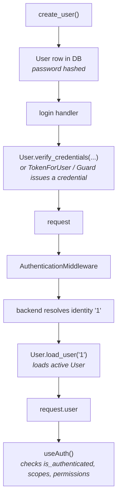

#  Users & User Models

Every authenticated request in sillo ends with one thing: a `request.user` object. This page shows the simplest way to get there, then goes deep on the contract that makes it work, the built-in `User` model, and how to build your own.

##  The simplest integration

You don't need to understand the whole contract to get a working user. sillo ships a `User` model and a `UserManager`; you connect the database, hand `User` to the auth middleware, and `request.user` appears.

```python
# app.py
from sillo import SilloApp, HttpContext
from sillo.record import setup_record, DatabaseConfig
from sillo.auth import AuthenticationMiddleware, useAuth
from sillo.auth.jwt_auth import JWTAuthBackend
from sillo.users import User

app = SilloApp()

# 1. Connect the database (creates the "users" table)
db = setup_record(app, DatabaseConfig.sqlite("app.db"), model_modules=["myapp.models"])

# 2. Resolve ctx.user from a JWT
app.use(AuthenticationMiddleware(
    user_model=User,
    backend=JWTAuthBackend(secret_key="change-me", identifier="sub"),
))

# 3. Protect a route — ctx.user is a loaded User instance
@app.get("/me", auth=useAuth())
async def me(ctx: HttpContext):
    return {"id": ctx.user.identity, "email": ctx.user.email}
```

That's the whole loop. To make `/me` reachable, you create a user and issue a token:

```python
# myapp/models.py
from sillo.users import User

# somewhere at startup / in a seed script:
user = await User.objects.create_user(
    email="alice@example.com",
    username="alice",
    password="StrongP@ss1",
)
```

Now any request carrying a valid bearer token for that user hits `/me` with `request.user.identity == "1"`, `request.user.email == "alice@example.com"`, and `request.user.is_authenticated == True`.

<aside type="tip" title="Pass the class, not an instance">
`user_model=User` is the **class**. The middleware calls
`User.load_user(identity)` as a classmethod. Never instantiate the model to
hand to the middleware.
</aside>

Everything below explains what just happened and how to customize it.

##  What "a user" means to sillo

Authentication only produces an **identity**. A string. The middleware's job is
to turn that string into a real object via your user class's
`load_user(identity)` classmethod:

```
backend resolves identity "1"
  → user = await User.load_user("1")      # your classmethod
  → request.scope["user"] = user          # becomes request.user
```

- If `load_user` returns a user, that's `request.user`.
- If it returns `None`, the middleware tries the next backend.
- If every backend fails (or there are none), sillo attaches `AnonymousUser` and `request.scope["auth"]` is `None`.

So a user class only has to do two things: describe itself through a few properties, and know how to load one of itself from an identity string. That contract is `UserProtocol`.

##  The user system at a glance

sillo's user code is layered so you can use as much or as little as you want:

| Layer | Class | What it is |
| --- | --- | --- |
| Contract | `UserProtocol` | Pure interface. Describes what "a user" must look like. No database. |
| Abstract model | `UserBaseModel` | A `Record`/`Model` subclass that **implements** the contract and carries the default fields + password logic. Not a table: subclass it. |
| Concrete model | `User` | The default user, `UserBaseModel` with `table="users"`. Use as-is, or subclass to extend. |
| Sentinel | `AnonymousUser` / `UnauthenticatedUser` | The unauthenticated user attached when no backend succeeds. |
| Lightweight | `SimpleUser` | No-DB user for tests/prototypes. |

```python
from sillo.users import UserProtocol, UserBaseModel, User

# UserProtocol  -> the contract every user satisfies
# UserBaseModel -> abstract Record model (default fields, password, load_user)
# User          -> concrete default you hand to the middleware
```

##  The built-in `User`

`User` is a `Record`/Tortoise model built on `UserBaseModel`. `UserBaseModel`
itself is an **abstract** model (`class Meta: abstract = True`), it defines the
fields and behavior but is never instantiated as a table; only a concrete
subclass (like `User`, or your own) creates one. `User` is deliberately lean,
it carries only the fields you almost always need and deliberately does **not**
pull in `TimestampsMixin` (created/updated) or `SoftDeletesMixin` (recoverable
deletes), so the schema stays predictable. If your project wants those, mix
them into your own subclass (see [Custom user classes](#custom-user-classes)).

```python
from sillo.users import User

user = await User.load_user("1")        # what the middleware calls internally
print(user.identity)                     # "1"
print(user.display_name)                 # "alice"  (== username)
print(user.is_authenticated)             # True (derived from is_active)
print(user.has_perm("anything"))         # False unless superuser / wired up
```

###  Fields

| Field | Type | Notes |
| --- | --- | --- |
| `id` | `IntField(pk=True)` | Auto-increment primary key |
| `email` | `CharField(255, unique, indexed)` | Unique, indexed lookup |
| `username` | `CharField(150, unique, indexed)` | Unique, indexed lookup |
| `password` | `CharField(128)` | bcrypt hash. The raw password is never stored |
| `is_active` / `is_staff` / `is_superuser` | `BooleanField` | `is_authenticated` is derived from `is_active` |
| `last_login` | `DatetimeField(nullable)` | Set via `set_last_login()` |
| `email_verified_at` | `DatetimeField(nullable)` | Set via `mark_email_verified()` |

###  Identity, display name, permissions

- `identity` returns `str(self.id)`: the stable string used by backends and
  `load_user`.
- `display_name` returns `username`: for logs and UI.
- `has_permission(perm)` returns `True` for superusers, `False` for inactive users, otherwise dispatches to the active permissions system (see [DB-backed permissions](#db-backed-permissions) below).
- `load_user(identity)` resolves through `UserManager().get_by_id(int(identity))`, which returns **only active** users. A deactivated (`is_active=False`) user fails to load and is treated as unauthenticated.

###  Authenticating credentials

`User.verify_credentials(identifier, password)` is the one-call login helper. It looks the user up by email **or** username, verifies the password, stamps `last_login` on success, and returns `None` when the user is missing, inactive, or the password is wrong:

```python
user = await User.verify_credentials("alice@example.com", "StrongP@ss1")
if user is None:
    # unknown user, inactive, or wrong password
    ...
# success: user is an authenticated, active User instance
```

Because `verify_credentials` is defined on `UserBaseModel`, it works on any
subclass too, including a custom user model.

###  Passwords

```python
user.set_password("new-secret")           # stores a bcrypt hash
user.check_password("new-secret")         # True  (constant-time compare)
user.set_unusable_password()              # "!" marker — nothing will ever match
user.has_usable_password()                # False
await user.set_last_login()               # updates last_login, saves that field
await user.mark_email_verified()          # sets email_verified_at
```

##  Creating and finding users: UserManager

`User.objects` is a `UserManager` attached to the model. It handles creation and lookups:

```python
user = await User.objects.create_user(
    email="bob@example.com",
    username="bob",
    password="StrongP@ss1",        # omitted → sets an unusable password
)
admin = await User.objects.create_superuser(
    email="admin@example.com",
    username="admin",
    password="VeryStr0ng!",
)
```

| Method | Behavior |
| --- | --- |
| `create_user(email, username, password=None, **extra)` | Hashes the password; missing password sets an unusable marker. `**extra` passes through to the model constructor. |
| `create_superuser(...)` | Forces `is_staff`/`is_superuser`/`is_active=True` and runs `validate_password()`: a weak password raises `ValueError`. |
| `get_by_id(id)` / `get_by_email(email)` / `get_by_username(username)` | All filter `is_active=True`. |
| `get_by_natural_key(identifier)` | Tries email, then username. Used internally by `verify_credentials`. |

You can attach `UserManager` to your own model the same way: `objects = UserManager()`.

##  Passwords, in depth

All hashing uses **bcrypt** (cost 12 by default) with a per-password salt, and verification is constant-time (resistant to timing attacks). The helpers live in `sillo.users.password` and are re-exported from `sillo.users`.

```python
from sillo.users import make_password, check_password, validate_password

hashed = make_password("my-secret")        # "$2b$12$..." — 60 chars, salt included
check_password("my-secret", hashed)        # True
check_password("wrong", hashed)            # False
check_password("", hashed)                 # False (empty never matches)
```

**Unusable passwords.** A user with no password (OAuth-only accounts, invited-but-not-yet-set) gets a marker prefix `"!"`:

```python
from sillo.hashing import UNUSABLE_PASSWORD_PREFIX
from sillo.users import is_password_usable

make_password(None)            # "!" + 40 random hex chars
is_password_usable(hashed)     # False when it starts with "!"
user.set_unusable_password()   # same effect, on an instance
```

`check_password` also short-circuits to `False` for empty input or the unusable marker.

**Validation.** `validate_password(pw, min_length=8)` returns a list of human-readable errors (empty list = passes). Rules: ≥8 chars, at least one uppercase, one lowercase, one digit, one special character.

```python
validate_password("weak")
# ["Password must be at least 8 characters.",
#  "Password must contain at least one uppercase letter.",
#  "Password must contain at least one lowercase letter.",
#  "Password must contain at least one digit.",
#  "Password must contain at least one special character."]
validate_password("StrongP@ss1")   # []
```

`password_strength(pw)` gives a quantitative readout you can show in a UI: `{"score": int, "strength": "weak"|"medium"|"strong", "feedback": [...]}`. Thresholds: score ≥5 strong, ≥3 medium, else weak.

**Upgrading hashes.** `needs_rehash(hash, rounds=12)` inspects the cost factor baked into an existing bcrypt hash. Call it on login to transparently bump weak hashes to a higher cost:

```python
if needs_rehash(user.password, rounds=14):
    user.set_password(raw_password)   # re-hash at the new cost
    await user.save()
```

##  DB-backed permissions

`UserBaseModel` checks `has_permission` via an in-memory list that is empty by
default. For production apps that need persistent, queryable permissions
(roles, groups, audits, admin UIs) use `sillo.permissions`:

```python
from sillo.permissions import PermissionMixin, Permission, Group

class Account(PermissionMixin, UserBaseModel):
    class Meta:
        table = "accounts"

# Define
await Permission.define("posts:create")

# Assign directly or via groups
await Permission.assign(user, "posts:create")
await Group.get_or_create("editors").add_permissions("posts:create")

# Check
user.has_permission("posts:create")   # True
```

See the [Permissions](/v1.0/guides/permissions/) guide for the full API: groups,
inheritance, batch operations, caching, startup seeding, and the complete
reference.

If you don't want the DB-backed model (perhaps permissions come from an
external role table, an LDAP group, or an enum) implement `has_permission`
directly on your user class (see [Custom user classes](#custom-user-classes)
below). The `sillo.permissions` module is optional; `useAuth` works with any
user that implements `has_permission`.

##  Custom user classes

You have two extension paths:

1. **Implement the contract only**: a non-DB user (LDAP, external API,
   in-memory). Subclass `UserProtocol`.
2. **Extend the database model**: subclass `UserBaseModel` (or `User`) to add
   fields, mixins, or override behavior.

###  Path A: contract-only users (`UserProtocol`)

```python
from sillo.users import UserProtocol
from typing import Optional

class MyUser(UserProtocol):
    # ── You implement these ──
    @property
    def is_authenticated(self) -> bool: ...   # True for real users
    @property
    def identity(self) -> str: ...             # stable string id
    @property
    def display_name(self) -> str: ...         # for logs / UI
    def has_permission(self, perm: str) -> bool: ...

    @classmethod
    async def load_user(cls, identity: str) -> Optional["MyUser"]: ...
```

`UserProtocol` provides sane defaults for the rest: `is_anonymous` (= `not
is_authenticated`), `is_active` (= `True`), `get_id()` (→ `identity`),
`has_perm` / `has_perms` (→ `False` / all), and `get_email_field_name()` (→
`"email"`). Implement the four members above and your class works everywhere:
middleware, `useAuth`, guards.

####  Example: LDAP-backed user

```python
class LDAPUser(UserProtocol):
    def __init__(self, dn: str, cn: str, groups: list[str]):
        self.dn, self.cn, self.groups = dn, cn, groups

    @property
    def is_authenticated(self) -> bool: return True
    @property
    def identity(self) -> str: return self.dn
    @property
    def display_name(self) -> str: return self.cn
    def has_permission(self, perm: str) -> bool: return perm in self.groups

    @classmethod
    async def load_user(cls, identity: str):
        entry = await ldap_server.search(identity)
        return cls(entry.dn, entry.cn, entry.groups) if entry else None

app.use(AuthenticationMiddleware(user_model=LDAPUser, backend=LDAPBackend()))
```

###  Path B: extend the database model (`UserBaseModel` / `User`)

`User` is the default. To add fields, mixins, or custom permission logic, subclass `User` (or `UserBaseModel`).

**With DB-backed permissions** (recommended, mix in `PermissionMixin`):

```python
from sillo.users import User
from sillo.permissions import PermissionMixin
from sillo.record import TimestampsMixin, SoftDeletesMixin
from sillo.auth.jwt_auth.mixins import JWTUserMixin

class Account(PermissionMixin, User, TimestampsMixin, SoftDeletesMixin, JWTUserMixin):
    bio = fields.TextField(null=True)

    # has_permission / has_perm come from PermissionMixin.
    # Call await user.load_permissions() after login to warm the cache.
```

`PermissionMixin` must come **first** among base classes so its `has_permission` / `has_perm` override the defaults.

**With custom permission logic**, override `has_perm` when you have your own
source (an enum, a role table, an external API):

```python
from sillo.users import User
from sillo.record import TimestampsMixin, SoftDeletesMixin
from sillo.auth.jwt_auth.mixins import JWTUserMixin

class Account(User, TimestampsMixin, SoftDeletesMixin, JWTUserMixin):
    bio = fields.TextField(null=True)

    def has_perm(self, perm: str) -> bool:
        if not self.is_active:
            return False
        if self.is_superuser:
            return True
        return perm in self._permissions
```

`UserBaseModel` is the abstract base (`Meta.abstract = True`); `User` is just `UserBaseModel` with `table="users"` and the manager attached. Build your own from `UserBaseModel` when you want a different table name or a fully custom base:

```python
from sillo.users import UserBaseModel
from sillo.record import Model

class AppUser(UserBaseModel):
    class Meta:
        table = "app_users"
```

##  SimpleUser & AnonymousUser

**`SimpleUser`** needs no database, ideal for tests and prototypes.
`has_permission` checks a passed-in list; `load_user` returns
`SimpleUser(identity, [identity])`.

```python
from sillo.users import SimpleUser

u = SimpleUser("alice", permissions=["read", "write"])
u.is_authenticated            # True
u.has_permission("read")     # True
u.has_permission("admin")    # False
```

**`AnonymousUser`** (also exported as `UnauthenticatedUser`) is the sentinel attached when no backend authenticates the request. Every capability check returns `False`; `identity` is `""`.

```python
from sillo.users import AnonymousUser

a = AnonymousUser()
a.is_authenticated   # False
a.has_permission("x") # False
```

You'll rarely construct these yourself. They're what `request.user` *is* on an
unauthenticated call (when `useAuth(required=False)` lets it through, or when
there's no auth gate at all).

##  Adding auth capabilities to User

A user object can manage its own tokens, sessions, and API keys by mixing in the auth mixins. This is what makes `user.issue_token_pair(...)`, `user.create_session(...)`, and `user.create_api_key(...)` available:

```python
from sillo.users import User
from sillo.auth.jwt_auth.mixins import JWTUserMixin
from sillo.auth.session_auth.mixins import SessionUserMixin
from sillo.auth.apikey.mixins import ApiKeyUserMixin

class Account(User, JWTUserMixin, SessionUserMixin, ApiKeyUserMixin):
    ...
```

Each mixin reads `int(str(self.identity))` as the `user_id`, which matches how `SessionAuthBackend` and `User.load_user` resolve identities. See [JWT](/v1.0/guides/jwt-auth/), [Sessions](/v1.0/guides/session-auth/), and [API Keys](/v1.0/guides/api-keys/) for the methods these add.

##  Registering with the database

`User` is a Tortoise model; tables are created when you call `setup_record` with the module that defines your user class:

```python
from sillo.record import setup_record, DatabaseConfig

db = setup_record(
    app,
    DatabaseConfig.sqlite("app.db"),        # or .postgres() / .mysql() / .from_env()
    model_modules=["myapp.models"],          # module containing User
)
```

`setup_record` runs `Tortoise.init()`, creates schemas (`safe=True`, so
existing tables are left alone), and closes connections on shutdown. The table
name is `Meta.table`, `"users"` for the built-in model; override it on a
subclass to rename.

##  How it all connects



If you internalize that arrow (*identity → `load_user` → `request.user`*) every
other auth feature in sillo is just a different way of producing the identity
on the left.

##  Related

- [Permissions](/v1.0/guides/permissions/): full permission system with groups,
  caching, and inheritance
- [Authentication](/v1.0/guides/authentication/): middleware + backend model
- [Protecting Routes](/v1.0/guides/protecting-routes/): `useAuth` and
  `has_permission`
- [JWT](/v1.0/guides/jwt-auth/) · [Sessions](/v1.0/guides/session-auth/) · [API Keys](/v1.0/guides/api-keys/)
