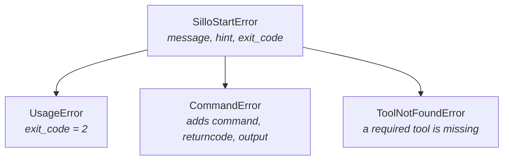

Every deliberate failure prints one sentence and, where there is one, a
concrete next action:

```
✗ /Users/you/code/myapp is not empty.
  Choose another directory, or pass --force.
```

The second line is the point. An error that only says what went wrong makes you
guess; the hint is where the tool tells you what to type.

## Exit codes

| Code | Raised by | Meaning |
| --- | --- | --- |
| `0` |  | Success |
| `1` | `CommandError`, `ToolNotFoundError` | Something failed: a fetch, an install, a missing tool |
| `2` | `UsageError` | Bad input: a name, a directory, an unparseable starter |
| `130` | Ctrl-C | Cancelled |

Anything unexpected also exits `1`, with a message asking you to report it.

## Usage errors

**`A project name is required.`**
`sillo-start create-app` with no arguments. The hint shows the shortest correct
line.

**`'2blog' is not a valid project name.`**
It becomes both a directory and a Python package. See
[Project names](/v1.0/start/naming/).

**`… is not empty.`**
Pick another directory, or pass `--force`. Existing files are left in place;
the starter is written alongside them.

**`'acme/team/template' is not a repository.`**
The starter has to resolve to exactly `owner/repo`. See
[Custom starters](/v1.0/start/custom-starters/#accepted-forms).

## Fetch failures

**`Could not find acme/nope at ref 'main'.`** The repository, the branch or
tag, or the repository's visibility. All three produce a 404 from GitHub, and
the tool cannot tell them apart, which is why the hint names all three:

```
Check the name and the branch or tag, and that the repository is public.
```

[Private repositories are not supported](/v1.0/start/custom-starters/#private-repositories).

**`GitHub returned 403 for acme/template.`**
Usually rate limiting from an unauthenticated address. Wait, or fetch from a
different network.

**`Could not reach GitHub: …`** No network, DNS, or a proxy in the way.
Creating a project needs network access. There is no offline mode, because
there is no bundled copy of the starter to fall back to.

The fetch times out after **60 seconds**.

**`acme/template contains an unsafe path: ../../.ssh/authorized_keys`** An
archive member whose path escapes the destination directory. Refused rather
than sanitised. That is how a malicious archive overwrites files elsewhere on
your machine, and quietly repairing the path would hide that someone tried.

**`acme/template produced an empty archive.`**
The ref resolved but has nothing in it.

## Install failures

**`uv exited with code 1.`** The manager's own output follows. It is never
swallowed. The resolver's message is the useful one. The project is still on
disk; fix the cause and install by hand. See [Package
managers](/v1.0/start/package-managers/).

## Getting more detail

```bash
sillo-start create-app myapp --verbose
```

Adds the full traceback to whatever was already printed. Without it you get the
message and the hint alone, which is the right default: a traceback through
`urllib` tells a user nothing about a repository name being wrong.

`--quiet` goes the other way, suppressing everything non-essential.

## The exception hierarchy

Every deliberate failure derives from `SilloStartError`:



`CommandError` keeps the failed subprocess's output on the exception, which is
what lets the CLI print it. Nothing is discarded on the way up.

Using them from your own code:

```python
from sillo_start.exceptions import SilloStartError, UsageError

try:
    ...
except SilloStartError as error:
    print(error.message)
    print(error.hint)
    raise SystemExit(error.exit_code)
```

The CLI catches the base class in exactly one place (a decorator applied to
every command body) so the rendering and the exit codes are decided once rather
than per command. `KeyboardInterrupt` is caught there too and becomes `130`.

## Reporting a bug

If you see:

```
✗ Unexpected error: …
  Re-run with --verbose for the full traceback, and please report this.
```

That is a failure the tool did not anticipate. Re-run with `--verbose` and open
an issue at [sillohq/start](https://github.com/sillohq/start/issues) with the
traceback and the command you ran.
